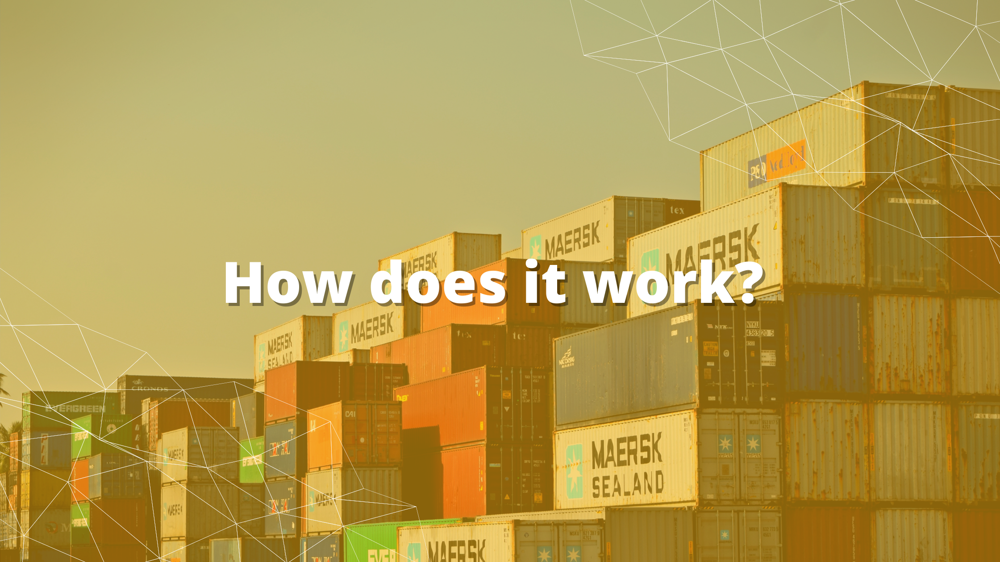

▪️ **Location:** Miami, Florida.    
▪ **Industry:** Logistics    
▪ **Founded in:** 2016    
▪ **Website:** https://www.cargobot.io/	    

Cargobot is a Miami-based, innovative, reliable, free and efficient technology platform that connects shippers with carriers, providing them with details about loads that need to be moved.     

It was founded in 2016 by <a target="_blank" href="https://www.linkedin.com/in/catalina-machado-b35704141/"> Catalina Machado</a>, <a target="_blank" href="https://www.linkedin.com/in/fernando-correa-a12705141/"> Fernando Correa </a>, <a target="_blank" href="https://www.linkedin.com/in/gustavomed/"> Gustavo Medina </a>. With their expertise in freight brokerage, technology, and consulting, they knew that the current state of ground transportation wasn't ideal for anyone except the middle-man.     

The system that had existed for decades was weighted down with inefficiency and held back by old technology. They decided that the industry that moves America deserved a better future.  It’s a simple but genius solution. It’s like this: Cargobot gets a commission for every load that carriers move through the Cargobot app. On the other hand, carriers can directly negotiate rates with the shippers with no brokers involved.    

     

 Shippers are able to list all shipments online. As a Carrier, you are able to bid on the loads you want, and when you win a bid you can choose how you want to get paid. Then, Cargobot will generate a rate of confirmation, although this has to be signed by the carrier first.    
 
 Once a load is in transit, it will be tracked by both the carrier and shipper via their app’s handy GPS tool. If you're a carrier and have reached your delivery point, simply upload your POD on the app. Cargobot will generate your invoice, store all paperwork in the system, and also offer you a rating system. Whether you're a shipper or carrier, you'll be able to rate the person you've dealt with. This criterion is stored for future use.     
 
 In order to access the app, you simply download it via Google Play or iTunes. If you've signed up on a business day, They'll need a day to verify your insurance before using the app. You should be able to view loads and start communicating with shippers after that.    
  
  
  <title-3 align="centered"> It’s main advantages?   </title-3>     
  
  ✔️Guaranteed carrier payment and shipment credit line    
	✔️Flexible Direct pay options available for carrier per load    
	✔️Shipper and carrier representative available with handling your account at no extra cost    
	✔️Technology feature of incident notification with immediate accessibility    
	✔️Visualize rate confirmation with the carrier making it a transparent relationship    
	✔️All in One tech platform that automates your process from start to finish     
	✔️Automated real-time tracking to pick up your delivery    
	✔️Automated invoicing    
	✔️Claim management per load    
	✔️Access to a nationwide network of prescreened carriers with reliable information and ratings    
	✔️Visibility of shippers and carriers amongst each other with real-time negotiation options    
	✔️Extra cargo insurance    
  
  Perhaps the greatest advantage the platform brings is that it eliminates the middleman and hidden broker fees, effectively connecting shippers, owner-operators, and fleet operators in an accessible way while guaranteeing their payments.     
  
This makes it truly a win-win method for the cargo sector, helping make Cargobot one of the best start-ups established in Miami in the last years, where it has garnered widespread recognition as a top platform for its innovative approach in a crowded sea of tech companies.  Thank you so much for reading!    

<title-5 align="left"> About Cobuild Lab </title-5>

At <a target="_blank" href="https://cobuildlab.com/">  Cobuild Lab</a>, we’ve been helping business owners, CEO's, COO’s and IT leaders get past the techno-speak and help them take a business process and turn it into a custom software solution, whether they need design and build services, technical assistance, or are looking to augment their existing team with experienced agile developers. Since 2012 we've focused on developing and combining cutting-edge techniques, tools, and technologies to increase development speed to deliver faster results.    

<youtube-video id="5fbYxQNgJ7s&"></youtube-video>     

Got an idea for a web or mobile app? Let’s build it! Check out our <a target="_blank" href="https://cobuildlab.com/price-calculator/">  price calculator</a> to have an estimate of the cost of your project or email us at contact@cobuildlab.com and get a FREE online consultation. 

  
  
