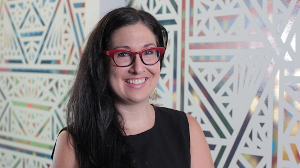
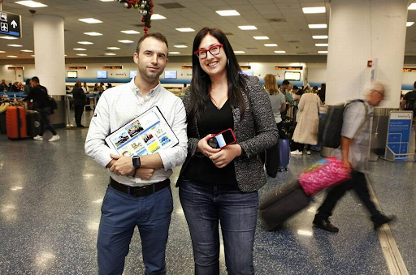

Caribu lets you **video-call** and reads together no matter where you are, so you never miss another story time. This **Miami-based startup**
integrates children’s books into a **child-friendly app**, providing a truly engaging communication experience for kids and their families.
The education platform helps parents, family, and mentors read and draw with children when they’re not together.

Caribu won third place in the [Miami Herald Business Plan Challenge](https://www.miamiherald.com/news/business/business-plan-challenge/article144205969.html) Community Track in 2017, scoring particularly high for value proposition and team experience.

<youtube-video id="https://www.youtube.com/watch?v=oS54Lnp6Pfw"></youtube-video>

**Maxeme Tuchman**, CEO, and Co-Founder of Caribu-Inc. is the daughter of Cuban immigrants who fled the Bolshevik revolution and the Holocaust. Her family history made her understand that education is the only thing that lasts.

<credits>Photo by Medium</credits>

Thanks to her perseverance, she obtained a privileged education and graduated from the Coro Fellowship in Public Affairs, the Leadership Program of Miami Fellows. He received his bachelor's degree from **New College of Florida**, an MBA from **Harvard Business School** and an MBA from Harvard Kennedy School of Government.

Among his experiences, he worked in Mayor Bloomberg's office, where he co-created the New York City Civic Corps and directed the art installation The NYC Waterfalls. She then joined **Teach for America Miami-Dade** as executive director, the Gates Foundation and was part of Ex-President Obama's White House Scholarship. And so it was that among so many experiences and her passion for educational equity launched her **Caribu application**.

<credits>Photo by Miami Herald</credits>

Caribu started as an MBA class project at Imperial College London. Alvaro Sabido's group saw a soldier reading to his daughter with just a webcam and thought they could do better. After this, they split up and Sabido later decided to turn it into a company and form a team in **Miami**, where he grew up. It took him five months, until the fall of 2016, to find Maxeme Tuchman, It took him five months, until the fall of 2016, to find Maxeme Tuchman, who joined as CEO at **FounderDating.com**, platform which facilitates a meeting of minds for CEOs and CTOs.

And so together, they positioned Caribu as an educational platform that helps parents, families, and mentors read and draw with children through a mobile application.

Caribu also **supports military families** through the **Blue Star Family association** which gives free access to military families, helping military children strengthen connections with their parents through distance reading.

<credits>Photo by Inc</credits>

<title-2>And how does this application work?</title-2>

Caribu is available on **iOS and Android** phones and tablets, has a well-organized library with more than 200 illustrated books from the best children's publishers, in 7 different languages. This app also provides an engaging live screen sharing experience with interactive drawing overlays. The users simply make a call, choose a book together, and read or draw in real-time — as if they were in the same room.

Caribu changed over to a monthly subscription model to provide subscriptions for organizations like a large hotel chain, large mentoring organizations, children’s hospitals, and military organizations.

<block-quote>“Caribu, a Miami-based developer of an app that connects parents and children via video call for reading, has raised $1.3 million by Be Curious Partners and John Cooper, managing director at investment bank Houlihan Lokey. Other investors include Revolution’s Rise of the Rest Seed Fund and AT&T.”</block-quote>
<credits>http://bit.ly/2CtPQST</credits>

<block-quote>"AT&T has selected Miami-based startup Caribu for the 2018 cohort of its accelerator program focused on education technology companies. Caribu will receive a $100,000 investment, plus $25,000 to cover the cost of the six-month program."</block-quote>
<credits>https://hrld.us/2V8ARFl</credits>

<block-quote>“Caribu CEO Maxeme Tuchman took home the $100,000 check at a global startup competition. Caribu beat out 19 other top teams from around the world at the Challenge Cup Global Finals.”</block-quote>
<credits>http://bit.ly/2EKXM4A</credits>
