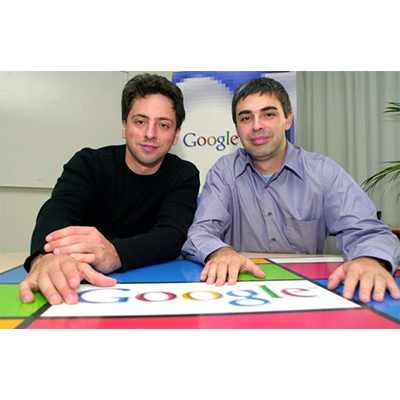

As humans, the best thing we know is relating to each other. We do it for love, for studying, for things in common, for working, and making business. At last, the correct team is considered as one of the success secrets for building a successful business. If we could do it alone, working teams and the specialties would not exist, but they do. So, choose the best team is not only a reality also it is a necessity, an important thing you have to do as well as possible. **Co-founders** are an important part of this dream team we want to create. 

To know how to do it, we’ll give you bits of advice and the necessary information. 

<title-2>Co-founders: the other half of your business</title-2>

If the idea is yours and you will take part in the process, for sure, you will be the founder. Then you should decide if you want to have co-founders.

Who are they? They will be your partners in crime when it is referred to business. They usually contribute economical resources, experiences, mentoring, specific knowledge or something you need to develop your business in a better way. 

Some experts think that having a co-founder is the best thing that an entrepreneur could have because this means that you were able to sell the idea to a first person before launching at the market.

On the other hand, there are some business experts who consider that starting a business is better if you begin alone. Fewer people to have for every agreement. 

Whatever your preference is, you need to convince others and sell them your idea. 

And why not? Co-founders can help you with that. But first, take into consideration some important things.

<title-3>Before undertaking, you have to clarify this with your co-founders</title3>

* Personalities
* Behaviors
* What you like and dislike
* How do you react under pressure 
* Money and all around it
* Incentives 
* Priorities
* Responsibilities
* Values 
* Work culture 
* Motivation
* Work methodologies 
* Styles

All of these related to business. Once you will talk and agree on this, you are ready to start or go for another co-founder. 

<title-4>Specifically, these are the co-founder functions</title-4>

This topic will change depending on the co-founder input. For example, if the co-founder invests economical resources, it is usual that he or she can decide about finance and the proper way to use the money. Now, it is common that co-founders don’t contribute with money, but they contribute with knowledge. In this specific case, responsibilities and functions should be different. 

What does it mean? Co-founders functions are not always the same. They will change in every company, and you as a founder can establish it how better you think. 

But we want to give you some common functions of co-founders to keep in mind:

1. Select the team’s members with you
2. Make a distribution about economic resources
3. Contribute to knowledge 
4. Plan strategies of some processes
5. Identify and take advantage of market opportunities
6. Promote the brand
7. Propose ideas for marketing and sales
8. Collaborate with business documentation 
9. Calculate financial estimates 
10. Collaborate with internal processes when it has been necessary

**Why is important to have one?**

Did you know that the principal reason for startup failing it is the wrong people working on it?

Choosing the best partner or team during the first steps of your business makes the difference between work and evolve better than you expect or fail to try. 

A co-founder even is going to take vital decisions from your hand, and it has to be a major influence on business operation.   
  
Some people say: to have a bad co-founder is better to be alone. 

In effect, our best recommendation for you in this: **thinks twice before choosing.**

<title-2>Tips to choose the best co-founder</title-2>

A really good co-founder needs to have the next skills: 

* **Strategical thinking:** That’s due to decisions they have to take or defend. It is very important they have been able to anticipate market changes. 
* **Management:** a co-founder it is a kind of boss. So, they should know to manage processes, people and everything inside the company. 
* **Financial connoisseur:** especially if they contribute with money or they have to take important decisions about business finance.

**Examples or stories of successful co-founders**

**1. Bill Gates and Paul Allen**

<credits>Photo by [News.culturacolestiva](https://news.culturacolectiva.com/ciencia/muere-paul-allen-cofundador-de-microsoft/)<credits>

They are the Microsoft co-founders. Two men that joined to work, and develop one of the biggest technological empires of all time. 

Although rumors said that they did have some problems as a team, they worked really good. 

For a long time, they were listed as the top rich men in the U.S. and the world, and it was due to the company they co-found called Microsoft.

**2. Steve Jobs, Steve Wozniak y Ronald Wayne**

<credits>Photo by [Iphoneros](https://iphoneros.com/52161/por-que-es-genial-el-video-conmemorativo-de-los-40-anos-de-historia-de-apple)<credits>

Apple has been one of the most important companies in the century, and these three men are behind this. 

They were Apple co-founders. Now on, the thing has changed, but at the beginning, they had to work a lot and take the best decisions to take Apple on the heights, where they continue staying. 

If they could, for sure you can. 

**3. Larry Page and Sergei Brin**

<credits>Photo by [Lifestyle.buorsorama](http://lifestyle.boursorama.com/high-tech/larry-page-et-sergey-brin-qui-sont-les-papas-de-google/)<credits>
  
Another tech monster. Google. 

This company was founded by these two men. They are the teamwork personification. From nothing, they could develop a company together. 

Can you imagine that you and your co-founder would be the next Larry Page and Sergei Brin? We bet for that and better. 

**4. Matthew Prince, Michelle Zatlyn, and Lee Holloway**

<credits>Photo by [Wired](https://www.wired.co.uk/article/server-samurai)<credits>
  
They are three co-founders of a business created in Miami: [CloudFlare](https://www.cloudflare.com/es-es/). A company that provides red services, web security, domain servers, and mitigation DDoS. 

Surely you knew this company, but Did you know that comes from Miami? Now, you can be the next in the city. Are you ready? 

**Co-founders** would be your best or worst decision while you are creating your business. Take your time, choose the best candidate and evolve faster than you can imagine. Heaven is the limit. 

