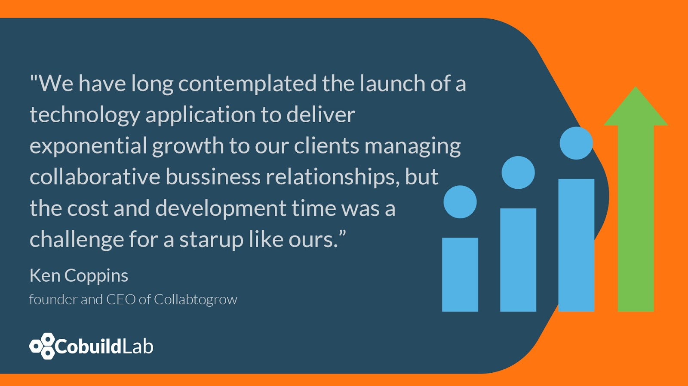
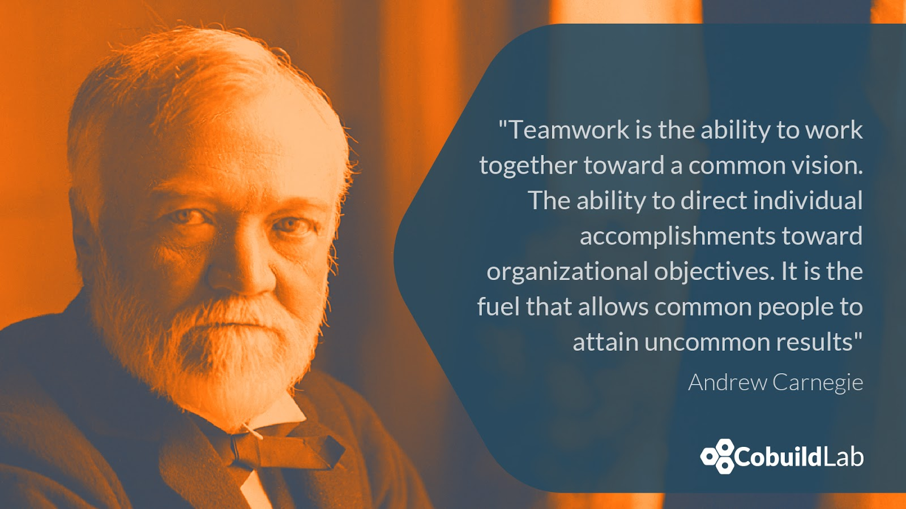
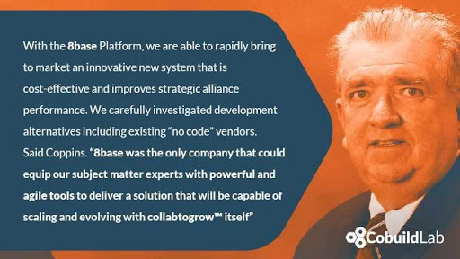
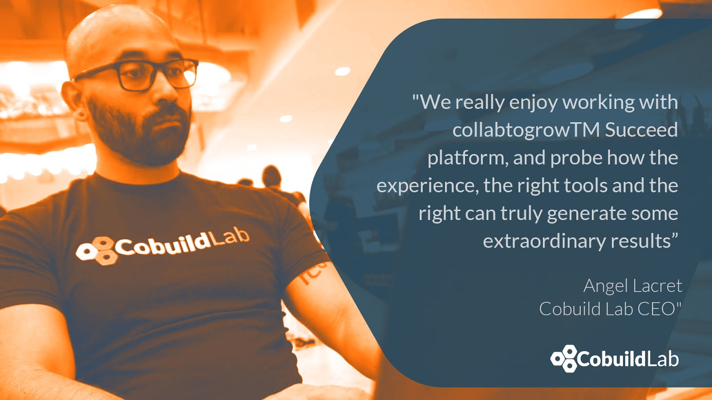
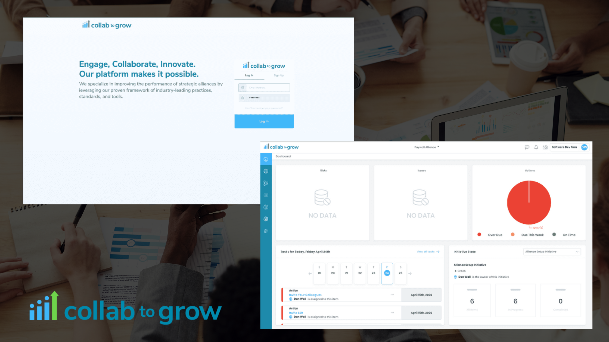

Miami, FL. Dec 28, 2020 - Earlier this year, a collaboration between 8base and Cobuild La was announced to build a new robust, cloud-based SaaS solution to more effectively structure, organize and govern corporate strategic alliances of the <a target="_blank" href="https://collabtogrow.com/"> Collabtogrow™</a>  firm and we want to tell you all about it.    

<a target="_blank" href="https://collabtogrow.com/"> Collabtogrow™</a> Inc. is a technology-enabled managed services and advisory firm that specializes in improving the performance of strategic alliances.    

In today’s world, collaborative business relationships are fundamental to success and 85% of companies view alliances as essential to increasing revenue and growing market share, yet more than half of all strategic alliances fail.    

<a target="_blank" href="https://www.linkedin.com/in/ken-coppins-432b70183"> Ken Coppins</a> and <a target="_blank" href="https://www.linkedin.com/in/bob-jones-1147834/"> Bob Jones</a>, both highly experienced corporate executives, management consultants, and co-founders of Collabtogrow™, believe that repeatable frameworks, workflows, and tools are fundamental for growing potential collaborative relationships.    

In <a target="_blank" href="https://collabtogrow.com/"> Collabtogrow™</a> they leverage their proven framework of industry-leading practices, standards, and tools to help their clients greatly increase their chances of their alliances being successful.    

<title-4 align="centered"> Transforming an Industry </title-4>    

Already losing a significant amount of time dedicated to structure and organizing corporate strategic alliances, they needed a solution that would not only give them more insight but give them back their time. So the next logical step was the development of an application that could help Collabtogrow™  accelerate the process in which, through their framework and workflows, increase the collaborative relationship potential of their clients.    

    

They needed a new system that would be cost-effective and improve the performance of the strategic alliance.  After researching different development alternatives,  including existing “no-code” vendors, they concluded that <a target="_blank" href="https://www.8base.com/"> 8base</a> was the only company whose platform provided the tools needed to build the application.    

By using 8base Platform services and low-code Platform, collabtogrow™ will accelerate the delivery of a robust, cloud-based SaaS solution to more effectively structure, organize and govern corporate strategic alliances.    

<title-4 align="centered"> Great challenges require great teams! </title-4>    

<a target="_blank" href="https://www.linkedin.com/in/albertsantalo/"> Albert Santalo</a>, founder and CEO of 8base said that, *"rather than build cloud infrastructure and a multi-tenant SaaS chassis from scratch, they close to leverage 8base and immediately begin work on their true innovation."*    

So the initial plan for developing the app was created by the 8base executive team, <a target="_blank" href="https://www.linkedin.com/in/albertsantalo/"> Albert Santalo</a>, and <a target="_blank" href="https://www.linkedin.com/in/opurl/"> Oscar Perez</a>.  The Product Designer at 8base, <a target="_blank" href="https://www.linkedin.com/in/candresarev/"> Carlos Arevalo</a>, worked on the technical designs and wireframes of the application, and <a target="_blank" href="https://cobuildlab.com/"> Cobuild Lab</a> led the architecture and development of the platform.    

One of the reasons why <a target="_blank" href="https://cobuildlab.com/"> Cobuild Lab</a> was brought to the team was for our extensive experience building web applications, especially with the ReactJS framework, which is a core element in the 8base stack.    

Our developers are battle-tested React frontend experts with great skills in coding HTML, CSS, and Javascript.    

When we joined the project we began having one weekly meeting to define the priorities and the strategy that we would use for creating the product. During these meetings, Jerry Harris and Bob’s practical know-how was directly taken into account when developing features which they wanted to manage inside the application, and from there early designs and proposals were created to solve each of those features .   

Once we started creating more specialized features and powerful tools we decided to meet 3 times a week to have a more iterative approach solving small pieces at a time, creating more agile and efficient development cycles.    

<title-4 align="centered"> 8base Platform </title-4>    

To develop the product we used the <a target="_blank" href="https://www.8base.com/"> 8base</a> services, which are a complete set of backend tools to enable Frontend developers to create amazing products faster. This also included the <a target="_blank" href="https://www.8base.com/products/boost"> 8base boost kit</a>, a ReactJS components library focused on simplicity, 8base Graphql API and Cloud Functions, Auth0 as an authentication provider, and SendGrid for email notifications.    

Over 6 <a target="_blank" href="https://cobuildlab.com/"> Cobuild Lab</a> developers participated in the coding process, all frontend specialists on javascript and ReactJs.    

During the later sprints, another development team was added in order to complete the more robust features to the platform in a timely manner: the “Balanced scorecard” and the “reports system”, both unique values of how collabtogrow handles the process of strategic alliances.    

After dozens of alpha product iterations, we are excited to present the first full version of the platform. Collabtogrow™ Succeed, which is a SaaS platform that will enable its clients to maximize the business returns from their partner ecosystems.    

    

<title-4 align="centered"> Collabtogrow™ Succeed</title-4>    

A  one-of-a-kind SaaS platform incorporating industry-leading practices, workflows, and tools to help executives unlock the growth potential of their strategic alliances.     

The Collabtogrow™ Succeed solution will automate the governance elements of an alliance, enable management of the alliance through KPIs and Balanced Scorecard and facilitate the partners’ ability to collaborate and innovate, by doing so:    

✔️ Maximizes the value of strategic alliances    

✔️ Allows to collaborate in real-time    

✔️ Tracks key metrics that power strategic decisions    

    

<title-3 align="centered"> The platform </title-3>    
    

<title-5 align="left"> CompetitiveAdvantage Collabtogrow </title-5>    

Founded by senior consulting executives with diverse industry backgrounds, Collabtogrow’s mission is to help their clients succeed by avoiding mistakes, improving overall performance, and succeeding with strategic alliances and partnerships.    

Whether you’re a business that’s new to strategic alliances, or you’re looking to revitalize your existing strategic alliance programs, their services are designed for you to expand market share, increase revenue, and establish meaningful relationships with your strategic partners.     

For more information, visit www.collabtogrow.com or follow them at @collabtogrow    

<title-5 align="left"> CompetitiveAdvantage 8base </title-5>    

8base’s mission is to democratize software development and unlock the power of digital transformation for businesses worldwide. It does this by providing the industry’s most modern low-code technology platform, operating environment, and toolset. With 8base, users can build enterprise-grade applications faster, more easily, and less expensively than with legacy IT alternatives. For more information, visit www.8base.com or follow them at <a target="_blank" href="https://twitter.com/8base/"> @8base</a>.    

<title-6 align="centered"> *"8base's product it’s designed to support the needs of a small user base while automatically scaling to meet more substantial demands."* Albert Santalo, CEO of 8base. </title-6>      

<title-5 align="left"> CompetitiveAdvantage Cobuild Lab </title-5>    
Cobuild Lab’s collaborative approach is something that sets us apart, we are not simply a software development company that produces mass-produced projects. We take the time and effort to really understand the problems that need to be solved in a user and business-centric approach.    

<title-6 align="centered"> *“We help entrepreneurs and industry experts to transform ideas into Web and Mobile Software Products. Since day one, our technique is focused on early results and transparent communication.”* <a target="_blank" href="https://www.linkedin.com/in/alacret/"> Angel Lacret</a>, CEO of Cobuild Lab. </title-6>      

 Follow us at <a target="_blank" href="https://www.instagram.com/cobuildlab//"> @cobuildlab</a>     
 
📱 Thank you so much for reading! 💻

