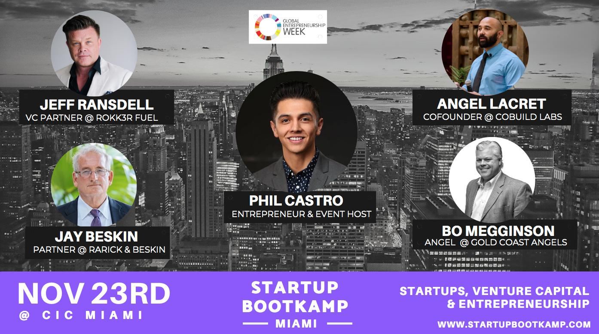

Miami, FL. Nov 18, 2019 - Cobuild Lab is now sponsoring <a target="_blank" href="https://www.startupbootkamp.com/miami3"> Startup Bootkamp</a>, a one day nationally known workshop that will teach you the fundamentals of starting your very own startup. This event is part of <a target="_blank" href="https://www.genglobal.org/gew"> The Global Entrepreneurship Week</a> that will take place from November 18 to 24 at the <a target="_blank" href="https://www.linkedin.com/company/cicnow/"> Cambridge Innovation Center in Miami</a>.   

There's a lot of work behind starting a Startup, and we know it's not easy when you're in the early stages of your journey. That's why in order to save you hundreds of dollars and years of time, the Bootkamp Startup team shares all the secrets only veterans know.  

With a pragmatic educational program it will give you tremendous insight into the world of startups, venture capital and entrepreneurship sharing amazing strategies for your business, and showing you the common mistakes entrepreneurs make and how to avoid them.  

 
 
<title-3 align="centered" > The Speakers</title-3>

<a target="_blank" href="https://www.linkedin.com/in/thephilcastro/#"> PHIL CASTRO</a> - ENTREPRENEUR & HOST - Phil is a serial entrepreneur and startup veteran from Chicago. Launched multiple successful small businesses of his own and he leads <a target="_blank" href="https://www.startupbootkamp.com/miami3"> Startup Bootkamp</a>.  

<a target="_blank" href="https://www.linkedin.com/in/jeffransdell/"> JEFF RANSDELL</a> - VC PARTNER @ <a target="_blank" href="https://www.rokk3rfuel.com/"> ROKK3R FUEL</a> - Jeff is an American entrepreneur, super angel, and venture capitalist building a portfolio of exponential technology companies from the Wynwood Arts District-based venture capital firm Rokk3r Fuel ExO, which he co-founded in 2017. He will talk about what he looks for in startups (traction, founding team, etc.), red flags, best approach for reaching out to VC's and what the future looks like for investing.  

<a target="_blank" href="https://www.linkedin.com/in/bo-megginson-70655433/"> BO MEGGINSON</a> - PARTNER @ <a target="_blank" href="https://goldcoastangels.vc/"> GOLD COAST ANGELS</a> - Bo is a seasoned angel investor who is committed to cultivating early-stage startups and entrepreneurs. He will talk about what he looks for in startups (traction, founding team, etc.), red flags, best approach for reaching out to angel investors and what the future looks like for investing.  

<a target="_blank" href="https://www.linkedin.com/in/alacret/"> ANGEL LACRET</a> - CO-FOUNDER @ <a target="_blank" href="https://cobuildlab.com/"> COBUILD LAB</a> - Angel is a software development pro working with non-technical entrepreneurs and industry experts to transform ideas into Web and Mobile Applications. He will talk about mobile and web development processes, best practices, UI/UX and trends.  

<a target="_blank" href="https://www.linkedin.com/in/jaybeskin/"> JAY BESKIN</a> - PARTNER @ <a target="_blank" href="https://www.rblawfl.com/"> RARICK & BESKIN</a> - Jay works with individuals and business owners to ensure cost effective transfer of family wealth to desired beneficiaries, including charities, with minimal estate and gift taxes. He will talk about what startups should consider before forming entities, financing, IP and more.  

Startup Bootkamp is scheduled for November 23rd at CIC Miami and will be open to all visionaries, early stage founders, aspiring entrepreneurs, and seed stage founders. Places are limited so make sure to reserve yours today.  

<a target="_blank" href="https://www.startupbootkamp.com/miami3"><button type="button" class="button is-primary">Reserve Your Seat Now</button></a>  

<youtube-video id="KuPGTANf-Rs"></youtube-video>
