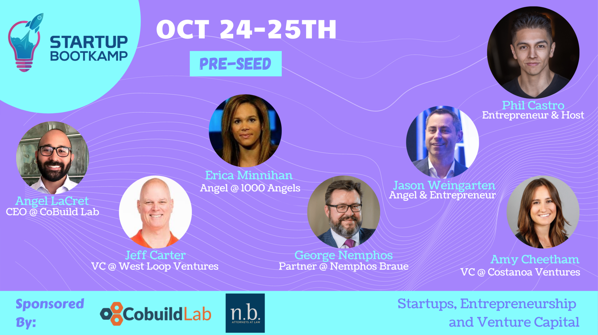

Miami, FL. October 14, 2020 - We’re excited to announce that Cobuild Lab is sponsoring <a target="_blank" href="https://startupbootkamp.com/v6/">  Startup Bootkamp</a>for the second year in a row!  Startup Bootkamp It's a two day 12-hour experience that is made for aspiring to pre-seed entrepreneurs who are looking for early-stage guidance.    

With a pragmatic educational program, Startup Bootkamp will give you tremendous insight into the world of startups, venture capital, and entrepreneurship sharing amazing strategies for your business and showing you the common mistakes entrepreneurs make and how to avoid them. The program will go over topics like entity formation, <a target="_blank" href="https://cobuildlab.com/blog/validating-your-idea-the-first-step-to-create-your-startup/amp/">  validating your idea</a>, creating your <a target="_blank" href="https://cobuildlab.com/blog/mobile-apps-web-apps-or-cross-platform-what%E2%80%99s-the-best-for-my-small-business/amp/">  mobile app</a>, how to find mentors, how to raise money from investors, and more. The weekend event will take place on October 24-25th and includes great guest speakers, an investor panel, live pitching, and a virtual happy hour networking event to follow.    

<a target="_blank" href="https://startupbootkamp.com/v6/"><button type="button" class="button is-primary">Buy a ticket </button></a>    

     

The event will be held in two stages, the "Beta" workshop experience where the host, <a target="_blank" href="https://www.linkedin.com/in/thephilcastro/">  Phil Castro</a>, founder and CEO of <a target="_blank" href="https://barpass.com/">  Barpass</a>, will be talking about the fundamentals of initiate a startup. Phil is a serial entrepreneur and startup veteran from Chicago and has launched multiple successful small businesses of his own and he leads Startup Bootkamp. Alongside him, as guest speakers will be:      

*    <a target="_blank" href="https://www.linkedin.com/in/alacret/">  Angel Lacret</a>, founder and CEO of <a target="_blank" href="https://cobuildlab.com/">  Cobuild Lab</a>, with over 15 years of experience in software development he has been helping business owners overpast the techno-speak turning logistical and productivity problems into competitive advantages and costs reductions using a custom software solution and he will guide you through how to make the most out your business by using a software product.    

*    <a target="_blank" href="https://www.linkedin.com/in/george-j-nemphos-3846bb6/">  George Nemphos</a>, a founding partner of <a target="_blank" href="https://nemphosbraue.com/">  Nemphos Braue</a>,  has extensive experience in representing both private and public companies, venture capitalists, angel investors, and private equity funds, he will guide you through all the legal aspects you must to know when initiating your startup.    

The second stage is the “Seed” workshop where Phil brings in many more highly established industry professionals such as <a target="_blank" href="https://www.linkedin.com/in/ericaduignanminnihan/">  Erica Minnihan</a>, <a target="_blank" href="https://www.linkedin.com/in/weingarten/">  Jason Weingarten</a>, <a target="_blank" href="https://www.linkedin.com/in/jeffreyrcarter/">  Jeff Carter</a>, and <a target="_blank" href="https://www.linkedin.com/in/amy-cheetham-61835127/">  Amy Cheetham</a> who are ready to share their infinite wisdom in this intimate workshop experience and do the majority of the teaching for the seed stage founders with topics like product-market fit, cap tables, equity splitting, hiring your first 20 people, and more. For the “Beta” workshop, only 5 startups are selected to pitch the panel of investors and for the “Seed” workshop, all startups will have the chance to pitch the panel of investors at the demo day.    

For us at Cobuild Lab, working in technology means working on the future, every man and woman in the industry is a visionary and passionate creator who thinks outside the box to build something amazing. This is why we are very excited to sponsor the Startup Bootkamp for the second year in a row to support the founders in their startup journey; we want to give them all the knowledge and tools we can, so they can scale up their businesses successfully.    

You can now use our code "SPEAKER" for 20% on all tickets!    
<a target="_blank" href="https://startupbootkamp.com/v6/"><button type="button" class="button is-primary">Buy a ticket </button></a>    

<title-6 align="centered">Photo: <a target="_blank" href="https://www.linkedin.com/in/alanthinks/">  Alan Guevara</a>, Chief of Product Management at Cobuild Lab giving a lecture about mobile and web development processes, best practices, and UI/UX trends at the Startup Bootkamp Event in 2019 </a></title-6>    

<title-5 align="left"> CompetitiveAdvantage Cobuild Lab </title-5>

At <a target="_blank" href="https://cobuildlab.com/">  Cobuild Lab</a>, we’ve been helping business owners, CEO's, COO’s and IT leaders get past the techno-speak and help them take a business process and turn it into a custom software solution, whether they need design and build services, technical assistance, or are looking to augment their existing team with experienced agile developers. Since 2012 we've focused on developing and combining cutting-edge techniques, tools, and technologies to increase development speed to deliver faster results.    

<youtube-video id="5fbYxQNgJ7s"></youtube-video>     

Got an idea for a web or mobile app? Let’s build it! Check out our <a target="_blank" href="https://cobuildlab.com/price-calculator/">  price calculator</a> to have an estimate of the cost of your project or email us at contact@cobuildlab.com and get a FREE online consultation. 

