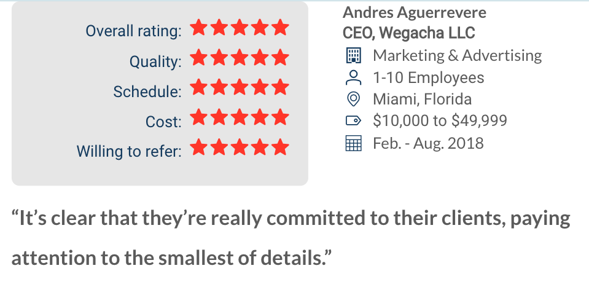
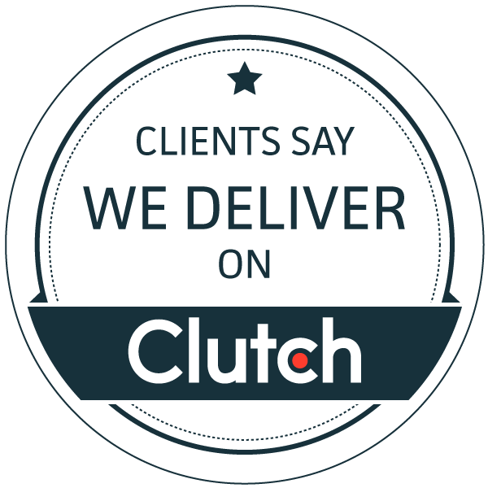

Cobuild Lab Inc. was recently included in ongoing coverage of leading software developers throughout the globe. The recognition comes from
Clutch, a B2B ratings and reviews platform for businesses, with the mission to help buyers of services make the most [informed decision](https://www.thedrum.com/news/2017/03/27/online-reviews-impact-purchasing-decisions-over-93-consumers-report-suggests)
when selecting a service provider. Software development is one of Clutch’s strongest and most competitive segments that they cover, making
the team at Cobuild Lab very proud to be included amongst such a distinguished crowd.

Clutch’s algorithm takes a number of factors into account when determining a company’s position its research. These include a company’s
demonstrated work, client base, and most importantly their ability to deliver on [past projects](https://cobuildlab.com/customer-success-stories) as determined by their clients. With these
factors in mind, we were evaluated and placed highly amongst other development and [product design companies](https://clutch.co/agencies/product-design)

While we’re proud to be featured in Clutch’s ranking, what we’re more proud of is the positive feedback we’ve received from our clients.
Our inclusion on their platform would not be possible if our clients hadn’t been willing to make themselves available for comprehensive
interviews with Clutch analysts that can be viewed in their entirety on our profile.

Here is an example what our clients have had to say so far:

Our first review on Clutch also qualified our team to be featured on their sister website, The Manifest, amongst their list of the best
[software developers in Miami](https://themanifest.com/software-development/companies/miami) in 2018!

We’d like to thank our friends at Clutch for including us in their ongoing efforts to identify to the top firms in the development &
design industries. We’re motivated to make sure we continue to develop our presence on both Clutch and The Manifest until we rise to the
top.

