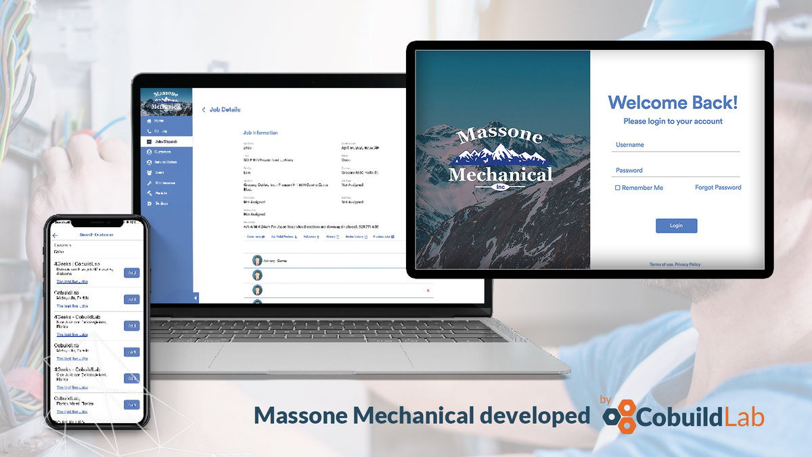

Miami, FL. October 13th, 2020 - We’re very happy to announce that as of late September we are officially associate members of the **Florida Customs Brokers & Forwarders Association**, this was confirmed  by Cobuild Lab’s CEO, <a target="_blank" href="https://www.linkedin.com/in/alacret">    Angel Lacret</a> who is seeing a prominent future for the company's new business relationships.    

The <a target="_blank" href="https://ww2.fcbf.com/">    Florida Customs Brokers & Forwarders Association</a> (FCBF) is the Florida trade association for industry professionals. The FCBF aims to transform Florida's industrial ecosystem by bringing together industry leaders and agency officials to collaborate and benefit from each other's expertise.  Its primary goal is to empower and prepare managers and staff alike to thrive in their businesses, keep them updated on changing regulations, and most importantly, advocate for the industry at both the state and federal levels. FCBF members are an authority each in their field, representing the diverse spectrum of the international trade industry. From customs brokers, air carriers to terminal operators and trucking firms, industry professionals work to maximize Florida's ability to compete effectively for international trade resources.    

<title-6 align="centered">Miami, photo courtesy of <a target="_blank" href="https://alanthinks.com/">    @alanthinks</a></title-6>    

According to the <a target="_blank" href="https://indicators.kauffman.org/">    Kauffman Index</a>, Miami is the second most entrepreneurial city in the U.S., the city is now home to 139 startups and companies on the <a target="_blank" href="https://www.inc.com/inc5000/2019/top-private-companies-2019-inc5000.html">    Inc. 5000 list</a>, registering the highest startup density found in the U.S., at roughly 247.6 startups per 100,000 people and this increase in startup activity in South Florida has piqued the interest of programmers, investors and tech companies such as Cobuild Lab. So we chatted with Angel Lacret about the importance of this new partnership for our company:    

**Q: What is the meaning for Cobuild Lab to be an FCBF member?**    
*“The very first questions we should ask ourselves as business owners are: ‘where are my potential customers and what are they looking for?’ Identifying and attracting new customers is a crucial part of your business strategy, after all having an outstanding product or service is useless if the right audience doesn’t know it, so you must be present right where your potential customers are.* 

*We are honored to be associate members of the Florida Customs Brokers & Forwarders Association as this opens up new business opportunities and will allow us to continue  to help business owners and executives get past tech barriers to transform logistical and productivity problems into competitive advantages."*    

<title-6 align="centered">Angel Lacret at <a target="_blank" href="https://cobuildlab.com/blog/cobuild-lab-was-sponsor-of-the-cto-founders-miami-event/">   CTO Founders Miami</a>’s event in 2019</a></title-6>    

**Q: What are the main challenges faced by the logistics industry?** 

*“Some of the logistics industry pain points (and perhaps one of the most important) are the need for technological advances to optimize business processes. With too many parties involved in the logistical process, is more than evident that fragmentation and inconsistency are leading the industry into inefficiency but technology can boost productivity by reducing time, cost, and errors.”*    

**Q: How can a Software Product improve a logistics company?**

*“Everything from using email autoresponders to automate workflow, custom software development can be the solution that revolutionizes the whole industry’s processes. Let’s say your company lacks coordination and you need to keep track of your shipment at every step of the way, we can build an app that links a bunch of processes together, from ordering a load, track and monitor the shipment around the clock to receiving the delivery, our software product could keep you updated at any time with alerts and notifications.** 

*A good example is a solution we built for <a target="_blank" href="https://www.massonemechanical.com/">   Massone Mechanicals</a>, which needed to improve its processes in terms of customer service delivery and information management. For them, we built a platform that allows them to automate every process from the moment someone requests their services, select the technician who will provide that service to track the shipment, and its delivery. Whatever it is, you name it, a software solution will do the job.”*    

<title-6 align="centered"> <a target="_blank" href="https://cobuildlab.com/blog/3-apps-that-we-enjoyed-developing-at-cobuild-lab/">   Massone Mechanicals</a> developed by Cobuild Lab </title-6>    

<title-5 align="left"> About Cobuild Lab </title-5>

At <a target="_blank" href="https://cobuildlab.com/">  Cobuild Lab</a>, we’ve been helping business owners, CEO's, COO’s and IT leaders get past the techno-speak and help them take a business process and turn it into a custom software solution, whether they need design and build services, technical assistance, or are looking to augment their existing team with experienced agile developers. Since 2012 we've focused on developing and combining cutting-edge techniques, tools, and technologies to increase development speed to deliver faster results.    

<youtube-video id="5fbYxQNgJ7s&feature=emb_logo"></youtube-video>     

Got an idea for a web or mobile app? Let’s build it! Check out our <a target="_blank" href="https://cobuildlab.com/price-calculator/">  price calculator</a> to have an estimate of the cost of your project or email us at contact@cobuildlab.com and get a FREE online consultation. 

