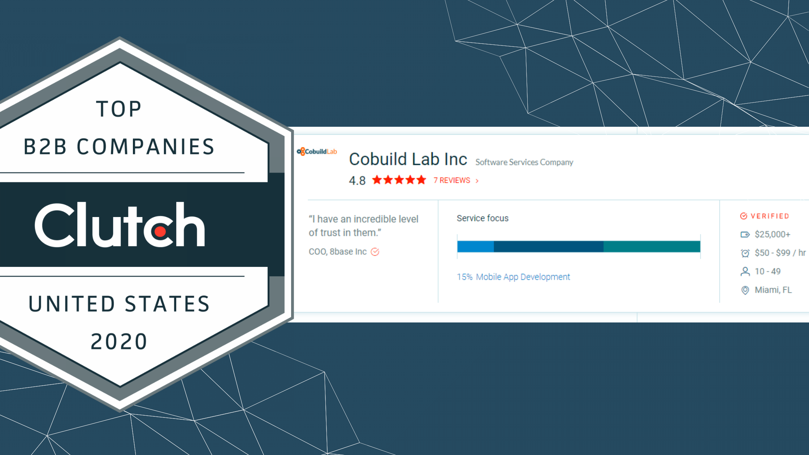
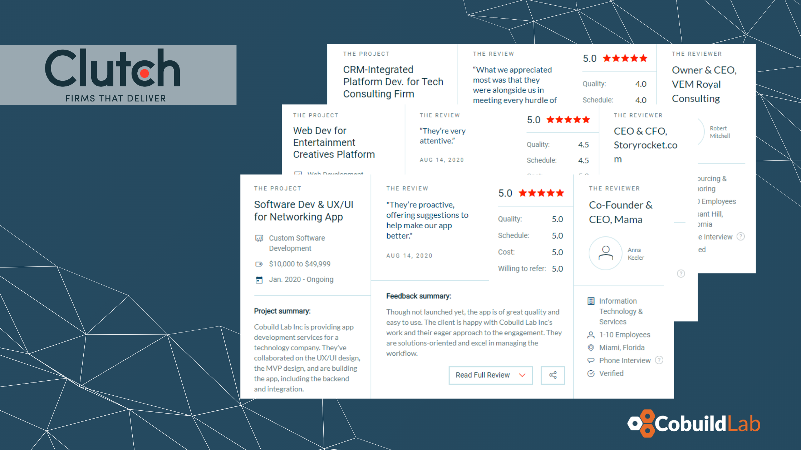
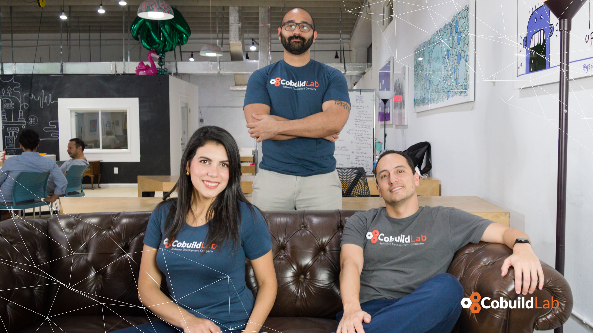

Miami, FL. October 28, 2020 - Earlier this month, the leading B2B ratings and reviews platform <a target="_blank" href="https://clutch.co/"> Clutch</a> announced the highest-ranking B2B companies across the country, and <a target="_blank" href="https://cobuildlab.com/"> Cobuild Lab</a> has been named a top B2B company in the United States.    

    

For us at <a target="_blank" href="https://cobuildlab.com/"> Cobuild Lab</a>, working in technology means working on the future, every man and woman in the industry is a visionary and passionate creator who thinks outside the box to build something amazing. Therefore being named a 2020 Clutch leader on the top B2B companies in the United States featuring on the <a target="_blank" href="https://clutch.co/press-releases/recognizes-top-performing-b2b-companies-florida-2020?utm_campaign=Award%20Blogs&utm_medium=email&_hsmi=96577010&_hsenc=p2ANqtz--CExYT40IM7CK1i9wfj7IIwq3sFHEEGFg8hkmeAcd87BASKOvKWnX3iGoka-ny8nQRbNLQZCZHTK5zRaPqDa0-lFyJ3Q&utm_content=96577010&utm_source=hs_email"> Top B2B Companies in Florida</a> report means hard work is paying off.     

We’ve been helping business owners, CEO's, COO’s and IT leaders to get past the techno-speak, take their business process, and turn it into a custom software solution, whether they need design and build services, technical assistance, or are looking to augment their existing team with experienced agile developers. Since 2012 we've focused on developing and combining cutting-edge techniques, tools, and technologies to increase development speed to deliver faster results.     

<title-4 align="left"> “To be recognized by Clutch as one of the best B2B companies in Florida is very important for our company. Clutch's website has allowed us to connect with other incredible companies and industry leaders as well as helping our business to grow” said <a target="_blank" href="https://www.linkedin.com/in/alacret/"> Angel Lacret</a>, CEO of Cobuild Lab. </title-5>    

<title-6 align="centered">Photo: <a target="_blank" href="https://cobuildlab.com/blog/congratulations-to-jacqueline-popovich-cobuild-lab-new-product-manager/"> Jacqueline Popovoch</a> our Product Manager and <a target="_blank" href="https://www.linkedin.com/in/alacret/"> Angel Lacret</a>, Cobuild Lab's CEO </title-6>    

<a target="_blank" href="https://clutch.co/"> Clutch</a> is a B2B ratings and reviews platform based in Washington, DC. They evaluate technology service and solutions companies based on the quality of work, thought leadership, and client reviews. A rapidly expanding startup, Clutch has become the go-to resource in the agency space. Their review process is reliable and transparent, and we’re grateful to those of our clients who have taken the time to provide feedback.    

Clutch is always looking for an honest opinion from the client, that is why during the review process they make a creative positioning of questions to provide the user with a complete overview of the company's services and the client's experience. After receiving a service, the client begins his review with a summary of the project and a description of the challenge that was presented; then he answers open questions about the solution and the results obtained from working with that company.    

    

Reviews are very important since the honest opinion of those clients acts as feedback for the company to improve its services as well as inviting potential clients to learn more about the company's workflow.  As Winston Churchill once said *"Criticism may not be agreeable, but it is necessary"*, well-managed reviews are an effective tool for professional development. Thanks to our clients’ participation and honest feedback on our work we can improve our communication and customer relations to provide a better service.    

We feel extremely proud of the efforts of our teams and in the name of everyone in Cobuild Lab, we would like to thank all the people that have supported us and contributed to the growth of our company. We are committed and we want to keep on improving so we invite you to surf <a target="_blank" href="https://clutch.co/profile/cobuild-lab"> our profile</a>, write us a line or leave a review. And once again, thank you so much for reading!    

    

<title-5 align="left"> CompetitiveAdvantage Cobuild Lab </title-5>

We transform Small and Medium size businesses by automating manual processes and tasks into optimized and streamlined workflows with Web and Mobile custom software. Everything from using email autoresponders to automated workflow can help you redefine your relationship with the customer and open up new revenue streams for you. It's time for you to use technology and automation to make your business more efficient.    

<youtube-video id="5fbYxQNgJ7s"></youtube-video>     

Got an idea for a web or mobile app? Let’s build it! Check out our <a target="_blank" href="https://cobuildlab.com/price-calculator/">  price calculator</a> to have an estimate of the cost of your project or email us at contact@cobuildlab.com and get a FREE online consultation. 
