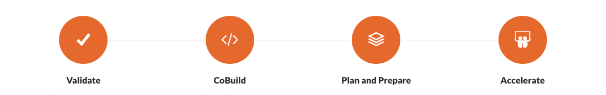

The Cobuild Process consists in a series of phases that have the goal of transforming an idea in a sustainable business, through the combination and collaboration of the areas of Lean Entrepreneurship, Business Strategy, Technological Innovation, and Exponential Growth Cobuild Lab divides this process into 4 phases: Validate, Cobuild, Plan and Prepare and Accelerate.

<title-2>Phase 1: Validate</title-2>

Plain and simple: Don't offer what people don't want. The purpose of this phase is to validate that your idea is aiming a problem that actually exists; Along with that, that the solution is something doable.

<title-4>Step 1: Idea Validation: Technical and Economical:</title-4>

In this step, we consult with experts on the company about the feasibility of the solution to be built. This quick analysis would reveal basically two things: The idea is built in a reasonable amount of time (1 - 6 months) with a reasonable amount of money. 

In this step is also important to write the specs to any Proof of Concept needed in the next Phase. A Proof of Concept is indeed proof that the idea can be built, usually, use for mitigating any doubts from the technical perspective and gain stakeholders support.

<title-4>Step 2: Market Validation: Estimation and Competitors Analysis</title-4>

Market validation is the way to confirm that your idea is a solution to a problem people actually have. Is this step and before building anything we close test your idea with a small group inside the company to get an honest feedback.

In this same step we take the time to build the first Customer Archetype, defining some aspects of our Market Audience: Age Range, Income, Work Sector, Job Titles, suffer from the problem we are trying to solve, how is the best to find them and how can we expose the product to them. 

At the same time, we start researching your competitors investigating ways in which the problem was solved before, their weakness and their power points, also how these solutions get to market and how well they are doing SEO.

<title-4>Step 3: Value and Growth Hypothesis</title-4>

Once we had established ground, we build our first version of our Startup Hypothesis: Value Hypothesis: We write down how our idea will provide value for those who are willing to use it. Growth Hypothesis: Once we got the point in which we are actually providing value, we write down the ways we can massively reach potential customers.

<title-2>Phase 2: Cobuild</title-2>

<title-4>Step 1: Prototyping</title-4>

At the initial stage of transforming the product into a product, we need to start with a prototype. A prototype, depending on the case can have none, one or some of the functionality that the final product will have, enough to be available to present and explain: how the product is going to work, how it can look like and how the user is gonna use it. 

A software product will at least include Wireframes, User Stories and a minimum set of features, and in other cases may include and is not limited to: Hardware interaction, Materials look and feels, etc.

<title-4>Step 2: Customers Archetypes</title-4>

Once we have a prototype around the table, it’s time to review the first version of the Customer Archetype. At this point, we have enough information about the market and the product to lay down the 2nd version reviewing the initial demographic y making the necessary adjustments.

<title-4>Step 3: Minimum Viable Product (MVP)</title-4>

It’s time to build!. 

In this step, we start building the product using agile techniques and early retrospective. The average time to have the first functional version is a month, and since that moment every week new functionality is added or tested. 

Having an early feedback of the product is very important in this Step. It is also important to remember that, maybe not all of the features discussed in the prototype have to be included it in the MVP, as its main goal is to have enough to test the Value Hypothesis.

<title-4>Step 4: Live testing</title-4>

One of the most important thing about building an idea is to have tested as soon as it’s testable. This can occur even if the MVP is not fully featured. 

The main goal here is to find a group of potential customers and start rolling out the product. This can be coworkers, stakeholders, family, close friends, suppliers, soon. The most important part here is to get an honest a usable feedback by conducting interviews with potential customers to really know about the impact on the product.

<title-4>Step 5: A/B Testing</title-4>

This is a critical step that depends a lot on the result of previous activities. You have the MVP, the results of the tests, and now what? 

Usually, if the product is generally criticized and qualified as not satisfying the need, it's an easy decision to make, just head back to step one, with the information and start the prototype again. Also, this decision comes very easy if the product is broadly accepted, you need to move on to the next step as quickly as possible. 

The real challenge here is probably having around a 30-40% of acceptance, it’s a critical choice to decide whether to move on with the product or head back to the prototyping step. There is no formula or rules that apply here because many things can happen, we selected the wrong audience, we didn’t provide an MVP reflecting the value hypothesis, the product is slow or not complete yet. So, the best way to take here should be review carefully the feedback from the Live Test along with the stakeholders and all members of the group, and make the call: 

Get the feedback and head back to step 1 (Prototyping) 

Change the test group and redo the Live Testing to validate the current feedback 

Tweak the MVP according to the feedback and redo the Live Testing. (Minimum changes) 

Add or remove some features of the MVP according to feedback obtain. This is A/B testing 

A/B testing allows you to split the testing groups into subgroups for testing features that feel misused, unnecessary or that they are missing from the original MVP. 

There is no short way here, prepare the team for a test, the customers group, and we start testing as soon as possible.

<title-4>Step 6: Product Market Fit</title-4>

At this point, we have a product that solves a problem, that works and that customers like. So we have validated or Value Hypothesis. Now, probably one of the most important steps: validate our Product Market Fit. The Product Market Fit refers to the segment of customers who are willing to pay for the solution that we are providing in terms of: How much, how often and how many are willing to do it. 

Our initial test group is a very important source of information on this, so this is the ones whom we interrogate first, moving on to some real-world potential customers or some early adopters. The results of this Step should provide the projections necessary to easily know how much money is involved in the life of our startup.

<title-4>Step 7: Value and Growth Hypothesis (Again)</title-4>

With the product in hand, the information provided by the test and our different surveys, we review our hypothesis and shape it again with the new data.