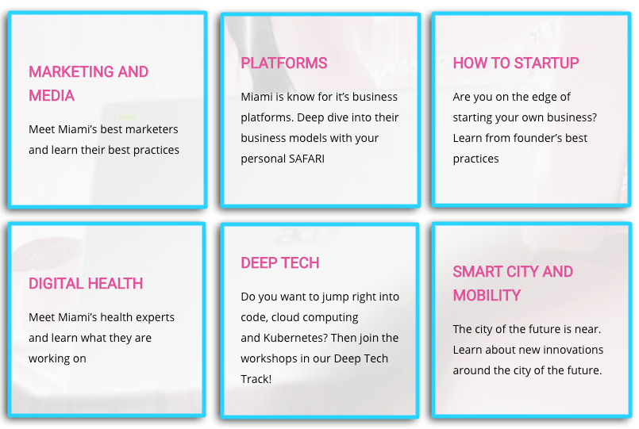

Miami, FL. Oct 21, 2019 - Between October 24 and 26, Startups, Investors, and accelerators will come together to attend 100+ sessions throughout Miami to connect, collaborate, and celebrate the startup ecosystem at one of the fastest-growing startup hotspots in the Americas at [Startup Safari](https://miami.startupsafari.com/). 

These events are perfect for everyone from CEOs and founders to early stage entrepreneurs.

On Saturday 26th, [Cobuild Lab](https://cobuildlab.com/) founder, [Ángel Lacret](https://www.linkedin.com/in/alacret/), as one of the speakers, will be talking about Customer-Driven Software Development.

There will be different topic tracks like blockchain, edtech, startup how-to's, digital health, deep tech, cybersecurity, and many more. Check out the [agenda here](https://miami.startupsafari.com/agenda/), so you don't miss anything!.

Are you ready to network with the entire Miami startup community? See you at Startup Safari!   

