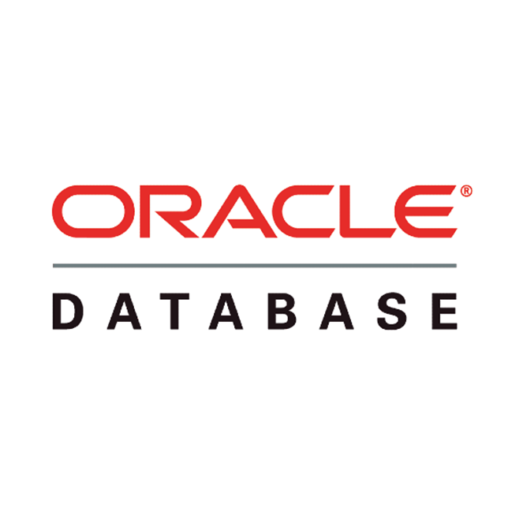
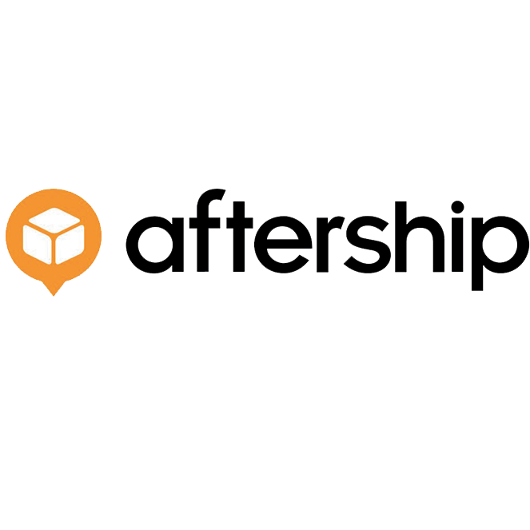

Miami, FL. Sep 28, 2021

**The use of custom software in logistics for e-commerce** can bring a lot of advantages for your business such as control of warehouses, tracking of merchandise, and facilitating the arrival of products to the customers’ doors, among others. 

As you may know, e-commerce logistics is one of the most critical parts of an online store, but costs continue to rise every year. In the last years, these businesses have been evolving and new technologies were applied to satisfy the global demand.  

So, if you want to learn how to implement <a target="_blank" href="https://www.cobuildlab.com/blog/custom-software-development-process-in-2021-step-by-step-towards-digital-transformation-in-logistics/"> logistics custom software </a> in your e-commerce business just keep reading!

 

<title-2>How can logistics be applied to e-commerce?</title-2>

 

Some of the strategies and actions you can take into account to implement safely and profitably the logistics and <a target="_blank" href="https://www.cobuildlab.com/blog/Supply-chain-synchronization/"> supply chain </a> to your e-commerce are:

 

<title-3>The use of flexible warehouses:</title-3>

 

Having more than one supplier allows you to be ahead of any problems that may arise in the future. 

**Example**: If one of your suppliers presents a problem later you will not stop your production or service delivery because you have a wild card up the sleeve that will allow you to keep one step ahead.

 

<title-3>Integration of management software:</title-3>

 

Thanks to these management tools it is possible to automate many of the activities and processes within the company that cannot be carried out by one person. 

You can customize many aspects of the supply chain and work efficiently, with greater productivity. 

Also, you would launch new products and expand to other regions of the world.

 

<title-3>Improve sales forecasting:</title-3>

 

With increased demand, products are going to be moved from one location to another. To meet these demands, e-commerce companies make the mistake of increasing their inventory drastically. At this stage, both timing and sales forecasting are very critical: 

Buying too much inventory would mean increased costs, obsolete stock, and additional overhead in the form of warehousing. As a retailer, using real-time data transparency will help you to control supply chains and react in time to changes in demand, and here is where custom software becomes important.

 

<title-3>Implementing supply chain and custom logistics software for your e-commerce:</title-3>

 

You can use various softwares specifically designed for supply chain management that can properly track and manage your inventory, process orders, manage suppliers, etc. These types of software have been gaining ground over the years as they have a variety of advantages and benefits over the old methods of managing a supply chain.  

 

<title-2>Off-the-shelf software tools for logistics at e-commerce</title-2>

 

<title-3>* SAP:</title-3>

 

<a target="_blank" href="https://www.sap.com/index.html"> SAP </a>'s IoT and digital supply chain promises customers to digitize their supply chains and facilitate collaboration with partners within the supply chain. This is possible through cloud-based implementation.  

In 46 years, the company served 378,000 customers, including Microsoft, Lennox, and Komplett Group. 

SAP is the world's largest enterprise software company and has become a household name since its founding in 1972.

 

 

<title-3>* Oracle:</title-3>

 

Oracle helps companies modernize their SCM processes by offering services such as product lifecycle management, supply chain planning, and order management to its customers. 

Oracle offers software as a service, as well as platform, infrastructure, and data services. The company has a total of about 430,000 customers in 175 locations.

 

 

<title-3>* Fishbowl:</title-3>

 

<a target="_blank" href="https://www.fishbowlinventory.com/"> Fishbowl</a> is a complete manufacturing and inventory management solution that helps medium to large companies address demand trends and manage supply issues. Designed to automate the manufacturing process, Fishbowl's features include order and job planning tools to maximize production efficiency.

 

 

<title-3>* Aftership:</title-3>

 

<a target="_blank" href="https://www.aftership.com/">  Aftership </a> is a Hong Kong-based logistics software company founded in 2011. It operates worldwide and is used by more than 10,000 e-commerce retailers worldwide. 

The main service offered by this logistics software is automated shipment and order tracking. Aftership uses a package tracking API integration system and offers integration with more than 600 logistics companies. 

The status of all orders can be tracked and managed from a control panel provided by this logistics software.

 

 

<title-2>Why is software customization a better solution in logistics for e-commerce?</title-2>

 

The customization of your logistics and supply chain software through software development is one of the smartest strategies that you can carry out. 

* It allows being more productive, and efficient since the software can be tailored to your processes allowing consumers to receive better service. 
* Similarly, customizing your logistics software allows you to understand the behavior of your customers and offer an inventory that meets the needs of consumers, avoiding overstocking in your warehouse. You can do this by conducting surveys, observing what your competitors offer, performing A/B tests, and studying your sales trends. 
* Another important customization aspect of this software is its scalability because through ERP you can add or remove tools and have all the tools you want in a single software. Thus, you can reduce the loss of information and eliminate the garbage that can generate each of the logistics processes. 

 

<youtube-video id="0vyrtbVER5I"></youtube-video>

 

Business efficiency at operational levels is critical to the <a target="_blank" href="https://sonary.com/content/business/ecommerce-design-elements-successful-websites-have/">success of e-commerce</a>. As we have seen, an efficient supply chain accelerates e-commerce processes to meet customer expectations. 

E-commerce has become a very competitive landscape. You must meet the ever-changing expectations of your customers and remain profitable. It’s here where <a target="_blank" href="https://www.cobuildlab.com/services/custom-software-development/"> custom software  </a> in **logistics for e-commerce** gets in. So, start today and apply it, in order to take your e-commerce to another level. Are you ready to start? Build your budget here.

**Team Cobuild Lab** 
