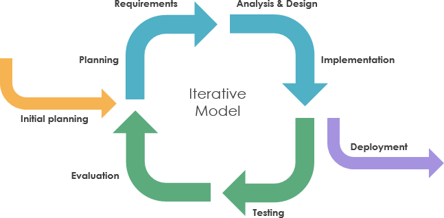
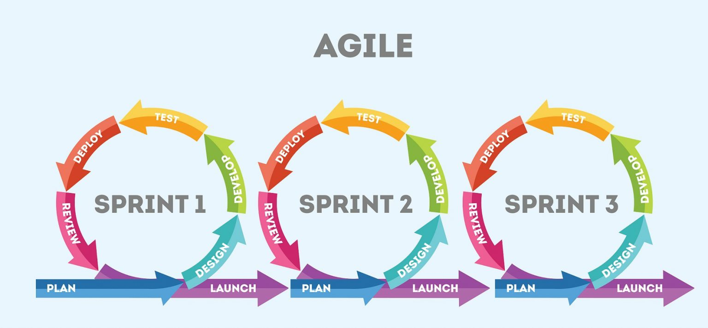

As time goes by, sustainable software development is becoming stronger in companies and developer communities, due to its high level of efficiency and productivity. Similarly, all this is being complemented and supported by the agile software development methodology, its main advantage is that it adapts to projects that do not yet have clear requirements, since changes can be introduced between iterations.  Below we show you the step-by-step of agile development in Cobuild Lab. 

 

<title-2>Agile custom software development process at Cobuild Lab</title-2>

 

At Cobuild Lab all our custom developments follow the following phases or steps to guarantee a great product and customer satisfaction:

 

<title-3>Phase 1 ( Plan):</title-3>

 

In this first phase, we carefully collect as much data as possible to accurately highlight the technical requirements of the project. In addition, this is the moment of greatest adaptability, since the more details are discussed in the preparatory sessions with the clients, the more positive impact it will have on the design and configuration of the optimal solution. Another task to highlight at this stage is to understand the perspective of the users, the more we understand this, the closer we get to what the company is looking for.

 

<title-3>Phase 2 (Construction):</title-3>

 

In this second phase we focus on keeping you involved in this construction, issuing daily progress reports while working hand in hand with your team. This phase is handled with extreme care as we build and create what was projected in the planning phase. We take care to reflect your processes but also incorporate your knowledge and critical information to make everything work as you do and increase your efficiency. 

 

<title-3>Phase 3 (Validate):</title-3>

 

It is important to highlight some aspects in this last phase because we at Cobuild Lab develop your project in parts in an agile and sustainable way, we make progressive interactions with the software before the final delivery, this with the purpose that you as our client can get what you are asking for and needing. This is why we subject it to a series of tests and internal deliveries, before launching it completely. 

Once we manage to cover all these aspects we formalize the release of the software, this way we protect your investment and decrease the likelihood of generating wasteful by-products that could end up causing whole new dead-end processes during development.  This is a key step to become more efficient and productive.   

 

<title-2>What is iterative software development?</title-2>

 

Iterative development is a process or method, in which a software product is developed by breaking it into smaller, more easily developed "chunks" of code, each of them developed separately, thus reducing errors and increasing efficiency and productivity throughout development. 

 

 

<a target="_blank" href="https://www.visual-paradigm.com/guide/software-development-process/what-is-a-software-process-model/">  Visual Paradigm </a>

Development usually occurs in repetitive product development cycles. Ideally, the cycles should result in fully functional product features. When enough features have been developed, they can be integrated to form a bug-free working version of the final product. 

 

<title-2>Sustainable software in Cobuild Lab</title-2>

 

At Cobuild Lab,  we take sustainable software development very seriously, this work philosophy must always comply with several characteristics to guarantee its total success. One of the main characteristics is zero waste, with this we manage to integrate most of the functions or features we develop to the final product, eliminating extra files and being more efficient. 

 

 

<a target="_blank" href="https://www.soldevelo.com/blog/is-agile-always-the-best-solution-for-software-development-projects/">  Soldevelo </a>

As a second feature, in the planning and analysis stage, we take care of giving a value and defining a purpose for each function in each of the interactions that are made. This gives more confidence to you as a consumer and allows you to better understand this product. And of course the implementation feature, here we corroborate each of the functions and activities to be carried out and see how efficient they are and if we achieve the objective set out in the planning phase of the interaction. 

 

<title-2>Comparison between sustainable development in Cobuild Lab and iterative development</title-2>

 

 

 

Custom software can certainly be the big plus that your company needs to solve many problems. The growth of this market is exponential, and we have seen how developing custom software  can bring great benefits for your company, increasing the efficiency and productivity of your team, and reducing human error. At Cobuild Lab, we are ready to help you develop your custom software, so don't hesitate to call us or ask for our services. 

