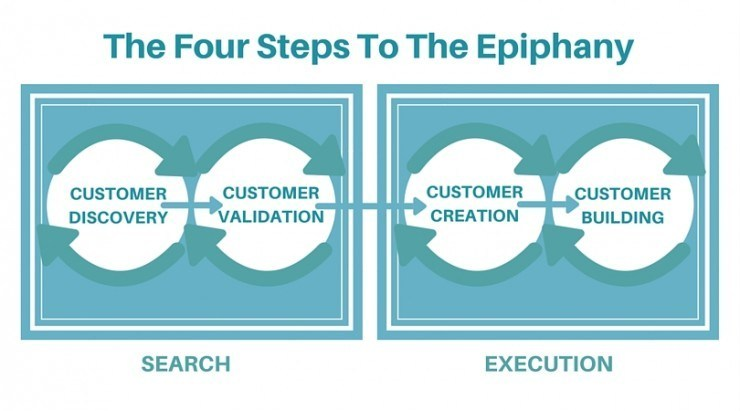

Building a software product base on the customers'needs, opinion, desires, and criteria.

<youtube-video id="xr2zFXblSRM"></youtube-video>

Here the general and common validations with customers are not enough. In this process, you are going to build, think, and make your business model based on the customer, even more than your own opinion and desires. After all, they're the ones who are going to consume. Let's begin!

<title-2>What is the Customer Development Process?</title-2>

This process is part of a development framework where users or customers find, create and validate the market of your business idea. 

And as if this were not enough, in this process users also participate in defining the features of your product to suit their needs better, participate in testing, and in the organization of resources for the business to scale. 

This process seems a bit bold, but it is accurate, and for others useful. 

It was developed by [Steve Blank](https://steveblank.com/) who is an entrepreneur and Business School Professor. 

In this process is essential to consider for the product the customers' views and criteria, because, in the end, they will be the ones to use it. 

This doesn't mean you don't make the product you want. The idea is yours, only that you would have to improve it and adapt it more to reality, taking into account the opinions and proposals of your consumers. 

In general, it composes of the following stages:

* The Search Stage, where you should discover the customer to validate him. Validate his or her necessity. 
* The Execution Stage where yo create the customer, you go for it, and then you build the company and the product based on the information recovered before.

It is important to emphasize that each step has proper and determined activities and substeps that should complete. But we will see in depth this information below. 

The process relies on the concepts on the scientific method:

- The observation and description of a problem or phenomenon from the perspective of the entrepreneur and of course, from the perspective of consumers. 

- The formulation of the hypothesis where we explain and delimited the cause of the problem.

- With the hypothesis made, an attempt is made to predict future results.

- Measure the results through testing and compare with the prediction

<title-2>Customer Development Process overview:</title-2>

In general, it composes of the following steps:

* Know the customer and the market.
* The observation and description of a problem or phenomenon from the perspective of the entrepreneur and of course, from the perspective of consumers. 
* The formulation of the causal hypothesis where we explain and delimited the cause of the problem.
* Make a prediction or measure possible future results with the observation of the causal hypothesis. 
* Realize experimental tests to measure the prediction performance.
* Once the problem is well identified and delimited for a group of users, a product is designed to solve it, which in this case would be a software product.
* The validation part of the customers and the market, to be able to know if the product has a chance to succeed and if it is viable too.
* You create the processes, the operative part of your company, the departments, and everything necessary to start the activities correctly and to be prepared before the planned scale. This is also known as "Company Building". 
* You build the product

<title-2>Customer Development Stages</title-2>

Source: [Cleverism](https://www.cleverism.com/how-customer-development-model-work/)

<title-2>1. Search Stage</title-2>

<title-3>A. Customer Discovery Step</title-3>

In simple words, this step is when you leave your area, your space, to look for customers and markets for the product that you want to develop.  At this point, you do not have enough information about the problem you are going to solve, about the people who have that problem, and about the market in general. 

In this first step, that's what you're going to discover and determine. 

The most crucial thing in this phase is to know and define well who your client is and will be. He is the real protagonist, and he is the one who will give you the necessary information about the phenomenon or the problem you are going to attack. 

In this step, try not to saturate it with proposals, features, or functionalities that you have in mind and would like to incorporate into the product. Dedicate yourself to getting to know it and ask it about the problem, not the solution. 

The most you could suggest to him would be the solution in general terms, and if he would like to have a product for it. All this, to lay the foundations on the market that later in this phase you will have to know and define. 

This step has three sub-phases:

* **Problem-solution Fit:** that is the validation with customers where they will understand and recognize the specific solution will solve a known problem to such a degree that they will buy it.

* **Product Market Fit:** At this point, it is not 100% necessary to have a first version of the product, but once you have collected the previous information, you should start to define, at least on paper, how you are going to satisfy the need or the problem you identified. And you should make sure to design a product that covers the demand of the market and the consumers too. This perfect match between the solution and the market demand generates what [we define as Product Market Fit. If you want to know a little more about this term we invite you to visit another post we made about this](https://cobuildlab.com/blog/achieving-product-market-fit-in-your-software-product/). In the meantime, it is enough for you to see that it is the perfect match between your offer and the market demand. This activity can do it in the form of a hypothesis, or if you wish, it is also possible to check it with an [MVP](https://cobuildlab.com/blog/minimum-viable-product/) or a prototype that you present to the customers after the initial interview of this step of the process. 

* **Sales Funnel:** defined as the customer purchase process business or marketing activities that must be done to mobilize consumers through the funnel and make them effectively buy your proposal.

<title-3>B. Customer Validation</title-3>

**It is composed for these items:**

**1. MVP validated**
**2. Validated Sales and Marketing roadmap:** This means that you understand the market segment correctly you are working with and with this, you optimized your conversion funnel from the knowledge of the product and the references you may have from customers. In practical terms, at this stage, you can determine that the money you invest in marketing will have its return and also its profit.

**3. Validated Business Model**

This stage is a more general idea. At this point, validation tells you that your business model is sustainable and scalable over time. In other words, the value you offer and establish generates profits over time that could exceed the operating costs of your business; in other words, the prices in technology, human resources, technical equipment, etc. 

Another type of startups or businesses at this point are limited to be governed by a market study,  and in the best cases, they make the validation by the hand of one or two testers or using a small consumers population. This is not bad, but under the perspective of the Customer Development Process, this is not enough, because the validation stage must be more in-depth. 

It is necessary to have more information that a market study or validation bring us. 

<title-2>2. Execution Stage</title-2>

<title-3>A. Customer Creation</title-3>

It's the third step. And that's where you're going to find some customers or at least the first ones. It can be with marketing efforts or the old-fashioned way, door to door efforts.

We would perhaps bet on less expensive methods than marketing, which should be done concretely in the next step. 

It can be defined as an initiation into the market. 

And of course, at this stage, you can also fine-tune details on the fly because as we told you, what matters is what the customer wants or needs more than what you think the product should comply. 

<title-3>B. Customer Building</title-3>

It would be the last stage. Where you capture all the learning and information you got in the previous steps and took them to action.

You structure departments, make the product, execute the marketing and sales plan, and make your project scale as high as possible. 

At this stage is where most economic resources are consumed because you already have all the information about the customer, the need, the solution, and the market. 

And that's all there is to it. With the **Customer Development Process**, you can develop software products and any product from a knowledge and action plan based on the understanding of the customer, the market, and the need or problem to solve. This way is how the product is structured, and then it is launched to the market. If you want to know more about this, consult us, we are ready to help.

