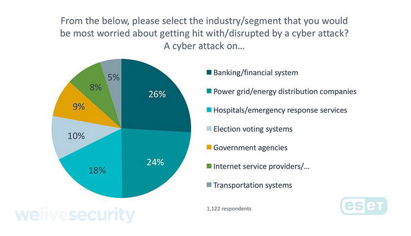

We always have felt the necessity of being saved. Maslow categorized as the second level of human necessities in his famous pyramid. So, the needed for security is an undeniable truth. 

Over time, the security is not only needed in jobs, feelings, economic resources, and family. Nowadays is more than a necessity on the web too. This necessity is called **cybersecurity.**  

<title-2>But, What is cybersecurity?</title-2>

Cybersecurity is more than a simple necessity. Cybersecurity is a group of actions that protect hardware, software, data, devices, and all systems you have connected to the internet. Of what? The famous cyber attacks. 

If you don’t know it, cyber attacks are usually for accessing, changing or destroying important information on your life, business, and everything is important for you.

<youtube-video id="JdfmV2KW11I"></youtube-video>

In cybersecurity, you see different elements as:

* **Application security:** is related to the use of hardware, software and which methods you can use to protect them of external threats. These methods are called countermeasures. Some of them are firewalls, routers that can prevent the IP address of an individual computer from being directly visible on the Internet, encryption/decryption programs, anti-virus programs, spyware detection/removal programs, biometric authentication systems, etc.

* **Information security:** this element of cybersecurity is related to strategies that managing tools, policies, and actions you make for protecting, detecting, and counter threats. Information security is related to safeguarding sensitive information. “Information security processes and policies typically involve physical and digital security measures to protect data from unauthorized access, use, replication or destruction. These measures can include mantraps, encryption key management, network intrusion detection systems, password policies, and regulatory compliance.” [search security](https://searchsecurity.techtarget.com/definition/information-security-infosec)

<youtube-video id="7L9JerWIT3Y"></youtube-video>

* **Network Security:**  They are some practices that protect a computer network and network-accessible resources. These policies prevent unauthorized access, use or modifications on devices that were part.

* **Disaster Recovery/ Business Continuity Planning:** once you plan, and select management tools, methods, and processes to protect your devices and networks, it will be time to do them or write everything in a document, and that’s exactly business continuity planning is. All of these, while a planned or unintentional disruption hampering regular business operations is in effect. Now, if you have an unexpected incident, you will need to follow a disaster recovery plan to recover the cybersecurity. The disaster recovery plan goal is to minimize the effects of an attack to continue working.

* **Operational security:** this is an analytical process where information is an asset, and you need to classify it and determine which controls do you need to protect it.

* **End-user education:** as the name says, this element is the education of end-users. How? Implementing a cybersecurity policy, procedure documents, showing tools, etc. Some experts think that one of the best ways to keep cybersecurity is educating end-users.  

<title-3>Why people are talking about cybersecurity nowadays?</title-3>

People now are talking too much about cybersecurity for many reasons and among them are the big cyber attacks that big companies, artist, banks, even employees have suffered the last years. 

If you didn’t know it cyber attacks are made generally with malware or how we commonly know it, virus. For example, the ransomware is a terrible malware that exists nowadays, is a trend to use it, and it is too much dangerous without mentioning that is difficult to recover from it.

November is the [National Critical Infrastructure Security and Resilience Month](https://www.dhs.gov/cisa/critical-infrastructure-security-and-resilience-month) and the team of [“We live security”](https://www.welivesecurity.com/2018/11/30/cyberattack-financial-sector-worries-americans/) made a survey to know what is the biggest afraid of Americans in relation to cyber attacks. The answer was really clear: the financial and banking cyber attacks.

Source: [We live security](https://www.welivesecurity.com/2018/11/30/cyberattack-financial-sector-worries-americans/)

In that month not only are surveys, also there are formative talks, conferences, and events in favor of education and cybersecurity culture. 

[Sony](https://www.bankinfosecurity.com/sony-pictures-cyber-attack-timeline-a-7710), [Yahoo](https://www.cashfloat.co.uk/blog/technology-innovation/yahoo-cyber-attack/), [Telefonica](https://www.ft.com/content/74c666ec-8dc7-3b20-b573-245bc0e9d935), [Chrysler](https://www.washingtonpost.com/news/powerpost/wp/2016/05/18/next-cyberattack-front-could-be-your-car/?noredirect=on), [Facebook](https://www.ft.com/content/c5f13f30-c33f-11e8-8d55-54197280d3f7), our favorite artists, even [our country](https://www.cnbc.com/2018/02/17/us-government-is-exceptionally-vulnerable-to-cyberattacks-security-expert-says.html) have been victims of cyber criminals, and that’s the main reason why cybersecurity is more than news, a desire, or something imaginary. It is a real and primary necessity. 

Technology is developing at an incredible speed and the consequence is more risks of been attacked. 

Actually, we can see in these days groups of cybercriminals in the whole world.

For example, [Anonymous](https://anonofficial.com/) is a really known criminal organization that exists from 2003. Likewise, Fancy Bears from Rusia, Ourmine, Shadow Brokers, Lazarus, and Tarh Andishan are some of them. And the worst, they have members in lots of countries in the world. So, we could be victims wherever we are.

So, people not only is talking about cybersecurity. Also, they are applying it and improving it. And you should do the same.

<title-3>How to improve cybersecurity</title-3>

Cybersecurity is from the passport of your social media account until the spyware or anti-virus you use in your devices. 

There are so many ways to increase the cybersecurity in your life or business. You could ask for a cybersecurity expert for that, but we want to give you some tips that will help you to step up:

* Invest in cybersecurity. This is the best advice we can give you.
* If you have a business and employees, look for training in the area. In that way, you will create a cybersecurity culture. 
* Reinforce your passwords. The two-factor authentication should be your best friend. 
* Having an antivirus is necessary too in every device you have. 
* Make a backup of your information. 
* Use VPNs for network connections
* Update your apps and programs. 
* Eliminate tools and software you are not using. 
* Delete expired browser certificates
* Look for a cybersecurity expert. They will give you the best tools for you.

<title-2>For 2019: debts and expectations of cybersecurity</title-2>

How we said, cybersecurity needs to be developed so much thanks to advances in technology and cyber crimes. 

Some experts think that one of the trends for the next year will be the data manipulation. In effect, people may feel insecure about information integrity. 

Others think that cryptocurrencies could be the objective of cybercriminals. The blockchain is almost impossible to hack, but some people think that someone is trying to do it. We will see next year. 

More and more cyber spies. This has been one of the favorite activities of cybercriminals, especially if it involves countries. Maybe it could be worst the next year. 

For that probably will be more common to see CCO (Chief Cybercrime Officer) in companies, governments, and organizations. 

Some people think that even [robots will be able to cyber attack us](https://www.businesscloud.co.uk/news/a-bot-cyber-attack-and-other-2019-tech-predictions) and make this prediction to the next year. Do you agree with that? 

Whatever the future awaits us one thing is so true and real; cybersecurity is within our reach to keep us safe. So, if you thinking about improving it, good for you, and if you are not, it is time to begin. Let's go for 2019 with a higher **cybersecurity**.

