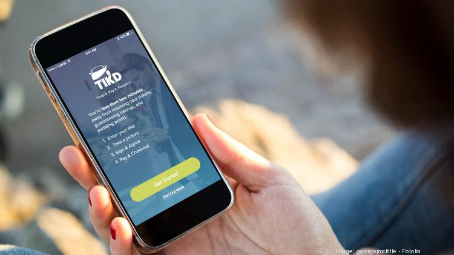

**TIKD** is a **Miami startup** that is solving the monitoring, payment, adjudication, and transferability problem associated with **traffic** and
**parking violations** for the 270 million registered vehicles in **the United States**.

From the beginning, it focused on providing access to justice and affordable payment options for the millions of Americans that can't
cover and emergency expense like a **traffic ticket**. From there we have turned it into a powerful technology that changes the way government
interacts with citizens and businesses. Since 2016, TIKD is providing drivers with a simpler, more cost effective way to handle traffic
tickets directly from their smartphones.

<credits>Photo by [Miami Herald](https://www.miamiherald.com/)</credits>

TIKD´s founder and CEO, **Chris Riley**, Served as on Officer in the United States Navy where he studied Political science at United State
Naval Academy. He has a Master of Business Administration at Harvard Business School. Has been President at Guzman Energy, LLC since 2013
and a visioner who is Revolutionizing the Ticket Industry.

Chris Riley founded TIKD after driving through what he said was a well-known speed trap in Miami that resulted in over $500 in fines. He
said it was the result of bad luck and random, punitive penalties. But TIKD, could have saved him both time and money.

Now he is determined to revolutionize the industry for all those who don't have the time to deal with traffic tickets so they just Snap,
Pay and Forget. All from their smartphones.

<credits>Photo by [The Business Journal](https://thebusinessjournal.com/)</credits>

They are disruptors using technology, big data and the law of large numbers to offer customers a multitude of benefits including
convenience, cost savings on the face value of their traffic ticket, affordable access to justice and the opportunity to minimize the
negative impact getting a traffic ticket can have on their driving license and record.

<title-2>Here’s how it works:</title-2>
The next time you get a speeding ticket, you now have a new option. Snap a picture of the ticket, type in the penalty
amount on the mobile-friendly **tikd.com** website, and within seconds you’re given an offer. You can pay the offered amount, generally 20%
lower than the stated fine, and that’s it. You’re all done. The company then sends in a lawyer to fight on your behalf, negotiating down
the ticket price further and ensuring you get no points. In fact, if it can’t get the points removed, you get a full refund (the company
has a 90%+ success rate). Meanwhile, TIKD makes money on the spread — the price you paid vs. the amount it can further negotiate down
the ticket.

<youtube-video id="https://www.youtube.com/watch?v=ztSDFEAOzxQ"></youtube-video>

<block-quote>We believe this partnership will be extremely valuable to vehicle owners and dealers within the shared mobility space,”
said Joe Furnari, CEO of HyreCar. “By vertically integrating services like TIKD on our platform, we are better able to quickly scale
inventory, which in turn drives customer retention, reduces costs and increases revenue.</block-quote> Oct 2018 http://bit.ly/2T8ZR1R

<block-quote>Get rid of your traffic ticket from your phone in two minutes, plus no points or your money back guaranteed</block-quote>
says Naveen Gurram  http://bit.ly/2NCejZV
