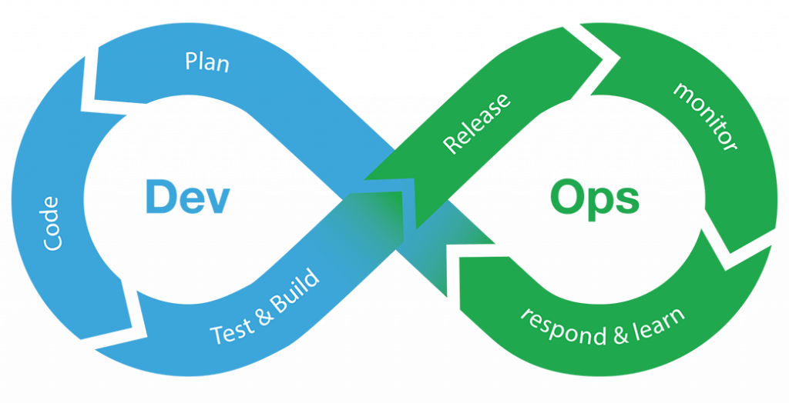

Miami, FL. Feb 16, 2022

Today <a target="_blank" href="https://www.cobuildlab.com/services/"> software development</a> is one of the largest and most important industries globally. Companies worldwide invest millions in software development to grow their businesses in the global market and <a target="_blank" href="https://www.cobuildlab.com/blog/benefits-of-using-productivity-tools-in-your-business/"> make them more efficient and productive </a>, achieving happier customers and better overall service.

Thanks to DevOps, companies have been able to develop faster and more efficiently their software and applications and leave aside a little conventional development. Next, we introduce you to **DevOps explanation and benefits**. 

 

<title-2>What is DevOps?</title-2>

 

The term DevOps, which is a combination of the words "development" and "operations," reflects the process of integrating these two disciplines into a single continuous process. 

DevOps is a set of practices, tools, and cultural philosophies that automate and integrate the processes shared by the software development and IT teams. It focuses on team empowerment, <a target="_blank" href="https://www.cobuildlab.com/blog/improve-communications-to-increase-team-productivity-by-developing-custom-software/"> team communication and collaboration </a>, and technology automation. 

DevOps teams use tools to automate and accelerate processes, making them more reliable. 

With a DevOps toolchain, couples can address core aspects of this methodology, such as continuous integration, continuous delivery, automation, and collaboration.

 

 

Source: <a target="_blank" href="https://idgrup.com/cinco-formas-de-crear-una-cultura-devops-de-alto-rendimiento/">  IDGRUP </a>

The DevOps lifecycle is divided into six phases, representing the processes, capabilities, and tools needed for development (on the left side of the loop) and operations (on the right side). Throughout each phase, teams work together and maintain communication to coordinate and align at speed and quality.

 

<title-2>Some DevOps benefits</title-2>

 

<title-3>**Promotes collaboration:**</title-3>

 

DevOps is an improvisation of simple, agile software development methodologies, as it also focuses on operations. Thus, DevOps promotes an environment where different teams work together to achieve common organizational goals. It means that the groups in your organization will no longer be isolated and will no longer work towards specific departmental goals. It reduces inefficiencies and saves time.

 

<title-3>**Speed:**</title-3>

 

Teams that practice DevOps release deliveries with greater frequency, quality, and stability. Continuous delivery allows teams to create, test, and deliver software with automated tools. <a target="_blank" href="https://www.cobuildlab.com/blog/importance-of-sustainable-software-in-custom-project-development/"> By increasing the frequency and speed of releases </a>, DevOps teams improve products quickly. Can gain A competitive advantage by releasing new features and resolving bugs rapidly.

 

<title-3>**Customer satisfaction:**</title-3>

 

Customer satisfaction is one of the things that can make or break your business. 

It is crucial for your business to thrive, as gaining new customers is much more expensive than retaining existing ones through improved customer satisfaction. Fortunately, one of the main advantages of DevOps is improved customer experience and, ultimately, customer satisfaction.

 

<title-3>**Quality and reliability:**</title-3>

 

Practices such as continuous integration and continuous delivery ensure that changes run smoothly and securely, which improves the quality of software products. Monitoring helps teams stay informed of performance in real-time. 

The quality of your software is essential for obvious reasons, and DevOps can help you maximize that quality. DevOps changes the way organizations do their traditional software testing. It makes testing a critical component in the entire SDLC and distributes its responsibility to all engineers involved.

 

<title-3>**Security:**</title-3>

 

It is an active and integrated part of the development process, as it integrates security into continuous integration, continuous delivery, and continuous deployment workflow. Safety is integrated into the product by implementing operational security audits and security testing in <a target="_blank" href="https://www.cobuildlab.com/blog/sustainable-software-project-with-agile-methodologies/"> agile development </a> and DevOps workflows. 

It follows the philosophy of constant iterative improvements, making the entire security management process more manageable. It also accelerates the speed of recovery if a security incident occurs.

 

<title-3>**Competitive advantage:**</title-3>

 

Implementing DevOps can be the trump card to provide that competitive advantage. 

The key differentiators that help a company be competitive are speed of software releases, high-quality features, continuous incorporation of feedback, and maximizing ROI. It translates into a decisive competitive advantage over those who have not adopted DevOps.

 

<title-3>**Innovation:**</title-3>

 

DevOps can only mean doing things faster at a reduced cost. But there is another clinical advantage that is often overlooked in business innovation. Usually, innovation occurs by tweaking an existing process or system, creating new ones, or introducing a better alternative to an obsolete procedure. 

DevOps enables you to deliver your software products quickly. This rapid software delivery frees up some of your developers' time, so they can spend it experimenting with any additional features or improving the effectiveness of existing ones. Developers can validate the feasibility of these ideas by performing proofs-of-concept and proceeding based on the results with minimal disruption to the current project.

 

<title-3>**Minimal cost of production:**</title-3>

 

Arguably, the most significant benefit of a sound DevOps strategy is the maximization of profitability from a business perspective. Interestingly, there are multiple ways in which DevOps reduces the costs incurred in an enterprise, either directly or indirectly. 

With proper collaboration, DevOps helps reduce management and production costs for your departments, as both maintenance and new upgrades are under a single, broader umbrella.  

 

<title-3>**Better manage unplanned work:**</title-3>

 

Unplanned work is a reality that all teams face, a reality that often affects team productivity. 

Established processes and clear prioritization, development, and operations teams can better manage unplanned work while still focusing on planned work. Teams that embrace DevOps practices work smarter and faster and deliver higher quality to their customers. 

Greater automation and cross-functional collaboration reduce complexity and errors, which improves mean time to recovery (MTTR) when incidents and outages occur.

Implementing DevOps in your <a target="_blank" href="https://www.cobuildlab.com/services/"> development projects </a> is undoubtedly a great advantage and a relief for your teams. If you want your company to be more competitive and productive over time, and that your customers are satisfied with the quality and delivery times is a fact if or if you must start using this development methodology to be the best. If you need help with your agile development, do not hesitate to write us, and without thinking, we will help you, do not wait any longer. What are you waiting for to reap the **benefits of DevOps**? 

**Cobuild Lab Team**

