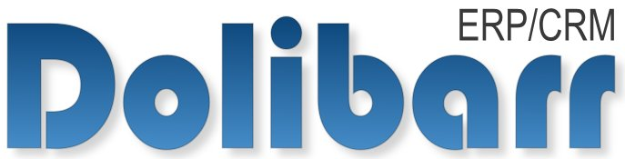
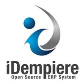

Before 1960 most software was **free and open-source enterprise**; this was because the programs needed a little development assistance to make the program better over time. Over the years, that slight help changed to more complicated support, this led to more significant software package development efforts, making software licensing a market trend. 

<title-2>But What is a Free and Open Source Software (FOSS)</title-2>

Open source means that you have access to the source code even for modifying it, and free software is related to having access to software for free, without any pay, differently of the open-source, which could have a price, usually low. 

For this post, we must integrate the ERPs FOSS programs; these programs are multi-functional since they allow the user to execute the program depending on how he needs it. The FOSS programs allow access to their source code; this will enable users to make corrections in their code, significantly improving the program. 

FOSS can also be modified slightly for specific tasks that the user requires. In combination with the open license, this simplifies the development process for many companies and gives them the flexibility that is not available within the limits of a proprietary or commercial product.

<title-2>Free and Open Source (EPR) Software</title-2>

Today in our companies there is a more significant workload, and as our company grows this load will continue to increase, so it is recommended for these cases to implement the use of an ERP system, these systems undoubtedly have the possibility of relieving the workload within the company by helping in the planning processes, purchasing, sales, accounting, marketing, among others. 

It is essential to say dear user that ERP systems integrate all your activities in one single platform so we can say that the information will be kept organized and will be carried out step by step. Another positive aspect of ERP systems is that they facilitate communication between workers, whether from the same or different departments; this generates a greater and more efficient response to a possible problem, reducing operational risks.    

**Source:** [Fiscgroup](http://fiscgroup.com/enterprise-resource-planning/)

<title-2>Some Examples Of  Open Source Enterprise Resource Planning Software</title-2>

<title-3>* Dolibarr ERP</title-3>

[Dolibarr](https://www.dolibarr.org/) is a great ERP system that has powerful tools for accounting, CRM, HR and inventory. This system is updated regularly so you can keep your tools up to date, always according to the business requirements of the moment. 
 
Dolibarr also has a network of very active users, which facilitates the repair of any problem and allows a discussion. We can also highlight that dolibar is a very well known system worldwide, so it is available in several languages.   

<title-3>* ERPNext</title-3>

[ERPNext](https://erpnext.com/) is a system that was designed for small and medium enterprises, which has a different package and tools to make life easier for the user. The simplicity of this system allows us to configure it, using simple forms to enter information about your company and guiding you through the whole process in a typical wizard-style configuration.

<title-3>* iDempiere</title-3>

[iDempiere](https://www.idempiere.org/) is a full-fledged ERP, with everything from invoicing to POS integration to warehouse management to forecasting. While iDempiere is open source, installing an ERP is never truly free.  iDempiere, like most open-source programs, relies on community support for troubleshooting. Businesses may also call in specialists with experience in iDempiere.

<title-3>* ODOO</title-3>

[ODOO](https://www.odoo.com/) is a general business management software. That includes CRM, e-commerce, billing, accounting, manufacturing, warehouse, project management, and inventory management. 

This software has two versions. First, the Community version (open source) called LGPLv3, which is supplemented on features and services by the Enterprise version's (proprietary).

<title-3>* OpenBravo</title-3>

[Openbravo](https://www.openbravo.com/) is an international business software company focused on helping retailers and restaurateurs through their internal processes.  The omnibus platform is one of their most significant proposals, which is the most flexible mobile and cloud-based.  

The **Free and open-source software** are undoubtedly a great advantage for companies since they allow them to reduce their operating costs because they do not have a license to use them, in the same way, they speed up the activities within the company and facilitate the work of users. They also allow you to make modifications to fit your needs, so they are an excellent option for small or medium-sized businesses that are growing.  If you want, we can develop another option for you or just introduce you to new options. Contact us and you will see. 
