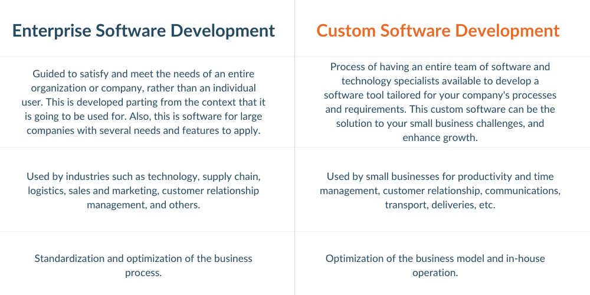

Enterprises, organizations, and companies today have met with the need of staying ahead with technology and everything it has to do with development services. Software development is the solution for a wide range of challenges to adapt to technology growth, such as customer service, productivity, customer relationship, databases, teamwork, etc.
The answer for many of the tailored-made features, tools, and characteristics for a specific requirement is based on Enterprise Software Development or Custom Software Solution.
To understand the differences and similarities, we first have to explain each of them separately:

 

<title-2>Business Software Development</title-2>

 

An <a target="_blank" href="https://cobuildlab.com/services/enterprise-software-development/">  enterprise software development</a> 
works to meet the operational needs of an entire organization or company rather than an individual user. Besides, this is software for large companies with various requirements and characteristics to apply.
Some examples of business software development are CRM <a target="_blank" href="https://cobuildlab.com/services/custom-customer-management-system/">  (Customer Relationship Management)</a> and business intelligence.

 

<title-3>Essential characteristics of an enterprise software development:</title-3>

 

<title-4>- Execution.</title-4>
It must function efficiently, including all areas in which it must work considering certain aspects of the business such as platforms and mobile applications.

 

<title-4>- Scalability</title-4>
It must evolve according to demand, so the software architecture has to adapt to sudden changes, whether they grow or not.

 

<title-4>- Safety.</title-4>
A security breach or bug can be devastating for any company with enterprise software development. Efforts should be made on its security, even incorporating other external security properties.

 

<title-4>- Cloud storage.</title-4>
A software development company includes this service within it. That will allow you to have all the data in one place. Also, it provides the agility and durability of access to the data, whenever and wherever you want.

 

<title-4>- Flexibility and performance</title-4>
An enterprise software may have the ability to provide microservices. The functions can be divided independently into small areas to operate on the industry sector that needs them.

 

These software development solutions have been used by large industries, governments, retailers, hospitals, and departments such as sales, marketing, customer service, finance, supply chain, logistics, and many others. Review the list below for the features and device for each industry:

- Government: Government's first software used is accounting software. Some of the prominent features for these are fund accounting, liens, custom reports, audit trail, and user rights.

- Retailers: Today, the software application for Retail Management is essential to address the following functionalities: Inventory Management, Customer Management, Retail Accounting, purchase orders, payroll process, and more.

- Hospitals: There are many kinds of healthcare software, electronic health record software, medical database software, medical research software, medical diagnostic software, medical imaging software, telemedicine software, appointment software ( programming), etc.

- Sales and Marketing: Customer relationship management (CRM), sales pipeline tracking, emailing, campaign scheduling, workflow automation, reporting and analytics, content management, and marketing.

- Customer Service: There are a few features to consider in customer service management: omnichannel communication support and live chat, customer sentiment analysis, internal chat option, a self-service portal, and ticket optimization.

- Finance: A financial management software must meet specific expectations with metrics such as automation and management of general accounting procedures from start to finish, planning, and forecasting, cash flow management and tracking, advanced reporting, and analytics.

- Supply chain: An efficient supply chain management software must be integrated into the entire supply chain process, have real-time collaboration capabilities, process optimization capabilities, analytics, forecasting, customization, and data-based access cloud.

- Logistics: logistics operations are achieved faster, with lower costs and risks. What are the areas you will manage through the Logistics Software? Customer request processing, purchase order processing, inventory management, supplier management, sales, and distribution.

 

<title-3>Benefits of an Enterprise Software Development</title-3>

 

Beyond connecting a few departments and having intuitive tools, some benefits you will  receive once you acquire an Enterprise Software Development:

Standardization of business processes in a development framework based on the improvement of the workflow and the process following a baseline of good performance.

An enterprise software product can integrate all business management functions and avoid or eliminate conflicting information from different sources.

- Improved productivity: Employees are more motivated and satisfied when efficient guidelines and processes are promoted. There are potential features like automation and real-time visualization that increase the ability to achieve goals.

- Improve income: When software helps a business's operations, it's much easier to identify areas for improvement, set competitive prices, and more.

- Manual data causes errors and mistakes, so say goodbye to them. With software development, there is the solution of acquiring and moving the data.

 

<title-2><a target="_blank" href="https://cobuildlab.com/services/custom-software-development">  Custom Software Development</a></title-2>

 

Custom Software Development is the process of having an entire team of software and technology specialists (developers, UX UI designers, QA's, project managers, product owners) available to develop a software tool tailored for your company's processes and requirements. This custom software can be the solution to your business's challenges and enhance growth. To develop custom software, we will need to understand your specific processes, problems, and needs.

 

<title-3>Essential characteristics of a Custom Software Development</title-3>

 

<title-4>- Scalability</title-4>

With custom software, you ensure this tool to be scalable for future changes through adaptation and accommodation based on a few requirements.

 

<title-4>- Integration</title-4>

Custom software development can be fruitful in terms of allowing seamless integration, and considering the current system when creating the model for this software development, it may be adapted and integrated within the current IT ecosystem.

 

<title-4>- Predictive analysis</title-4>

This is the branch of advanced analytics that is supposed to make predictions about unknown future events. Predictive analysis uses several techniques, such as data mining, statistics, modeling, machine learning, and artificial intelligence.

 

<title-4>- Updates</title-4>

When it comes to changes, custom software development has it. With this service, you can change any characteristic or trait you have whenever you want. You don't have to wait for new features to arrive to apply them to a custom software solution.

 

<title-4>- Competitive Advantage</title-4>

Standing out in such a crowded market is possible with custom software development, giving you the freedom to add features that improve customer relationships, productivity, and more. Customers will perceive it!

 

<title-3>Solutions that a Custom Software provides</title-3>

 

- Mobile and <a target="_blank" href="https://cobuildlab.com/services/web-development/">  Web Development</a>: Professionally crafted websites with design and distribution.

- UI and UX Design: This will make your company look awesome, with accurate content distribution.

- <a target="_blank" href="https://cobuildlab.com/services/mvp-software-development/">  MVP Software Development</a>: Having that product that will help you improve your market positioning is essential, and it's possible with custom software.

 

<title-3>Benefits of a Custom Software Solution</title-3>

 

A custom system specifically tailored for your company will give you many advantages:

- Optimization of business processes. Each organization has its specific processes, operations, and business model. Therefore, the software must be designed and developed in such a way that it can align with and follow the business model and internal operations. This custom software helps optimize your business.

- Emphasize commitment to your business. Having your software for your business gives you the credibility that interests you and the values ​​of your internal processes and your business model.

- Uniqueness. Your software will be the only one with the selected features and tools and, of course, the requirements of your business.

- Adaptability. With changes and evolution, you have to adapt to new processes and technologies to maintain your marketing strength.

- The profitability is there. A custom software development and development process plan and phase, depending on your budget, individual process flows can be automated.

 

Let's compare them!

