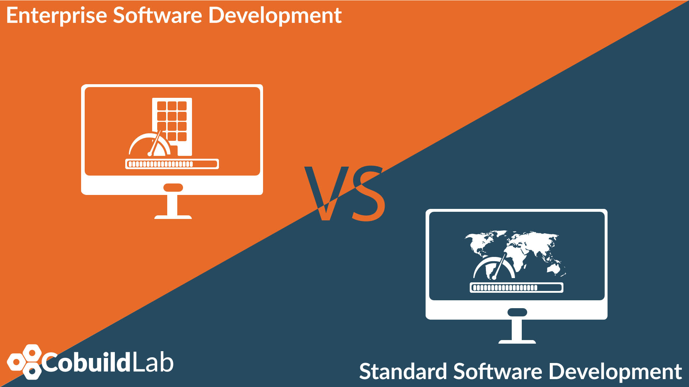

Although [software development](https://cobuildlab.com/blog/best-software-development-process/) is only one, if it is executed on startups for the development of new Software Products, or if it is applied on a company to replace a system, we can see certain particularities or aspects that change a little. 

But don't misunderstand us, it's [software development](https://cobuildlab.com/blog/best-software-development-process/) in essence, and the result will always be a software product or a software solution. For you to see this better, we will talk here about the Enterprise Software Development and make another posts about [Software Product Development](https://cobuildlab.com/blog/product-development-process-for-software-products/) when it comes to startups. Then you will draw your conclusions.

If you have an organization and want a software solution that automates processes or makes it more productive, this post will interest you very much. Let's get started!

<title-2>What means Enterprise Software Development?</title-2>

The first thing you should know about this modality of software development is that it is a software whose goal is not to meet the needs of a specific person or a particular. Enterprise Software Development is intended to meet the needs of an organization that already exists and a system (maybe manual) that is in place.

This software development is developed based on an environment within an organization, which is where it is going to be used and where it is going to meet a goal.   

It is also known as Custom Software development, and as a result, you usually get useful tools to develop the business. An example of this type of software is an online payment processor, product catalogs, a process automation tool, a quick project management tool, systems integration or applications, forms, among others. 

Also, the development of software for enterprises models or marks the functioning of the organization, because once the solutions or tools are obtained, what happens is that they originate new methodologies and processes. 

In addition to setting the tone and offering solutions, Enterprise Software Development aims to improve efficiency, productivity, and business functionality. 

[Martin Fowler](https://martinfowler.com/), who is a prominent developer, and British speaker, considers that enterprise apps, which would be one of the results of software development for companies, are referred to the view, manipulation, and storage of large amounts of complex data generally, which lead to support and automation of business processes of the organization. 

Source: [Wikipedia](https://en.wikipedia.org/wiki/Enterprise_software)

In the same way, these enterprise apps serve a large number of users who are usually connected through a computer network.

<youtube-video id="84RsYvBJEUA"></youtube-video>

<title-2>Particularities and characteristics of the Enterprise Software Development</title-2>

Enterprise Software Development not only has a clear goal. Also, it has certain aspects that characterize it and doing it differently from standard or particular processes as well. 

These are organizations that already have the experience. They must control the resources, or the actions they perform so that their margin of error was lower because the consequences could be much more complicated if something were wrong. 

You can find out more about these special features below.

<title-3>Performance</title-3>

Of course, the performance of an app or enterprise software must be implicit. This type of software needs to work very well because they will be vital parts on processes within an organization, and often involve economic processes. 

As we well know, companies are like clocks. If something does not work well, the integral component of the organization will be affected. Precision and quality cannot postpone them. 

In addition to this, this type of software is usually very demanding. This software is used by many people simultaneously, and by different kinds of devices, ranging from desktop mobiles and sometimes can even be industrial. This high demand makes prevailing an excellent performance of the app or the software. 

That's why testing and quality control in enterprise software development is much more thorough.

<title-3>Scalability</title-3>

Scalability is a quality of any software product. A product that is not scalable will sink, be out of the market in a matter of time. 

Scalability determines the growth and advancement of the software, in functionality, in features, and any aspect deemed necessary. This growth, of course, should not affect the performance of the software. 

<title-3>Security</title-3>

Security is also another critical topic in enterprise software development, normally the most important. 

It is a subject that requires investment, specialists, and depth analysis. And we are not only talking about the security of computers, servers, and code. We are talking about cybersecurity for the employees or people who use it, for the information it handles, but also security for all the devices that make up this network. 

Attacks by cyber-criminals are increasingly harmful and not only compromise information but also infrastructure. If it is a medium or large organization, this topic is of special care and therefore tops the list of particularities of the Enterprise Software Development.

<title-3>Cost</title-3>

If you already have a company, you know that money and time matters a lot. That's why this topic is also dealt with a lot of particularities in software development processes for companies. 

When we talk about costs we mean to have a thorough planning and absolute control of all the monetary factor from phase 1 of the project, the initial investment, up to the maintenance costs after the soft launch of the MVP and the full launch of the product. 

If it is an organization that already exists, cost controls are much more rigorous because there are many existing items, and a small imbalance can have severe consequences for the development of the company. And there is also the issue of return on investment, which we will discuss in the following point.

<title-3>Fast ROI</title-3>

As we told you, the control of expenses in the development of business software is rigorous, and this includes an expectation of ROI or return on investment and the time in which it will have. 

This factor is a priority, and it is possible to measure it with indicators such as productivity, efficiency, and the impact of this on the overall budget (you earn or save more money or resources). 

In the development of software for business, the return on investment cannot be long term, should be estimated its start in the short or medium term, and once it happens should be documented to calculate also the profits of the development. You must always earn something for the organization because otherwise, it would not make sense to do so. 

<title-3>Interconnectivity</title-3>

More than one person almost always uses enterprise software that is developed, and sometimes simultaneously. Sometimes it even works through interconnected networks. And as if that weren't enough, it also usually interacts with other tools, devices and software. 

If this fact is not respected in a development project for a company, it can be very harmful to the internal processes of the organization that is using it. That is why this software must be very well integrated with the established workflow or improve it so much that it is not necessary to be integrated, but in general, it must.

<title-3>Robustness</title-3>

This topic is related to security, interconnectivity, and in definition, is the strength and support that characterizes a system or software for business. 

It must not only be developed with robust, proven, reliable, and secure technology. It must comply with minimum security standards; it must be compatible, versionable, easy to access and manage for authorized persons, it must have a record of the activities and processes it carries out and several qualities that make it a robust software. 

<title-3>Customization</title-3>

Each of these tools, as we said, is designed for a business environment and meet the needs of departments, teams, or employees of a company. But they are also tools that are usually customizable.

<title-3>Storage</title-3>

The issue of storage is critical. It is supposed to be considered with a lot of detail in enterprise software development. 

Not only because one works with large amounts of information, but also because this information must be stored in the best way because it can be used in the future. Either by audit, to measure productivity, see where it can be improved, business intelligence, etc

It must be stored and stored well. The cloud may be a good option, but today there are many more options, which the technology expert or the team that helps you develop the software must choose.

<title-3>Difference between Enterprise software Development and New Software Product Development</title-3>

We have already mentioned the main difference between the development of startup software or new products concerning enterprise software development. And this is that, when it comes to startups, a product is created that meets the needs of a particular person or a group of people who have similar qualities or rather a profile on an environment of high uncertainty, while business software meets the needs of an organization. More than people, this software is designed for companies, processes, work environments, and automation. This is the starting point for all of the differences listed below:

* Another difference they have is the environment in which they develop software products. In the case of traditional startups, the environment that is taken into account is an open market, generally demographically located, while in enterprise development the context in which the product or app is developed and used is business, is a closed and limited work environment. 
* Related to this, we can also say that in traditional software development a product is launched to a heterogeneous public, which although segmented, have different thoughts, criteria and many personal reasons that may intervene in the way you use the product and feel with the product. In the development of business software, it could be said that the target with which we work is more homogenized, mainly because they are people who use this tool in standardized processes, are processes that regardless of the person who executes them have a form. And that in general, the interaction that the different consumers have is very similar or the same. 
* We could say that enterprise software has a slightly longer useful life than mass or standard software, and this is for the issue of updates, versions, and improvements make through time. This premise is partly due to economic resources; in the estimate, you should even plan some updates, and they are usually medium or long term. These apps or systems are very well thought out and often, do not need significant updates over time because what you are looking for is to be more productive or optimize processes.  
* Software for companies is usually used to reduce costs or automate processes and thus be more efficient and productive. Mass consumption software does not necessarily have this purpose. 
* Enterprise software necessarily manages and stores large amounts of essential data that will be used for various purposes.  This is why the subject of storage is vital in this type of development. This is not necessarily the case with standard software because it may not be relevant. 

<title-2>Do you apply to have a Technical Co-founder or add a Technical Partner in this area?</title-2>

The answer is yes. If you have a medium-sized or smaller company, perhaps you have an IT department, technology specialists within your team, but maybe you do not have a Technical Co-founder yet,  and you want to develop software for your company that automates processes, improves internal operations or complements the one you already have, perhaps it is a good idea to bet on a contractor or a Technical Co-founder. 

This would help to renew all your systems; it would inject oxygen not only to the most critical internal processes but also to the company and your work team. He or she is a specialist, who would enter your organization's environment to add innovation, technology, new ideas, greater [cybersecurity](https://cobuildlab.com/blog/cybersecurity/), and in general, positive things. We think it's a great idea. 

If you want to know more about this or are interested in our support in this area, do not be shy, contact us. 

<title-2>Good examples of Enterprise Software Development</title-2>

* An excellent example of business software is the [workflow tools](https://cobuildlab.com/blog/workflows-in-your-business/) that are so good that some companies include them as an essential, inherent need of the company. 

There are many examples of this type of solutions such as [WorkFlowGen](https://www.workflowgen.com/), [Trello](https://trello.com/en), tools such as [Slack](https://slack.com/intl/en-ve/), which were not designed for your company, but are a massive product, but offer the solution you could look.  If you need to automate for example the assignment, management, and control of tasks, having a team that develops a tool similar to this one but adequate to your needs may be the best thing that happens to you.

* Another example are CRM or Customer Relationship Management (CRM) Software. Another example is CRM or Customer Relationship Management (CRM) Software. With this type of business software what you are looking for is to have a kind of database of all customers and potential customers of your company along with the places where you can contact them. If it is in person, by phone, by social media platforms, and also the details of when you last made contact with them and all the attention or history you have with each customer. 
"Typically, the best CRM services include features like workflow automation, dedicated document libraries, role-based user access, multi-currency support, email integration, and tracking, and lead capture from websites and custom reporting." Source: Sisense
This tool can also be developed for your company.
* Almost any tool that automates your company's process or helps you to increase productivity. This is 100% customized. Not all companies have the same needs or perform the same activities. 
There are no limits when it comes to Enterprise Software.

<title-2>Conclusions</title-2>

1. Enterprise software is a technological solution that helps improve the processes and development of a company that already exists.

2. It is created based on the needs of a company

3. Enterprise software is an excellent choice for those who want to improve some aspect of the company's productivity, and have already tried everything with human capital. 

4. There are many business software options available in the market, or that can be developed from scratch and completely customized for your company.

5. This type of project has precise controls and particularities that make it distinctive from standard software development.

6. They are products developed and planned in the long term so that they have a long useful life. 

7. It is a good idea to bet on a contractor or a Technical Co-founder to develop a software of this type since it adds knowledge, experience, and innovation.  

Do you have a company and want to develop software to make it more productive? **Enterprise Software Development** is the best solution for you. We hope this information has helped you a little, and if you want more, we are to order for you. 

