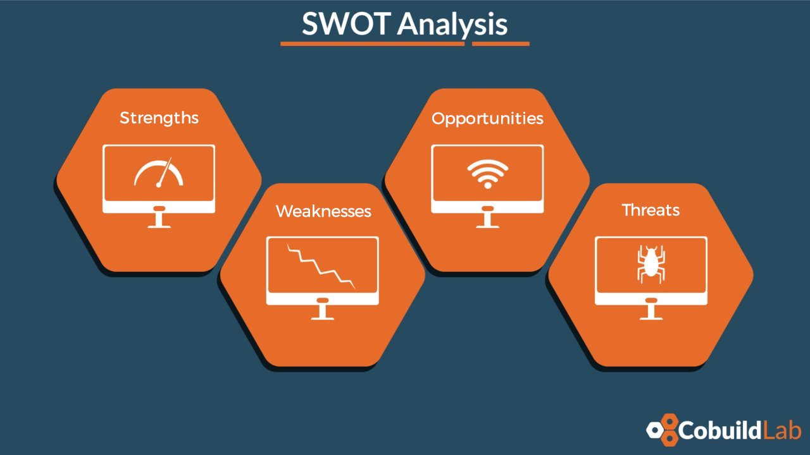

The **first steps a software entrepreneur** takes are crucial for success. These will be the basis, the foundation upon which you will build your idea, your opportunity, your plan, your business, and your [New Software Product](https://cobuildlab.com/blog/software-development-for-new-products/) or [Enterprise Software](https://cobuildlab.com/blog/enterprise-software-development/). 

<title-2>Without further ado, let's take a look at the first steps you must take as a software entrepreneur</title-2>

<title-3>1. Think of your strengths and weaknesses</title-3>

As human beings, we have strengths and weaknesses. Usually, we are better at some things than others, but when we are starting as entrepreneurs, we must be aware of them in order to improve. 

If you are good at something, take advantage of it, but if you’re not, train yourself in it. Look for professional help or find an ally who has that strength, and can contribute it to the project you’re starting.

It will allow you to reinforce your weaknesses and help you find ways of exploiting your strengths. This early step can give you a solid foundation in the entrepreneurial process.

An excellent technique to help you discover your weaknesses and strengths, even going a little beyond that knowledge is the [SWOT analysis](https://www.mindtools.com/pages/article/newTMC_05.htm). 

This will be something that you’ll be able to use your entire life as an entrepreneur, from before you start your project to even after you launch it. 

In this analysis, you can visualize the internal strengths and weaknesses that you have as a person, and also the opportunities and internal threats that you have as an entrepreneur.

How can you discover them? In the following way: 

* **Strengths**

What are you good at naturally?
What skills have you worked to develop?
What are your talents, or natural-born gifts?
What are your advantages?
What do you do better than anyone or at least better than average?

* **Weaknesses**

What are your negative work habits and traits?
Does any part of your education or training need improving?
What would other people see as your weaknesses?
What could you improve?
What should you avoid?

It's best to be as realistic as you can, and face any unpleasant truths as soon as possible. 

* **Opportunities**

Look at the external factors you can take advantage of. 
What is the state of the economy?
Is the software industry growing?
Is there new technology in your industry?
What excellent opportunities can you spot?
What interesting trends are you aware of?
Changes in social patterns, population profiles, lifestyle changes, and so on.
Local events.

All of these are opportunities for you as an entrepreneur. A useful approach for looking at opportunities is to determine your strengths and ask yourself whether these open up any opportunities. Alternatively, look at your weaknesses and ask yourself whether you could open up opportunities by eliminating them.

* **Threats**

Is the software industry contracting or changing directions?
Is there intense competition for the products or ideas for which you are best suited according to the strengths?
What is the most significant external danger to your goals?
What obstacles do you face?
What are your competitors doing?
Are quality standards or specifications for your job, products, or services changing?
Is changing technology threatening your position?
Do you have bad debt or cash-flow problems?

All these questions can help you with the work of finding your threats.

<title-3>2. Discover and express your mission</title-3>

Know yourself, your aspirations, your long-term goals. It's an introspection exercise where you go to see where you want to go. What would be the purpose of your undertaking? And this applies even to your idea. What would you like to fix or solve in society, in your surroundings, etc. 

Look long term, because if you don't, you're more likely to lose your way and not even find a good reason to do everything you do beyond only generating money. 

This exercise is invaluable because you will only be able to find what you are looking for based on what you are and want. On the other hand, if you don’t have a clear idea of where you’re going or what you’re looking for it will make it very difficult to get there.

This doesn't mean that if you didn't complete this step, you won’t be able to find a purpose or  medium and long term goals. Yes, it is possible that you can achieve it, you just have to make the extra effort to align your purpose and goals now.

<title-3>3. Begin to make decisions</title-3>

This is one of the most important skills you can develop as an entrepreneur and for any other project in reality. You must learn to make informed decisions. The main reason being that you and you alone are going to be responsible for everything that happens. 

The path of decisions, although very important is not easy, but it is not impossible either. It is a habit that will be perfected as you develop as an entrepreneur.. 

One of the biggest decisions you could face as you undertake your software project is to decide whether you should  continue being employed or dedicate yourself full time to your project.. If you decide to be an employee, it will require much more work and effort. You must fulfill two responsibilities: those of your job and also all the activities of the new venture. You will strive twice as hard as the typical employees. But this effort without a doubt, and if you follow the steps correctly is very likely to be well rewarded. 

Another decision you will have to make from the beginning is the issue of financing. You should choose a [funding method](https://cobuildlab.com/blog/methods-to-raise-funds-for-your-startup/) or find a way to get your project started. Although you don't need to have an extreme amount of resources to get started, the money will always be necessary. Think smart, and if you want, we invite you to read some [financing tips](https://cobuildlab.com/blog/tips-to-raise-funds-when-you-are-entrepreneur/) that we do in advance for entrepreneurs like you. 

[In Miami these can work for you.](https://cobuildlab.com/blog/know-venture-capital-firms-in-florida/)

Another important decision you will have to take is who or whom will be part of your team. They should be people who share your vision, but also know how to develop a software product, and materialize your wishes as an entrepreneur. 

And in general, there are several decisions that you will have to make even before starting your business. Try to get as much information as possible, analyze the advantages and disadvantages, think of possible scenarios, and decide what is necessary. 

<title-3>4. Be aware of the problems or situations that those around you have</title-3>

This is very important. Knowing your environment, problems or situations, or even thinking about what you would like to improve in your life, can give you excellent ideas that will help shape your business.

If you happen to be developing software that you don't visualize in your local region, then you must work extra hard since you must also know the problems and situations of the environment you want to reach. 

Knowledge is power. Although this may sound cliché, it is true. Having knowledge and empathy for a person’s reality can help you develop a more compelling product. Empathy and knowledge are two skills that if you don't naturally have them, then you must develop. 

<title-3>5. Develop super habits and put them into practice</title-3>

To be a super entrepreneur, you have to have super habits. This is not a superpower. It is the understanding of good habits, like responsibility, organization, leadership, diligence, creativity, respect, punctuality, and many more ethical practices you must constantly strengthen. 

Taking charge of yourself and the business you are going to start as well as the team that will be under you is done by first setting the example.  And you will have to do all this without expecting any recognition or reward. 

There are no bosses, no schedules. No one would know if you work less or more. But there is something bigger: a mission that should excite you and one you should feel identify with: your future and your business. 

<title-3>6. Stay up to date</title-3>

We have told you about the need to be informed on many occasions. And we will continue to do so. 

If you are starting a business linked to software development, you must look for someone who may advise you. Not knowing anything about it or not seeking help is a mistake. This is necessary. You don't have to be the most prominent expert, but you should be familiar with it. You must understand and have the right partnership that can also help you make this step happen. 

The right partner is someone willing to explain the technology to you. To help you can understand enough without having to be the technical cofounder.  That way you will be able to pitch and sell your software product in front of others, comfortably being able to explain the functionality and technologies used. 

Never be satisfied with any amount of knowledge. Always look for more, this will open many doors in the future, and will make you continuously improve, question yourself, etc. 

<title-2>Entrepreneurial Myths</title-2>

* **An efficient and effective entrepreneur is not the one who does many things with the least amount of resources.** They are the ones who do the most important things, in the least amount of time with moderate effort and investment.

* **An entrepreneur doesn't organize when he has time.** The available or free time comes when he habitually practices the organization, hierarchization, and distribution of charges, responsibilities, list of to-dos, etc.

* **The entrepreneur is born.** The entrepreneur can be trained, working on themselves, developing personal skills, choosing the right people for their team, and most importantly, giving free rein to creativity. 

* **If the economic environment is not promising, entrepreneurs won’t be able to start, or the path will be too steep for them.** This could not be further from the truth, even less so now, with so many [funding methods](https://cobuildlab.com/blog/methods-to-raise-funds-for-your-startup/) including even digital financing. Still, without getting funding it is possible to start a software project with an accelerator, which would take care of this. Also, by looking for the help of a [software development company](https://cobuildlab.com/) who could take on the quality of technical cofounder, it will not only improve the quality of the product, but it will reduce the initial investment significantly. If you want it, you can achieve it, just like that.

Be careful; don't be influenced by false myths. 

These are your first steps in a long journey, which will have many satisfactions and challenges along the way. If you are already in this process, we wish you the best. We hope that you not only meet your goals, but that you also exceed them. If you need some help developing your idea or your software application, we are here willing to help you. **Good luck, entrepreneur. At this point, you are one in thought and action.** 
