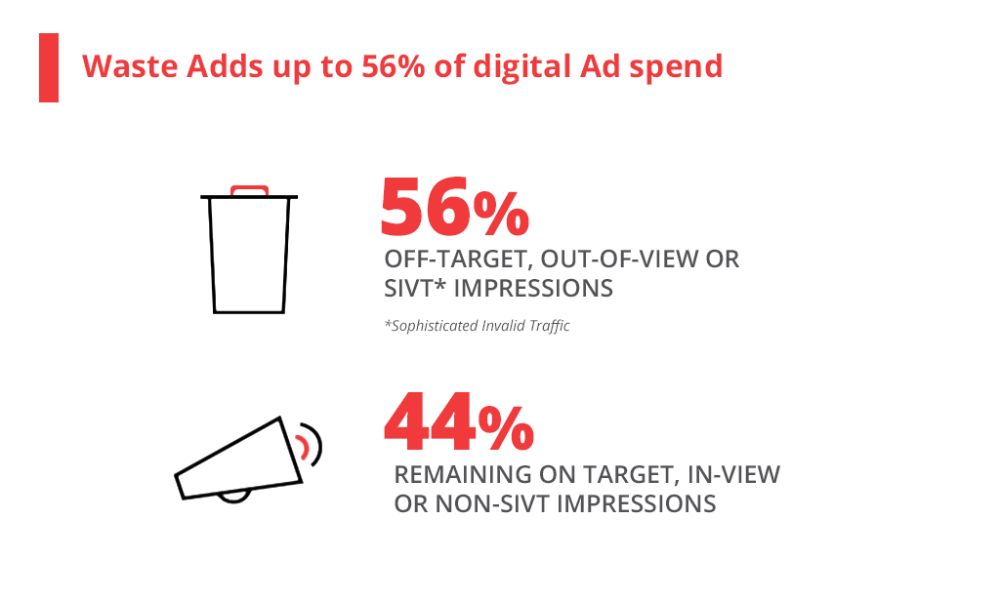

Advertising is a valuable business since it was created. It generates a lot of resources, makes brands sell, makes markets grow, and generally moves the world.

With the advance of technology, the advertising industry developed even more and now uses applications, pages and endless software resources that make easier, effective and efficient work and advertising activities, and at the same time, generated more money for those who perform activities of this type, as well as for the amount of software startups that appeared and created what we know today as the industry of **AdTech** or Advertising technology.

<title-2>Let's define it</title-2>

AdTech is a term that refers to all software tools and systems that somehow analyze and manage advertising activities or programmatic [ad campaigns.](https://cobuildlab.com/blog/Planning-your-ads-campaign-on-10-steps/)

["The advertising ecosystem is made up of advertisers, demand-side platforms, Ad Exchanges, supply-side platforms, and Publishers"](https://theappsolutions.com/blog/development/what-why-how-adtech/). This creates a market where demand and supply generate revenue for any of the parties involved. And all this is achieved by collecting data, analyzing them, and processing them on a given platform.

To do digital advertising requires a big computing capacity, and a lot of information, which if you wanted to carry it on your own, it would be challenging and expensive. It is better to invest in services and products developed for AdTech that born. They offer products and services of quality and that are always developing new alternatives for this world of advertising. Sometimes on their own, and other times with the support of large technology companies that have proven to be very interested in this field. This is the case with Google and Facebook.

Need a better explanation? here's a video:
<youtube-video id="j-9bunwHZqM"></youtube-video>

<title-2>Why AdTech is considered a trend?</title-2>

The advertising industry is very lucrative since it was created, and with the software complementing it, its growth has been much more significant.

This industry moves lots of capital in the world — those who offer advertising services, and who need exposure on web or digital platforms.

Google and Facebook practically monopolized this market here, but the emergence of many startups also occurs because of two reasons:

1. These large companies do not think twice about investing in small software startups, buy them, or even support them with technology.

2. If this is not what you want as founder, the market is always open because there is not a company in the world that does not need advertising, and always look for new options to carry it out.

Another good reason why AdTech has become a trend is that the internet is so full of information and value proposals. Some experts think that only the [SEO optimization](https://cobuildlab.com/blog/seo-tips-that-will-increase-your-position-in-search-engines/) for content already falls short and require additional efforts to be visible on the web. Of course, this does not happen everywhere in the world. Specific markets are still very open. This demand for online advertising is an ocean of opportunities for all startups specializing in advertising.

All this without mentioning all the advances in technology that make this type of [software products](https://cobuildlab.com/blog/software-development-for-new-products/) a much more complete experience, fun, effective, efficient, and better in many aspects. Much has been done in the AdTech industry, but there is always room for [innovation.](https://cobuildlab.com/blog/identifying-opportunities-to-create-a-software-product/)

<title-3>Evolution of AdTech industry this 2019 (The Worldwide Panorama)</title-3>

Let's be concrete with the reasons and list them so that you understand them better:

- [Time Warner Inc. was purchased by AT&T](https://about.att.com/story/att_completes_acquisition_of_time_warner_inc.html) who invested \$85 billion to continue moving resources in this industry.

- An Israeli startup that allows developers to acquire users and advertisements on game screens for mobile devices is an example that AdTech industry startups have enormous opportunities to succeed beyond those not supported by the giants of technology. Its name is [IronSource](https://www.reuters.com/article/us-tech-ironsource-outlook/israeli-adtech-firm-ironsource-sees-revenue-of-900-million-in-2019-idUSKCN1RD1VY), and its director and co-founder noted that this 2019 is estimated to close the year with more than \$900 million in revenue. Omer Kaplan is his name, and he considers that there are still many opportunities and spaces in the market, because although Google and Facebook have primarily dominated, they have had a steady growth in recent years and for some stagnated or slow, while small or medium software startups have had exponential growth.

- This market has also grown thanks to the exponential growth of companies such as [Trade Desk](https://www.thetradedesk.com/), [AdRoll](https://www.adroll.com/), [Criteo](https://www.criteo.com/), Google, [4C Insights](https://www.4cinsights.com/), [InMobi](https://www.inmobi.com/), [Amobee](https://www.amobee.com/), [Adform](https://site.adform.com/), [IgnitionOne](https://ignitionone.com/), [Kenshoo](https://kenshoo.com/), [AppNexus](https://www.appnexus.com/), [Quantcast](https://www.quantcast.com/), [FlashTalking](https://www.flashtalking.com/), etc. They are all members of this industry. And you can be too from today.

<title-2>Particularities of the AdTech Industry for startups</title-2>

Like all industries, businesses, and markets, there is always some risk, some difficulty, and certain particularities that are not the most positive.

Knowing these aspects is essential because it helps you make an informed decision taking into account the opportunities and threats that exist. Not everything can be useful.

The decision we refer to is the choice of the industry in which you will develop your software product.

- In the case of the Ad Tech industry, you should know that many times tools are excellent, the value proposition unique and innovative, but this does not give a 100% guarantee of effectiveness. You must clarify this issue to your consumer saying that it is probably that their ads investment would be lost if they do not follow the steps for developing and optimizing an ad campaign, or if they do not use the software tool, you are providing.

[According to Nielsen's 'Measurement Breakthroughs' report, 56% of advertising campaign impressions are lost](https://innovecs.com/blog/adtech-trends/) due to fraud or off-target audiences. This number could affect your customers without necessarily being your and your solution's responsibility.

**Source:**[Innovecs](https://innovecs.com/blog/adtech-trends/)

- Another issue you must solve or take into account if you want to develop a software startup in the advertising industry is billing in more than one universal currency. Advertising is a universal language, and the specialists who can be your target audience are found all over the world. Technology has erased physical boundaries, and therefore, you must take this issue into account to provide facilities or adapt to the rates, currencies, or economic realities of different countries.
  "Integrate a currency converter into your ready-made platform. Find an application programming interface (API) that provides access to the maximum amount of world currencies and updates currency exchange rates regularly. You can try such APIs as currencylayer, Fixer, or XE Currency Data.
  Provide your customers with the opportunity to use significant payment gateways such as PayPal, Authorize.Net, Stripe, SecurePay, 2Checkout, and Payline."
  **Source:** [Innovecs](https://innovecs.com/blog/adtech-trends/)

- Everyone who develops a startup in the AdTech industry must have a software team capable of adapting to the advance of disruptive technologies such as virtual reality, augmented reality, and artificial intelligence.
  The competition in this sense is quite intense, because for example, Google last year added artificial intelligence to some of its proposals in the advertising industry, but even if you are starting, if you focus on taking advantage of new trends in technology, you will surely find an attractive value proposition to make to your target audience.

It is a fact that this industry has excellent promises and will continue to grow. Either with the evolution of technology as well as the development of more and better startups. Remember that you can be one of the software entrepreneurs dedicated to the **Ad Tech software industry.** If you need help, [contact us](https://cobuildlab.com/), and we will help you.
