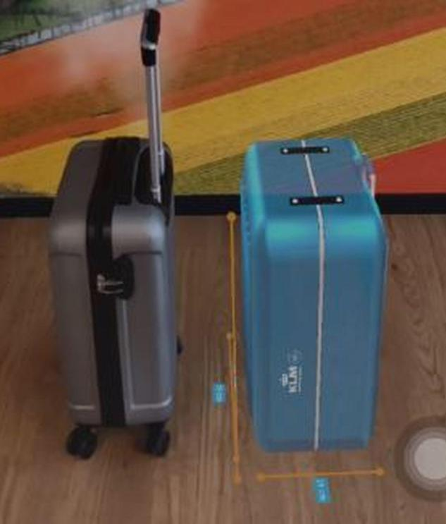

A few days ago, when Facebook annunciated the launch of Augmented Reality Ads, we wrote an article about the concept and benefits of using this new technology to promote your business, brand or entrepreneurship in this social network.

Now, we bring you five companies and successful cases that have used Augmented Reality in their marketing plan and how this increased their sales. As we have seen, **Augmented Reality allows you to present your product or service in a reality in which your client can interact**. Think of all the possibilities this represents for your business. You can explain and show to customers how the shirt you are selling would look on his body or if a bed fits in his room. 

**The main premise of Augmented Reality (AR) is to satisfy the customer's need to know, try and use the object that you sell**. Again, the customer's need, not yours. When you create an application with AR, you have to think like your client, what they want to see in there.  The question is to improve the shopping experience and enrich it.   

**1.- KLM Royal Dutch Airlines.** Recently, [KLM airlines incorporated augmented reality](https://www.youtube.com/watch?v=LAvRIFN_hNc) to **check if the size of the customer's suitcase meets the necessary conditions**. In the app, they offer other services with AR which the passengers can interact and verified their flights from home.

  
<credits>Photo by [Los Angeles Times](https://www.latimes.com/)</credits>

Also, KLM has an application to fly with them through virtual reality. This is the [KLM Flight Upgrader](https://www.youtube.com/watch?v=PwTFsXDmHx0), which can be downloaded for both Android and iOS. The passengers can use it even when they are not flying with KLM. The app gives them a visual experience of a KLM flight; they can watch movies or eat a virtual meal, all without paying anything.   

**2.- eBay** 

The internet sales giant, eBay, has also invested in AR. With [the last actualization](https://www.youtube.com/watch?v=7ezT7omejfk), the sellers were the ones who perceived the difference when testing the AR, in specific cases such as the sizes of the shipping boxes. The customers will be able to interact with this technology that brings a new way to visualize the products through the app before buying.   

**3.- Home Depot** 

Another e-commerce that joins to AR is Home Depot. Incidentally, there are **the big internet sales companies that have understood all the benefits that they can get from the AR**. 

In [Home Depot Mobile App](https://www.youtube.com/watch?v=yETvPdW9J4s) you can see doors, windows, toilets, faucets, furniture, and others home articles and how would they look in your house. Right there, it shows you the price of the product and the existence. This app is available for Android and iOs.   

**4.- L'Oreal** 

The makeup brand L'Oreal has partnered with Perfect Corp to create [YouCam](https://www.youtube.com/watch?v=6B5XBcSqdjU) makeup app. In it, you take a picture of you and try different eyeshadows, lipstick, mascara, eye pencils and eyelashes, among other, from your home, without going to the store. The app is available on Google Play.

Also, L'Oreal launched another app Style My Hair, where you can see various hairstyle, haircuts, colors, and shades. It is perfect if you want to try another look. Definitely, L'Oreal understood how difficult is for a woman to buy products of the complicated world of hairstyle and makeup. 

**5.- Antena 3** 

But if your company does not offer a product or service specifically, something that we could not touch, you can also use AR. This is the case of the social media communication Antena 3, in Spain; they use AR to explain [the costs of rent in a building of a neighborhood in Madrid](https://www.antena3.com/noticias/tecnologia/asi-ha-estrenado-antena-3-noticias-la-realidad-aumentada-en-su-informativo_201809075b9295630cf2a2488845ada3.html). 

The news presenters used Augmented Reality to start a traditional live report of the subject. Very briefly, they show us the building and then make a scale of one of the apartments, where they indicate the square meters and the distribution of the space. Without a doubt, it was a very innovative and creative way to present news.  

<credits>Photo by [Antena 3](https://www.antena3.com/)</credits>

Augmented Reality gives the users and sellers a new shopping experience and a very different way to interact with the brand. Surely, you are thinking that this costs a fortune; but also you have to think about all the return that you will get from this investment. 

Do you remember [Networking](https://cobuildlab.com/blog/networking-for-entrepreneurs-the-key-to-growth)? So, take advantage of the technical contact that you have made, make some calls, offer, negotiate, and find a way to not spend all your money on this strategy. 

Keep in mind in your marketing plan that it is so important to make a video which you can explain how to use your brand's application with AR, so that your customers enjoy it and be engaged with your brand.