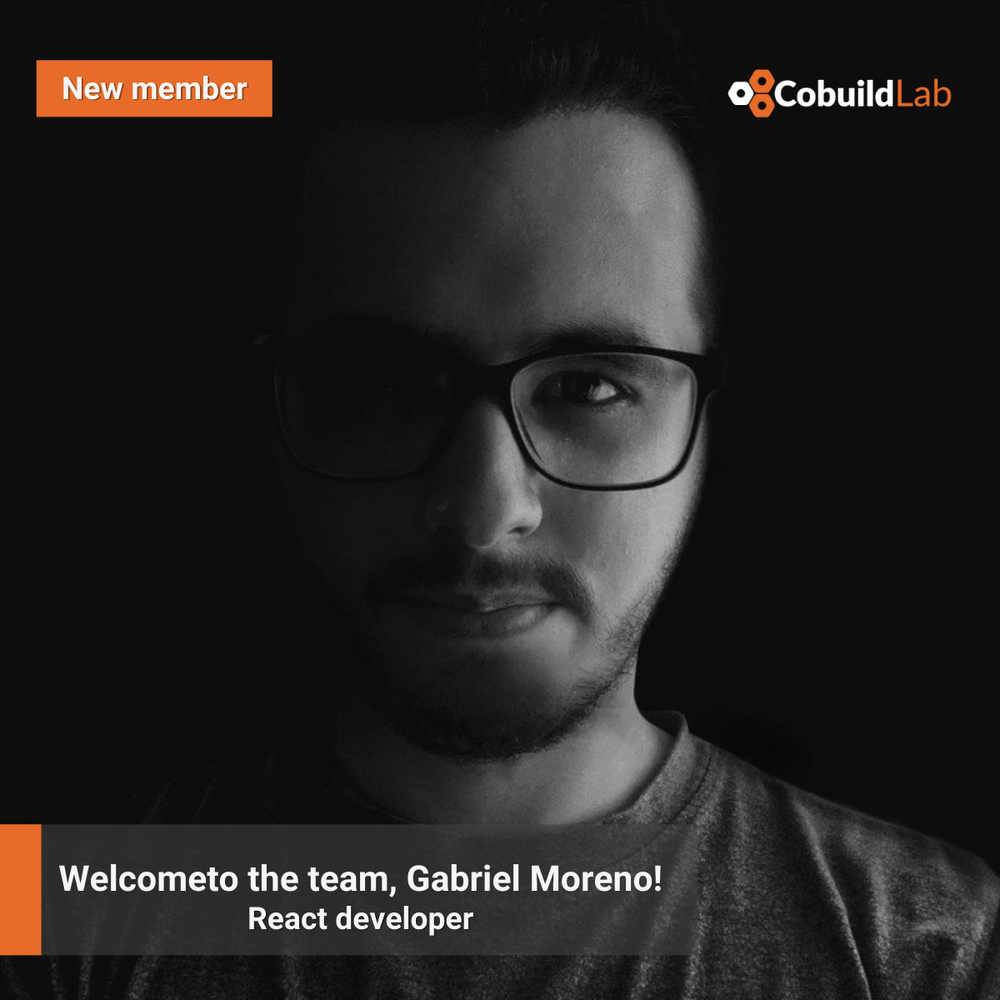

Miami, FL. Sep 24, 2021

<title-4> 2021 has brought new opportunities and new faces to Cobuild Lab and we couldn’t be more excited! The Miami-based software development company has welcomed Gabriel Moreno in its crew. </title-4>    

<title-3 align="centered">  Gabriel Moreno, React developer  </title-3>

    

Cobuild Lab’s web development team is excited to welcome <a target="_blank" href="https://www.linkedin.com/in/gantoreno/">  Gabriel Moreno</a> in the position of **React Developer**. In this role, Gabriel will be responsible for developing and implementing user interface components using React.js concepts. He will also be in charge of reviewing application requirements and interface designs as well as documenting application changes and developing updates.

Gabriel is a Software Engineer, graduated from Rafael Belloso Chacin University in Maracaibo, Venezuela. He is highly skilled at React.js, JavaScript, and Python becoming a full-stack web developer specializing in corporate identity.

For us at <a target="_blank" href="https://cobuildlab.com/"> Cobuild Lab</a>, working in Tech means working in the future, and we welcome Gabriel as a visionary and passionate creator who thinks outside the box, we wish him the best of luck.  Thank you so much for reading!    

<title-4 align="left"> About Cobuild Lab </title-4>

<youtube-video id="5fbYxQNgJ7s"></youtube-video>     

Got an idea for a web or mobile app? Let’s build it! Check out our <a target="_blank" href="https://cobuildlab.com/price-calculator/">  price calculator</a> to have an estimate of the cost of your project or email us at contact@cobuildlab.com and get a FREE online consultation. 

