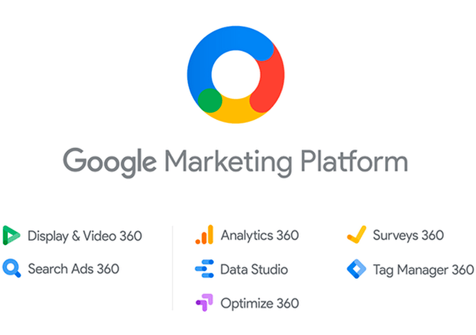

For many years we knew that Google offered us advertisement options on two platforms: Google Adwords and Google AdSense. Since July last year, that panorama changed a little with the launch of a platform called [Google Ads](https://cobuildlab.com/blog/tips-to-create-effective-campaigns-in-google-search-engine/), which came to replace Adwords. And together with it, two more tools were launched. One of them is **Google Marketing Platform**, which we will talk about in this article.

<title-2>What exactly is Google Marketing Platform?</title-2>

In a few words, Google Marketing Platform is a new tool from the technology and information giant that integrates marketing and web analytics services. 

Its main objective is to help us plan, buy ads and also measure their performance, to optimize our campaigns more efficiently. And all that, with just one tool. 

The Google platform integrates Google Analytics 360 Suite services and Doubleclick products as well.

Source: [Analityc.googleblog](https://analytics.googleblog.com/2018/06/introducing-google-marketing-platform.html) 

And to be more specific, it includes the [Display & Video 360](https://support.google.com/displayvideo/answer/9059464?hl=en) and [Search Ads 360 advertising products](https://support.google.com/searchads/answer/1187512?hl=en), as well as [Analytics 360](https://marketingplatform.google.com/home), [Data Studio](https://datastudio.google.com/u/0/navigation/reporting), [Optimize 360](https://support.google.com/optimize/answer/7084762?hl=en), [Surveys 360](https://surveys.withgoogle.com/) and [Tag Manager 360 analytics products](https://support.google.com/marketingplatform/answer/6365892?hl=en).

Source: [Aukera](https://aukera.es/blog/que-es-google-marketing-platform/)

<title-2>Introducing yourself on Google Marketing Platform</title-2>

<youtube-video id="RlB_f6EG4r4"></youtube-video>

Of course, no one could introduce you better to [this platform than Google itself, and that's why we link you to this information.](https://analytics.googleblog.com/2018/06/introducing-google-marketing-platform.html)

When you log in to your Google Marketing platform account, the first option you'll see will be an integration center that will allow you to connect several products that are part of the tools mentioned above, and that this Google proposal brings them together in one place. 

Source: [Rockcontent](https://rockcontent.com/es/blog/google-marketing-platform/)

In this way, we will be able to make 100 integrations with data partners, DMPs, exchanges, measurement solutions, and other technology providers. You control what you use and what you don't use. 

“Display & Video 360 brings together features from our display advertising products: DoubleClick Bid Manager, Campaign Manager, Studio and Audience Center. Display & Video 360 allows you to execute ad campaigns end-to-end in one place, creating efficiency in how you work and helping your teams do more together.”

[Analytics.googleblog](https://analytics.googleblog.com/2018/06/introducing-google-marketing-platform.html)

The advertising services you will be able to have them with:

* **Display & Video 360**: which is a tool to plan, design and do all the creative management of your campaigns. And also share all this information with your teams: where the money is being invested, where the ads are being executed, all the analytical information, etc. 

* **Search Ads 360**: It offers you workflow tools, reports and features that allow you to optimize your offers to have more value in your search campaigns. Basically, this tool exists for this, to optimize search campaigns.

While analytical services you'll get them from: 

* **Analytics 360**: it is an integration of marketing products and data analysis with which you can analyze consumer behavior, develop insights and work on that to give them a better user experience. Part of the products that is composed are: 

A. Google Analytics 360: Develop insights into how users engage with your business online and offline.
B. Google Attribution 360: Model cross-channel, cross-device attribution that focuses on ad impressions and ad clicks.
C. Google Audience Center 360: Consolidate audience lists and user data to build new audiences, publish those audiences to your marketing platforms, and report on their performance.
D. Google Tag Manager 360: Use an enterprise workflow to manage web and app tags from a single interface.”

[Support.Google](https://support.google.com/marketingplatform/answer/6292532?hl=en)

* **Data Studio:** it allows easy access to data from Google Analytics, Google Ads, Display & Video 360, Search Ads 360, YouTube Analytics, Google Sheets, Google BigQuery. In this way, you explore through them in an interactive way. It also offers a fluid collaboration in real time with other people.

* **Optimize 360:** It is a tool from Google that we can use for doing A/B Testing, get all of that information, and take the better decision for your business. In this site, you also could find another tool like Google Analytics and Google Tag Manager. With Optimize 360 we can see more than one variant to the page that you are testing with this tool. In addition to that, we can make multivariate tests and redirect tests.

* **Surveys 360:**this tool is about advanced segmentation and remarketing. It is simple. It can help you to create online and mobile surveys and getting the consumer insights and relevant industries. Obtaining the results of these surveys, you can value the marketing strategy, also knowing its benefits and make decisions about your business. 

* **Tag Manager 360:** a tool that serves to put labels to your website or web platform and at the same time is a marketing analysis platform and a platform for optimizing labels on the web. 

<title-3>Here are your benefits</title-3>

* You will be able to know the buying behavior and accurately measure the interests of your audience, and at the same time, make the ads. All on the same platform. 
* Your marketing campaigns can be faster because you only have to use one tool, and with the rapid exchange of insights you can increase the effectiveness of the actions and campaigns themselves.
* This platform was born out of the need to integrate the analytical suite with Doubleclick's services. And in this way, to be more efficient and effective by measuring marketing results and optimizing investments. And in addition to this, simplify both functions to make the user experience better. 
* You have a more integral view of the data. Thanks to the integrated data you will understand much better who your audience is, what actions you must do to attract qualified traffic, and who of that traffic has already become or is loyal to your brand. And all that, with the integration of visitor behavior.  
* You will be able to make decisions almost in real time because in this way the data is shared with the platform. 
* You will have more control over the investment you make, being able to make adjustments even during the campaigns, to improve your results without wasting resources.

<title-3>Don’t lose this case of success of Google Marketing Platform</title-3>

<youtube-video id="lCz0cGIWmlU"></youtube-video>

Take advantage of this new tool, and test how effective it can be for your brand. We are in the same process. For the time being, we just keep all the good promises of this **Google Marketing platform**. 

