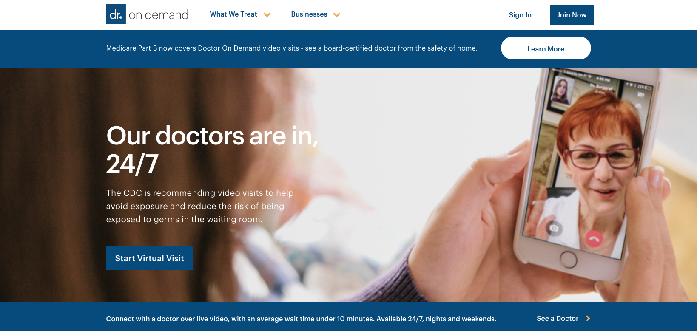
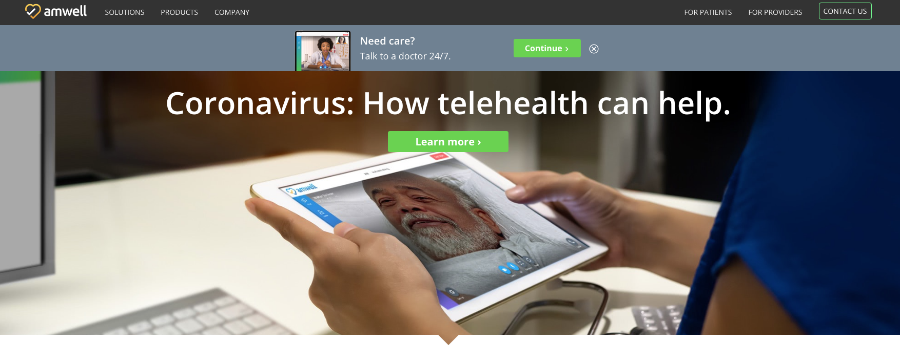
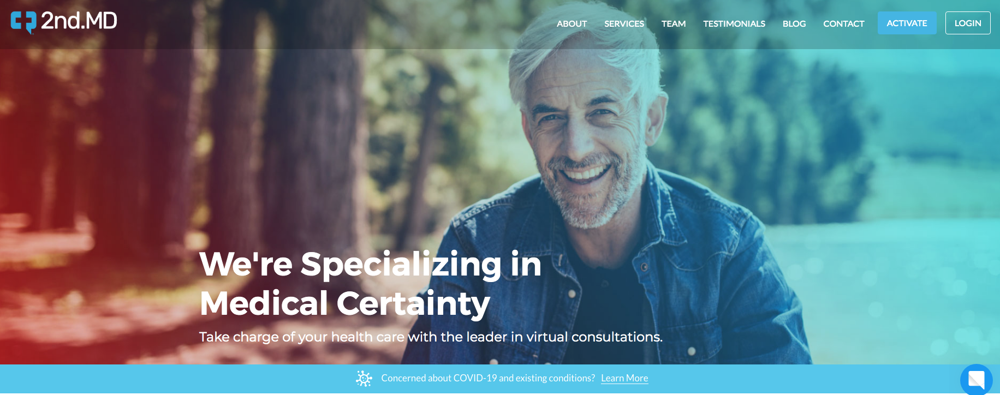

Before the rise of the COVID19 crisis, providers were slowly but surely adopting the use of **healthcare apps** in their pursuit of easing clinical communication between providers and patients as well as improve the management of hospital workflows. The post-coronavirus healthcare landscape will only accelerate the development of this kind of apps in the very near future.
Healthcare mobile apps would give providers the ability to effectively streamline communication between patients, providers, and their caregivers allowing for 24/7 management of a patient’s condition along with the ability to personalize healthcare per patient, and that makes them perfectly suited for this new environment of social distancing and limited resources.
An idea becomes truly successful when it can solve the real-life problems faced by the population. The same goes for healthcare mobile apps.
Let’s say that you’re suffering from high fever or a very severe headache, and instead of waiting or visiting your doctor, you can instantly set an appointment or even request him/her for a home visit. All of this in just a few minutes on your smartphone. Sounds really convenient, doesn’t it?
Patients value quick and convenient healthcare services. They seek simpler ways to reach out to healthcare providers and get solutions to their problems.

 

<title-2>Using and On-demand Healthcare App</title-2>

These apps are designed to provide a platform that brings the doctor to your doorstep for medical care using your smartphones from anywhere. Now, there is no need to wait several hours in the emergency or waiting room in the hospital. You can just use the on-demand healthcare app and get your basic medical treatment at home.

The process of using an on-demand health care application is very simple. 

1) First of all (using an app or website), you set up a home visit for the time that’s best for you. You provide information about your symptoms, medical history, and insurance information at the time of booking.

 

2) Then, the doctor or a healthcare worker shows up at the given address and time for the house call. They’ll perform physical assessments based on the symptoms and diagnosis. They will then prescribe medications or tests.

 

3) Finally, you pay a set fee to the doctor through the app itself. Usually, an app will show the doctor’s fee for a house call before scheduling an appointment. Some on-demand apps offer a digital report or summary of the service. You can use these documents for record-keeping purposes.

Benefits aren’t limited to the on-demand house calls; these apps can also provide a great alternative to get supplementary care services. With an on-demand app, you can find different services including:

* Blood tests
* Flu shots
* Virtual assistance for colds, ear infections, headaches
* Annual physical exams
* Family health assessments

 

<title-2>Here are some on-demand healthcare apps you can check out right now:</title-2>

 

<title-3>[Doctor on Demand](https://www.doctorondemand.com/)</title-3>

 

 

Headquartered in San Francisco, California, Doctor on Demand provides an online platform where patients can consult with healthcare providers for urgent care. Recently, the startup received $74 million funding and recorded annual revenue of $12 million.

 

<title-3>[Amwell](https://business.amwell.com/)</title-3>

 

 

Amwell app makes doctor consultation convenient for the patients. You can book an on-demand video visit with the doctors, therapists, psychologists, and other healthcare providers. You can also choose to send prescriptions to the pharmacy of your choice. The app is funded and supported by the American Well company.

 

<title-3>[2nd.MD](https://www.2nd.md/)</title-3>

 

 

If you want a second opinion on a medical condition, 2nd.MD app can help you. It connects you to doctors and healthcare providers for online consultations. The company was founded in 2011 and has recently got a $2.29 million investment.

 

<title-2>Other Benefits of Healthcare Apps</title-2>

One of the primary reasons why this type of apps holds great potential in healthcare is the comfort and convenience they offer to users. You don’t need to take a day off from work and travel in traffic to see the doctor. All you have to do is schedule a house call and wait.

Another great benefit of using on-demand healthcare apps is the reduced costs in hospitalization and healthcare spending. Patients are less likely to visit ER’s, or urgent care clinics when they get to see doctors in their own house. This will free up space for patients who seek more intensive care in hospitals, especially in times of crisis.

On the other hand, an in-house visit allows doctors to spend more time with the patient. When doctors are not pressed for time, they can provide the best care and ensure a proper diagnosis.

On-demand healthcare apps also reduce the burden and costs of the in-office administrative paperwork. It can help doctors save their time, and focus their full attention on their patients.

 

<title-2>The Future of Healthcare Apps and Software</title-2>

Every major crisis opens up opportunities for software and app development in certain areas of work. Right now, in the midst of the COVID-19 global crisis, one of these areas of work in healthcare.

For example, Virtual Reality has a multitude of applications for health and healthcare, from developing new life-saving techniques to training the doctors of the future and from the clinical to the consumer. And by 2020, the global market could be worth upwards of $3.8 billion. VR has the ability to transport you inside the human body – to access & view areas that otherwise would be impossible to reach. Currently, medical students learn on cadavers, which are difficult to get hold of and (obviously) do not react in the same way a live patient would. In VR however, you can view minute detail of any part of the body in stunning 360° CGI reconstruction & create training scenarios that replicate common surgical procedures.

Another invaluable front for development in healthcare is the field of Artificial Intelligence and Robotics. AI is getting increasingly sophisticated at doing what humans do, but more efficiently, more quickly and at a lower cost. The potential for both AI and robotics in healthcare is vast. Just like in our every-day lives, AI and robotics are increasingly a part of our healthcare eco-system. Beyond scanning health records to help providers identify chronically ill individuals who may be at risk of an adverse episode, AI can help clinicians take a more comprehensive approach for disease management, better coordinate care plans, and help patients to better manage and comply with their long-term treatment programs. Robots have been used in medicine for more than 30 years. They range from simple laboratory robots to highly complex surgical robots that can either aid a human surgeon or execute operations by themselves. In addition to surgery, they’re used in hospitals and labs for repetitive tasks, in rehabilitation, physical therapy, and in support of those with long-term conditions. 

Humankind needs to further develop the already growing field of on-demand healthcare apps in order to contribute to the reduction of healthcare expenditure on a global basis. We need to make medical care more streamlined and focused, and the field of on-demand healthcare app gives us a chance to do so, as the demand for this type of services will only grow from now on.

Technology applications and apps encourage healthier behavior in individuals and help with the proactive management of a healthy lifestyle. It puts consumers in control of health and well-being.

Finally, there’s a need to further develop software and apps that help us organize the workflow on the medical field (**healthcare apps**), and also organize far more effectively patient medical data, thus lowering medical costs and helping us as a society to focus our resources in the areas where they’re needed the most. Especially at times like this. 

