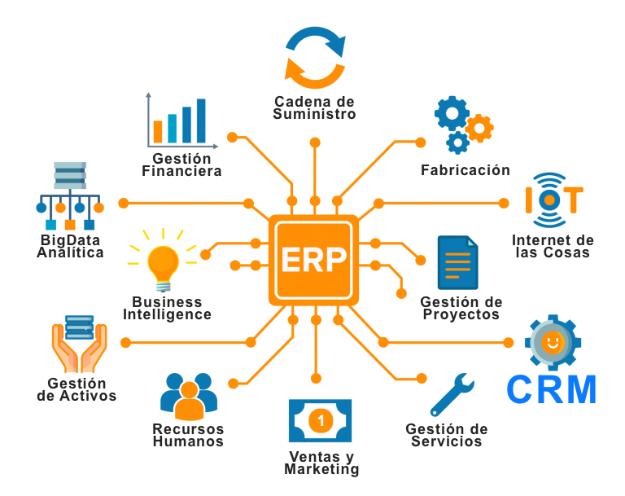

As your business begins to expand and grow, you'll find that many moving parts aren't always easy to coordinate. As your company expands, you may find that it makes sense to engage an enterprise resource planning (ERP) application for better visibility, which can help you make data-driven decisions.ERP software integrates all functions and departments into a single system to streamline information, synchronize reports and provide automation across the organization. It also improves day-to-day business activities, such as compliance, accounting, supply chain, procurement, manufacturing, and project management, also helping you plan, forecast, budget and report on important financial results.

 

 

Source: <a target="_blank" href="https://www.ntxpro.net/erp/implementar-un-erp-2/">  ntxpro </a>

 

<title-2>How ERP can help your company grow?</title-2>

 

<title-3>Waste can be reduced from every single  department:</title-3>

 

<a target="_blank" href="https://www.cobuildlab.com/blog/enterprise-open-source-software-erp-platforms/">  ERP software </a> has this great ability to monitor in detail every department and production area within the company, to document exactly where you might be  losing money or wasting resources during normal operations. From underutilized warehouse space to excess production or long lead times, you will be able to recognize where you can make changes to help your company run more efficiently. And best of all, it's all done from a single platform, so the information is all concentrated in one place.

 

<title-3>Better customer service:</title-3>

 

Thanks to ERP, customers can be more involved with the company, and it allows them to feel more confident with the company, fostering trust and satisfaction. ERP allows you to integrate <a target="_blank" href="https://www.cobuildlab.com/blog/custom-crm-why-and-how-to-use-it-in-your-business-in-2021/">  Customer Relationship Management </a> (CRM) functionality into the ERP software. This can simplify the order management process by coordinating the workflow for all departments, including inventory, production, accounting, and shipping. In addition, customers can track the progress of their orders. It can also contain information about orders, customers, inventories, etc., in a single platform and prevent their loss.

 

<title-3>Saved Money:</title-3>

 

ERP unifies many of the systems that may currently be fragmented in your organization. From product development to accounts payable, your staff will be able to access all the tools they need for their work from one centralized system.

With ERP, users don't have to search for information in multiple systems. With the central database, information is much easier to retrieve. In addition, your organization saves money with ERP by eliminating the need to train users on multiple systems. This not only reduces the amount of money spent on training, but also reduces the logistical effort involved. Instead of scheduling multiple training sessions with several different vendors, you only need to communicate with one.

 

<title-3>Maximize your time:</title-3>

 

Maximizing the company’s workers time is one of those great benefits ERP can bring to your organization. This is because many of the tasks that were previously done by employees become automated, leaving more time for workers to focus on tasks or activities that require a little more precision and creativity.  In the same way, it increases the productivity and efficiency of your company, making it grow exponentially. 

 

<title-3>Increase Collaboration:</title-3>

 

ERP can foster collaboration because employees now have more time because many of the tasks or activities they used to perform are now automated, and all the information is in one place so everyone has the same information and knows where to find it. This makes collaboration easier. This also helps departments to be more transparent about the information they handle.  

 

<title-3>Improved inventory management:</title-3>

 

<a target="_blank" href="https://www.cobuildlab.com/blog/Warehouse-and-Inventory-Management/">  Monitoring your inventory </a> can be one of the most titanic tasks there can be, but thanks to ERP this task has been simplified because of the use of barcodes, RFID tags, and serial numbers to monitor inventory at every stage of the supply chain. These tools help you keep track of inventory levels in the various warehouses, items in forwarding, and those on the shelves ready for consumers. Increased warehouse visibility greatly optimizes the picking, packing, and shipping process, eliminating all the guesswork.

 

<title-3>Improved Production Planning and Resource Management:</title-3>

 

ERP provides information on all manufacturing operations, including the shop floor. This allows users to optimize production schedules, equipment, and labor to maximize capacity. In addition, ERP manages the bill of materials (BOM) and fixed assets. With this software, users can easily create and edit BOMs and track all previous changes.

Each company is unique and faces different challenges at different times. But you should also keep in mind that the more your company grows, the more responsibility and the more information you need to manage, so don't complicate things any further. Good enterprise resource planning paves the way; it allows you to grow your business and, at the same time, frees you up to focus on the most important aspects that, in the end, will be more profitable. So don't hesitate any longer and start investing in ERP for your company today.
