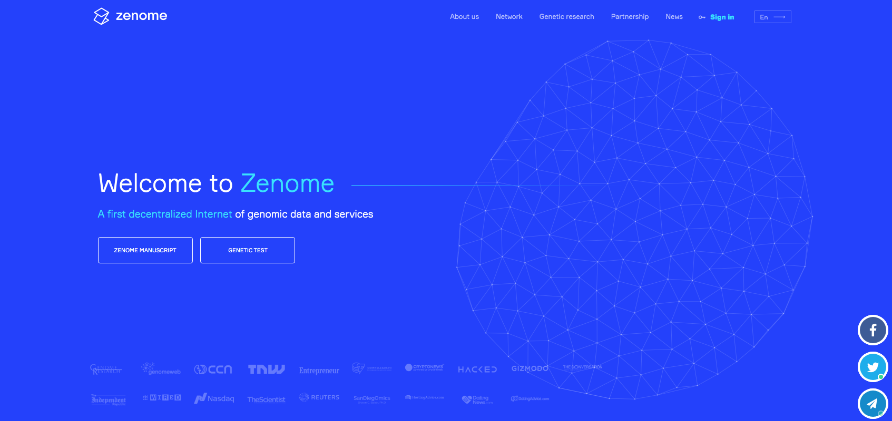
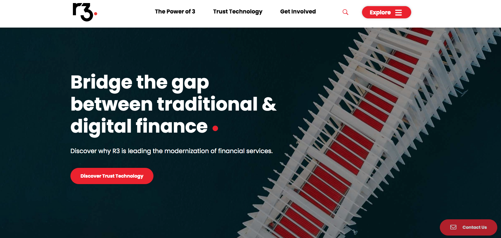
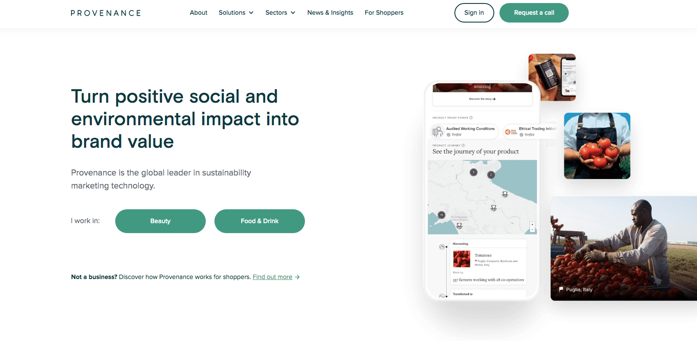
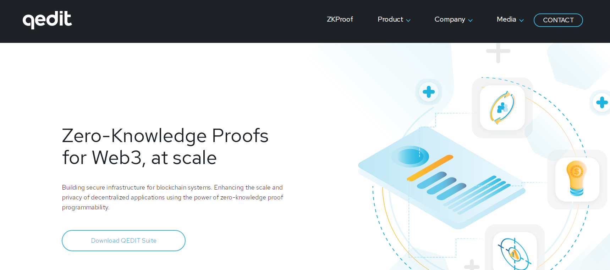
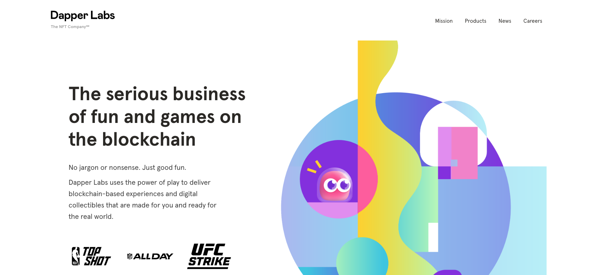
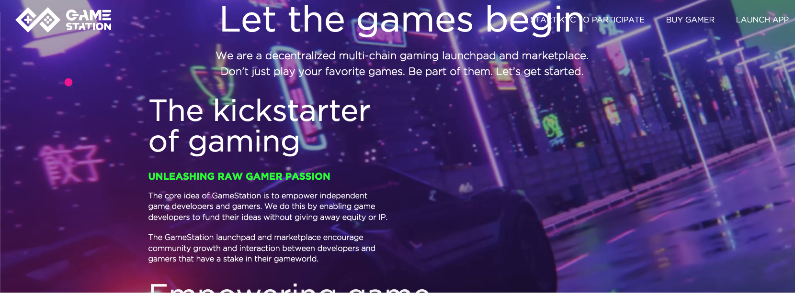
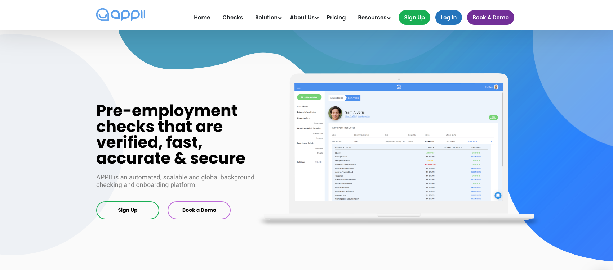

Miami, FL. May 25, 2022

<a target="_blank" href="https://www.cobuildlab.com/blog/blockchain-world/">   Blockchain technology </a> continues to dominate the world of entrepreneurship.

As a startup, you are in a critical position to invest and exploit <a target="_blank" href="https://www.cobuildlab.com/services/">   Blockchain technology </a> to the fullest. It will help you put ahead of other new businesses and move forward in areas such as finance. 

Next, you'll see **how startups are using blockchain.** Keep reading!

 

<title-2>Let’s see some uses of blockchain in startups </title-2>

 

<title-3>Blockchain for <a target="_blank" href="https://www.cobuildlab.com/blog/avsee-a-new-software-project-in-the-healthcare-industry/">   healthcare startups: </a></title-3>

 

Healthcare institutions manage colossal data volume; they suffer from the inability to share data across platforms securely. 

Better data collaboration between providers could mean more accurate diagnoses, effective treatments, and cost-effective care. 

Blockchain technology could enable hospitals, payers, and other parts of the healthcare value chain to share network access without compromising data security and integrity and do it in real-time. 

Blockchain provides real-time visibility into the supply chain, enabling a faster response to supply disruptions, which is crucial for vaccine distribution during a pandemic. This visibility will also help identify vaccine batches that must be recalled in an adverse event.

**Example:** 

Genomics researchers also use it to perform computations on massive datasets, often stored in centralized cloud-based repositories. 

A clear example of blockchain use in healthcare is <a target="_blank" href="https://zenome.io/">   Zenome </a>, based on Ethereum, which uses compute and storage nodes in its system to perform bioinformatics analysis. Users of the system pay the nodes for their service. 

 

 

Zenome also aims to protect individuals' ownership and control over their genomic data. Users who upload their information to the blockchain can sell temporary or permanent access to their data to entities such as pharmaceutical companies.

 

<title-3>Banking:</title-3>

 

Banks serve as critical warehouses and value transfer hubs from a macro perspective. 

Blockchain could serve the same function as digitized, secure, and tamper-proof ledgers, injecting greater accuracy and information sharing into the financial services ecosystem. 

Blockchain has the opportunity to disrupt the financial system by disintermediating critical services provided by banks, from payments to clearing and settlement systems. This purpose is the most common use of technology nowadays. 

<a target="_blank" href="https://www.cobuildlab.com/blog/technology-brands-and-blockchain/">   Blockchain </a> technology offers a secure and inexpensive way to send payments that reduces the need for third-party verification and overcomes the processing times of traditional bank transfers. As a result, the number of cross-border B2B payments on the blockchain will soar to nearly 1.8 billion by 2025, up from 122 million in 2020.

**Examples:**

<a target="_blank" href="https://www.r3.com/">   R3 </a> CEV is a consortium of leading world financial institutions collaborating to develop commercial platforms, such as Corda. This blockchain platform will become an operating system for financial markets worldwide.

 

 

<title-3>Supply Chain Management:</title-3>

 

<a target="_blank" href="https://www.cobuildlab.com/blog/top-5-benefits-of-blockchain-for-your-business/">   Blockchain in supply chain management </a> provides permanent transparency and validation of transactions shared by multiple supply chain partners. 

Operations are permanent and verifiable, making it easy for an owner or customer to view each record. 

In other words, using blockchain for supply chain management allows you to fish for the information you need and get the correct answers every time and wherever you are. 

Blockchain technology is ideal for tracking, linking, and, most importantly, recording all these transactions. This way, delays are decreased to a minimum, and human errors might slow down the entire process.

**Examples**

<a target="_blank" href="https://www.provenance.org/">   Provenance </a> is a project by several London startups. Their app allows its users to buy merchandise from one another, building trust in this form of e-commerce. It is intended for retailers, producers, and shoppers. It allows access to information about a single product's origin, journey, and impact.

 

 

<title-3><a target="_blank" href="https://www.cobuildlab.com/blog/cybersecurity-&-artificial-intelligence-how-can-they-benefit-your-business/">   Cybersecurity: </a>  </title-3>

 

Cyber-attacks are the main threat to our digital world. Since blockchain is a decentralized system, it is ideal for environments where security is high. 

Here, all information stored in a block is verified and encrypted using a cryptographic algorithm, which means there is no single entry point for a large-scale attack. 

In addition, blockchain can quickly identify malicious data attacks due to peer-to-peer connections, where data cannot be altered or manipulated. 

It seems ironic, but the blockchain network is public and inviolable. That’s what makes it spectacular.

**Examples:**

<a target="_blank" href="https://qed-it.com/">   QED-it </a> is a security solutions provider to enterprise-ready Distributed Ledgers. It offers a cryptographic primitive called Zero-Knowledge Proofs (ZKP), which mathematically proves that a particular process has a specific output without revealing any details, thus maintaining the privacy of the data and the parties involved. QED-it offers this computation-heavy ZKP solutions to companies employing trustless blockchain technology.

 

 

<title-3>Art:</title-3>

 

The art industry has already begun to embrace blockchain and tokenization to increase global access to the art market and reduce transaction costs. 

In the digital art world, NFTs are being used to certify ownership of individual artworks. 

For example, artists use NFTs, based on blockchain technology, to create a unique signature for each artwork they sell, allowing them to track each work, obtain royalty payments and prevent forgeries.

**Examples:**

<a target="_blank" href="https://www.dapperlabs.com/">   Dapper Labs </a> uses blockchain to deliver experiences and products to millions of people worldwide. The startup brands itself as “THE” NFT company because it has been part of some of the most successful NFT projects, such as NBA Top Shot, CryptoKitties, and UFC on Flow. Perhaps this is one of the reasons that, according to PitchBook, Dapper Labs is one of the most heavily-funded companies operating in this sector.

 

 

<title-3>Sports management:</title-3>

 

Sports management agencies and corporations generally invest in athletes directly. But blockchain could decentralize the athlete funding process by democratizing the ability of fans to have a financial stake in the future of tomorrow's sports stars.

**Examples:**

Using blockchain to invest in athletes and make a profit has not been proven on a significant scale. However, The Jetcoin Institute has promoted the idea of fans using cyber currency - in this case, Jetcoins to invest in their favorite athletes and receive a small portion of the athlete's future earnings, such as VIP events and seat upgrades, etc. It sounds right.

 

<title-3>Gaming:</title-3>

 

Online gaming continues to experience expansive growth and is now considered a competitive sport, with coveted titles to win, significant cash prizes, and even a black market. 

Blockchain technology allows players to have a more level playing field to compete, earn rewards, and exchange assets across digital universes. 

Through blockchain can securely exchange digital tokens for cryptocurrencies without third-party investment.

Through the blockchain's distributed ledger, players can use a perfected character or set of skills and items across digital worlds. That means they can earn rewards faster and exchange them through a decentralized source.

**Examples:**

The first project on this list helps blockchain game developers find the support they need to produce high-quality, in-demand games for the burgeoning GameFi marketplace. 

<a target="_blank" href="https://www.gamestation.io/">   Gamestation </a> is a blockchain-based gaming community that supports independent developers and gamers through its 100% game-centric incubator, launchpad, and marketplace. 

Gamestation's focus on empowering developers and connecting them with gamers is changing the paradigm of how games are created and launched. Gamestation's native token, $GAMER, will be what drives and incentivizes the ecosystem.

 

 

<title-3>Education & academia:</title-3>

 

By nature, academic credentials must be universally recognized and verifiable. 

In primary/secondary schooling and university environments, verifying academic credentials remains a manual process heavily dependent on paper documentation and case-by-case checking.

Deploying blockchain solutions in education could streamline verification procedures, reducing fraudulent unearned educational credit claims.

**Examples:**

<a target="_blank" href="https://appii.io/">   Appii </a> uses blockchain to verify credentials. The company combines blockchain, smart contracts, and machine learning to verify the academic credentials of prospective students and teachers. 

APPII users create a profile and fill out their academic resumes, including their educational history and transcripts. 

Appii also uses blockchain to verify a user's background and lock their information into its blockchain.

 

 

Now you know **how startups are using Blockchain** today.  If you don't want to be behind with your venture it is highly recommendable to develop your app by using it. To make it real, <a target="_blank" href="https://www.cobuildlab.com/">   contact us </a>, and we'll do it in the blink of an eye, with the help of our team of super programmers. 

**Cobuild Lab Team**

