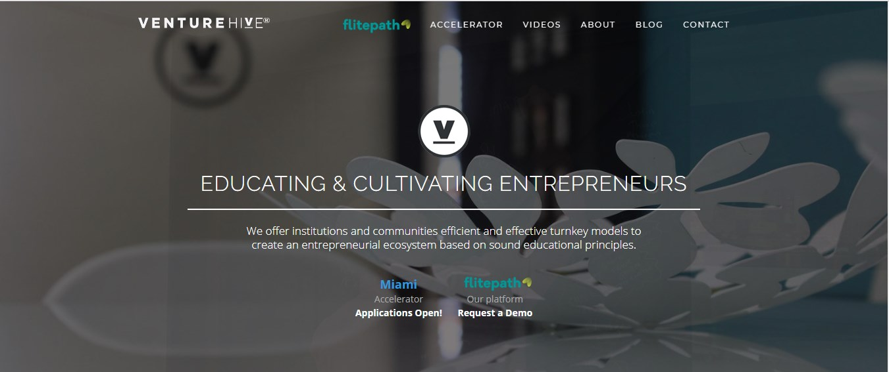
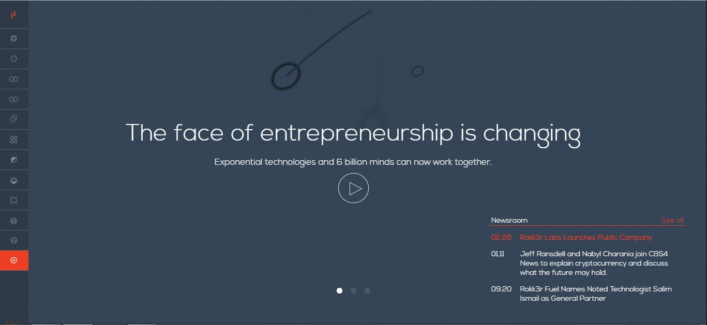
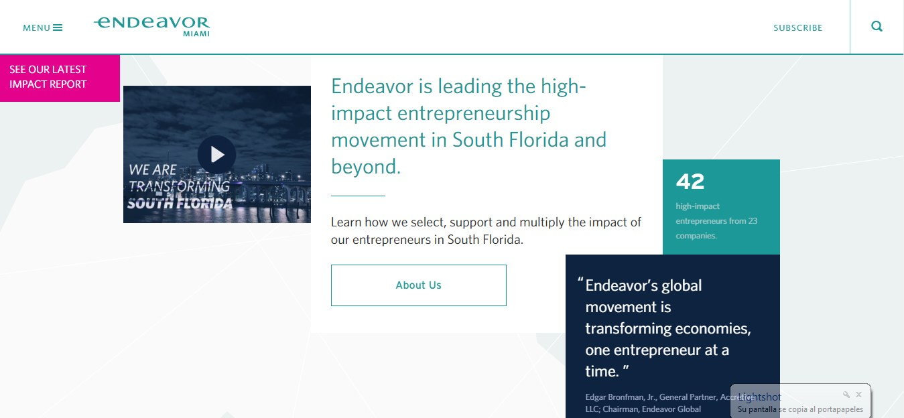

<block-quote>“A startup is a company working to solve a problem where the solution is not obvious and success is not guaranteed”</block-quote> 

Neil Blumenthal, co-founder, and co-CEO of Warby Parker.

In the last decades at least, certain small ventures and companies have been labeled with the word “startup”, associated them with certain elements in their context: innovative disruption, high uncertainty, bootstrapping, accelerate growth (potentially) and in many cases been in the tech space or driven by tech experts. In all these years many differ in the elements that a new company has to have to be called a “startup”, but what all of them agree is one specific concept: **uncertainty**. Due to this, this types of organizations had always in required for help, for people with skills in different areas, solid experience an resourceful, and from this is where the concept of Accelerators and Incubators comes into place.

In simple terms, Accelerators and Incubators are companies that aim to help entrepreneurs and startups to growth, slightly in different ways. Incubators usually help build concepts or ideas into disrupting products or top solutions, and accelerators usually help this type of solutions to scale properly. Again, in this concepts, many people have different definitions that are somehow similar and somehow different, but equal in purpose. This companies also classified themselves in the stage of the company, idea or concept maturity, and this is where the term Idea Accelerators comes into place.

<title-2>What is it idea acceleration?</title-2>

An Idea Accelerator can be considered as a Startup Accelerator focusing on the Development Stage. This development stage also is known as the Seed Stage or Idea Stage, it’s the earliest step in the creation of your venture when you have that idea that you want to transform into a business but you haven’t achieved yet the proper validation. 

It implies good professionals in different areas, models, techniques, appropriate tools, plans, and tests to transform the main idea into a real and sustainable business.

But you have to be careful. It is not the same talking about startup acceleration than idea acceleration, and people tend to confuse them. Later we will explain better this point.

For now, we will talk about where you can accelerate your business idea in the sun’s capital: Miami. 

<title-3>Where I can I found accelerators in Miami?</title-3>

 Technology and Miami are the best friends. This beautiful city is home to lots of startups, accelerators, creative people, and businesses.

Do you want to be a part? Do you have an idea? In Miami all is possible. 

Here, we love technology, and that’s the main reason why lots of people invest money and time supporting this kind of projects. 

These people are on acceleration companies, some of them are developers or investors who you can visit to find financial aid, coaching, education and generally, people who want to make business. 

<title-3>These are some companies that can accelerate your idea</title-3>

* **Cobuild Miami:** Cheers for us. And when we are saying us, we are referring to you too.

Our name said all we want to be, a team with you. [Co-build](https://medium.com/@alacret/the-cobuild-process-the-new-way-to-make-dreams-come-true-f3be4de9420f) is referred to that. 
 
This world has built from many ideas that others had. Imagine if everyone in the world could have an amazing idea at this moment. Which do you think would be the next step?

Definitely must going for professional support to develop and achieve every necessary step until making the idea happens.

These [first steps](https://medium.com/@alacret/cobuild-process-part-1-validate-and-cobuild-fdffa11e67b1) for developing a solid company are the most important because they will be the base. That’s why you must achieve them with the best team you consider. 

But what happens if your idea needs to be improved? We mean, adapt it better to the market necessities, get to know the consumers better, and generally improve necessary details. 

All of that we can do it from your hand. Actually, we talk about idea acceleration, and not of startup acceleration, because we start from the main idea of accompanying you from the conception of the idea.  

Continuously we are making meetups, and some events to create a really nice community where we can help us, and build nice things together until making of Miami, the capital of entrepreneurship.  

<credits>Photo by [Cobuild Lab](https://cobuildlab.com/)<credits>  

* **Venture Hive:** this is a startup accelerator in Miami that bet for innovation. They were founded by Susan Amat in 2013, and now, they have a team of 6 members in different areas to bring acceleration. And not only this, they also offer the next:
	
<title-4>“We cultivate and educate entrepreneurs through three levels of engagement: Venture Hive Prep™, Venture Hive U™ and Accelerator/Incubator programs.”</title-4>

They think that entrepreneurship is also part of educating, and we agree with them. The best way to improve an idea or business project is educating you, from the hand of specialist who has theoric knowledge and enough experience developing business.  

What is it the difference between us? Venture Hive can help you with the concept and incubating of the business idea, while our focus is not only there. Our cobuild process applies even to marketing and different business strategies. 

This accelerator is one option you can use to create and incubate your idea in Miami. 

<credits>Photo by [Venture Hive](https://www.venturehive.com/)<credits>  
  
* **Rokk3r Labs:** They only want a thing, make exponential every startup or small business that goes to him. 
They also have the cobuild concept, and their team it is shaped by strategist, creative people, and engineers.  

They are lovers of technology, like us, and that’s why they always use a startup cell to develop an idea. 

Which is the difference with our concept? How we said, it is not always necessary create a startup to develop an idea. 

Sometimes accelerating ideas have others phases. Everything will depend on the needs of your business project. 

If you want to know the life.cycle of your small company, here, you can find out, 

They have been in the market from 2012.
    

<credits>Photo by [Rokk3r Labs](https://www.rokk3rlabs.com/)<credits>   
  
* **Endeavor Miami:** Entrepreneurship is changing world economies, and team members of Endeavor Miami believe that and we agree with them. 

But to be an entrepreneur require some things that you cannot do alone. This is another option for you in the beautiful Miami.   

This accelerator also is located in other parts of the world, but the most important thing is that they are part of the startup acceleration community in Miami, and we are happy about that.

<title-4>“Endeavor’s global movement is transforming economies, one entrepreneur at a time.<title-4>
 
 They consider that endeavor it is a movement, which improve entrepreneurs. Actually, they are a startup accelerator. Also, they bet for educating, but another important concept they have it is relationships, networking you can do to move on with your small business. 

That’s amazing. Having some allies, especially if they are in the hall world, you can do lots and important things. We agree with them at this point. 

But we keep thinking that’s not enough to launch your product or service in the market, and make your company sustainable through the time.

Linda Rottenberg and Peter Kellner are the founders of this amazing company which in some countries in the world, including Miami. The first company was founded in 1997.

<credits>Photo by [Endeavor](https://endeavormiami.org/)<credits>  
  
<title-2>Idea acceleration vs Startup acceleration</title-2>

How we said before, these terms are usually considered like synonyms, but they aren’t. To be more specific, startup acceleration  an idea acceleration are different phases when you are developing a company.

They could be together, but also you can use one without the other one. This principle is the best reason to know that they are not the same. 

A startup is a small business which is in its first steps, and tend to be related with technology. When we are talking about startup acceleration, it means that you already have an idea probed and you should have a small team working on them. Actually, for this you are looking for an accelerator. 

But, if your idea needs to be improved, but you will have to go back and you could lose time, money and some other resources. 

Now, if you look for help from the beginning, you will have the opportunity to evaluate your business idea with experts who could make it better. Because they are taking in considerations some necessary aspect to create the best version of your business project, you can drastically reduce the probability of failing. 

In this case, we would be talking about idea accelerators.

<title-3>Which are these aspects to accelerate an idea?</title-3>

1. Market necessities and desires
2. Pricing issue
3. Business model
4. Customers profile
5. No passion for the market
6. Viability 
7. Capital

At first, you can think that they are not important, but trust us, they are really important to improve your chances for success. 

So, it comes usually to this: if you have an idea, what do you think that should be the first step? Create your Startup and try to accelerate? or shape your idea first and then create your company?

