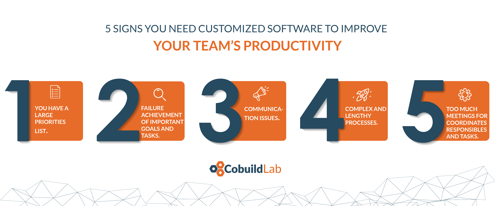

Communication is the foundation of successful human relationships, and productivity relationships at work are no exception to this rule.

In this post, we're going to take a journey through the most common productivity pain points our clients have had, but we go deeper into the importance of communication in this improvement process. Let’s start with reasons to improve communications to increase team productivity, specifically by developing custom software.

 

<title-2>Productivity increment starts with right and proper communication</title-2>

 
  
Suppose you have a multidisciplinary team that develops many different tasks.

Proper communication helps you assign and explain better what and how your team members have to do their job.

If that doesn’t happen, your team won’t have any idea about the process and resources essential to accomplish it, and you must invest more time and money to clarify them.

So, more meetings, mistakes, communication needs, and less productivity in general.

* **A <a target="_blank" href="https://www.atlassian.com/time-wasting-at-work-infographic">  study by Atlassian </a> showed that employees attend 62 meetings per month, which means around 31 hours a month. The same study found that almost half of employees believed meeting to be the number one time-waster at the office.**

* **The average worker spends 13 hours a week on emails alone, which means 28% of the workweek is taken up by email.**

Source: <a target="_blank" href="http://attentiv.com/email-takes-time/">  Attentiv</a>

* **A business with 100 employees spends an average of 17 hours a week clarifying communication, translating to an annual cost of $528,443.** 

Source: <a target="_blank" href="https://www.linkedin.com/pulse/four-steps-avoid-miscommunication-stacey-hanke/">   Siemens</a>

All this happens due to communication issues. So, don't you think it's necessary to improve it? We think yes, and we'll help you with this.

 

<title-2>Some of the most common challenges that stall your company's productivity:</title-2>
  
 

 
  
If you felt alluded to by any of them, yes, you need a software tool that eliminates these situations, and you can make your company as productive as you’ve always wanted. 

Software tools are the best compliment of human work because the margin error doesn’t exist. The storage capacity is infinite, and besides, tracking and optimization are easier.

Here, another matter comes into play... Hire commercial software or develop a customized tool. The answer (based on our experience) is below: 

 

<title-2>Using a commercial tool to increase productivity:</title-2>

 

* You can manage your particular and collaborative tasks, but if you need some customization it will not be possible to achieve it. 

* You have to think about the technology and the compatibility of all the tools that make up your company's productivity system. 

* You have to pay an annual or monthly fee, or you will have to buy a license to use each tool. 

* You have to train your current staff to know how to use the tools. 

* Productivity will improve in specific percentages because tools were designed for general goals and not specific to your business. 

 

<title-2>Thanks to a custom tool for productivity you can:</title-2>

 

* You can manage your processes, individual activities, collaborative activities, and customize them as much as you want because it is a system where you will be the architect.

* Compatibility is not a problem because they are tools developed for you, and they will be compatible if you want them to be. 

* Initially, it may be a little more expensive, because it is a project that you start, but in the long term, you will not have to pay monthly fees or renew licenses. 

* Your team can participate in the design of the tools, not only to tailor them to their work but also so that they know how to use them without additional training. 

* You will be able to develop plans to improve productivity in the short, medium, and long term. 100% personalized. If you want to start by areas, with specific objectives. Everything is possible. 

Remember this info when you want to improve your productivity, but especially when the time comes to decide between a commercial tool or a customized software development to improve communication, and therefore the productivity of your business. Contact us if you decide on the second option. 
