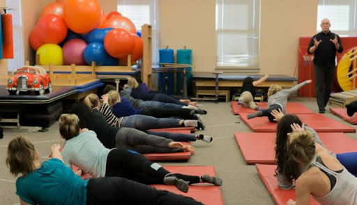

Every company wants its employees to be more efficient and productive. But each employee wants to have more time to relieve stress and tiredness. How to get the balance? In this case, the company must take the initiative and plan activities that make the work easier for
its employees.

**When the company offers some options to reduce the anxiety and pressure, the employees feel more identified with the business objectives**, improves the work environment, the team integrates better and, therefore, increase the performance of work.

For several years, companies around the world have implemented yoga, pilates and meditation classes in their own offices so that its employees have a little time off from work and just relax. Let’s see how these activities are made them more efficient and have improved their creativity.

<title-2>1. Business Yoga</title-2>

This millenary discipline has been introduced in many companies around the world that have proven the multiple benefits for their workers. **Yoga mitigates stress and helps maximize physical and mental abilities.**   

According to a WalletHub study, **stress affects more than 100 million people in the United States**, due to money, work, family and relationship. Miami is the fifth city with the highest level of stress in this country. **The stress related to work exceeds 300.000 million dollars per year.**  

With yoga, we can prevent common illness, such as back pain, neck pain, carpal tunnel syndrome, exhaustion; improves body posture; increases energy and productivity; therefore, it reduces labor absenteeism and the cost of health for your company, explains Izaskun Larrazabal, a specialist in business yoga.

Cases like Mahou (the leading beer company in Spain), the museum Guggenheim Bilbao and Armani Exchange (in the United States) have implemented 1 hour or 45 minutes of yoga business in the daily work or 3 times a week.

<title-2>2. Pilates</title-2>

Not only technology companies are recognized for including sports activities for their employees, such as Google, Twitter, YouTube or Facebook. In Spain, **Liberty Seguros and Mahou also offer Pilates as a complement to work.**

Pilates is more dynamic than yoga; it uses the same posture but incorporates exercises to tone different parts of the body. **This option is ideal for these employees who like to do something more moving than the gentle movements, flexibility, and stretching of yoga.**

Liberty also organized and identified several places in its building to make a circuit of training, more complex and active that pilates and yoga, but equally beneficial to its workers.

<credits>Photo on [Why not pilates](https://whynotpilates.net/)</credits>

<title-2>3. Meditation</title-2>

More than 160 institutes around the world, including universities like Harvard, UCLA, and Stanford, have shown the meditation can help to find a greater sense of serenity. Hence, **people who practice this relaxation technique improve the decision making, planning, creativity and health at higher levels.**

Google, Reebok, Medtronic, Bridgewater, General Mills, BMW, and Coca-Cola are not the only ones that encourage the practice of concentration. The 2.700 employees of Oprah Winfrey communications consortium and important figures such as Juan Manuel Santos (former president of Colombia), Dilma Rousseff (former president of Brazil) and singer Paul McCartney enrich their work with meditation.

**Offer your workers a comfortable and quiet space to meditate 20 minutes in the morning and afternoon and that will guarantee a decrease in the level of stres** and conflicts between employees.

<title-2>4. Powernap</title-2>

