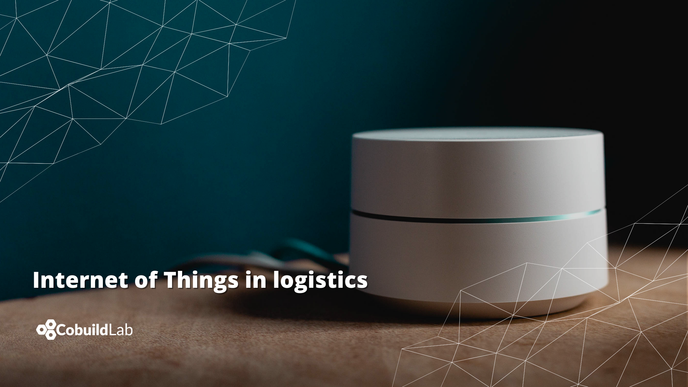

When we talk about the Internet, we understand that although it may seem like a normal part of our daily lives, we cannot deny that the word is synonymous with revolution, with the future. And the truth is that since the democratization of the Internet, our entire existence has taken a 360-degree turn.    

Its beginnings date back to the ‘60s when, in the middle of the cold war, the United States created an exclusively military network with the sole purpose that -in the hypothetical case of a foreign attack- military information could be accessed from anywhere in the country. Quite a lot has changed since then, now in the 21st century all our devices are interconnected with each other, we now have access to endless information available to us 24/7 just a click away thanks to the internet.    
 
Now, we all know very well the wonders of the internet but what do we mean when we talk about the Internet of Things? Simplified to its acronym IoT its meaning is as vast as our passion for technology, but we will try to synthesize it for you. There is no shorter and simpler way to define the Internet of Things than this: it is a system that allows millions of devices to be interconnected through the internet to transfer data through a given network without any interaction with human beings.    

Anyone who has already ridden the wave of Digital Transformation immediately associates the digital interconnection that we can make with everyday objects such as a refrigerator with the use of the internet. And what about its use in the logistics industry?    

<title-4 align="centered"> The Digital Revolution is already here </title-4>    

About 5 years ago, the use of the Internet of Things in the logistics industry was nothing more than a prediction that envisioned a major growth in the use of technology in this area. Today, that prediction has been fulfilled and exceeded expectations. It is one of the first technological solutions that most seduces industry professionals, along with Artificial Intelligence and Big Data.    

The Internet of Things gives "intelligence" to businesses, offering endless possibilities through the interconnection of all the assets that are part of the supply chain, such as controlling in real-time the route of a given product from the moment it leaves the warehouse to its final destination.     

The use of the Internet of Things in the industry has accelerated the digitization of the industry, allowing to organize, control, and automate processes remotely and from any device with an internet connection, reducing time and saving costs so that the human hand only adds value.      

<title-4 align="centered"> Benefits of using IoT in the logistics industry </title-4>

     

▪️ **Gain operational efficiency:** it is now possible to increase the levels of effectiveness thanks to the connection of the devices that make up the value chain, thus increasing production by saving time during operations as well as improving product quality without so much human intervention.     

▪️ **Reduces costs:** an efficient supply chain allows you to offer a better service at a much lower cost, and it all comes down to proper logistics management.      

▪️ **Improves the quality of the customer experience:** With an optimized process, a better quality product or service to offer, it is a sine qua non to be more attentive to offer a more immediate response to the customer, every step of the way, and even more importantly, in case any incident occurs.     

▪️ **Optimize safety:** The use of the Internet of things allows optimizing regulatory compliance and safety in all phases of logistics, it can detect failures and accidents during the supply chain process, which makes it possible to prevent occupational hazards.     

<title-4 align="centered"> The use of the Internet of Things in logistics </title-4> 

     

The digital transformation of the logistics service industry has accelerated with the introduction of the Internet of Things to automate, organize and control processes from any device with internet access and from anywhere in the world. Real-time tracking at every stage of the supply chain is an invaluable asset as it not only boosts the speed and efficiency of some processes but by automating them, it considerably reduces the time and costs involved. To expand the panorama, here are some examples of the use of this technology in the industry:     

▪️ **Warehouse automation:** There are already devices that accurately record incoming and outgoing goods, volume, and weight sensors on the shelves to identify if the merchandise being placed there is the right one. Warehouses with climate controls and sensors to detect space availability, all shelves filled with smart labels to identify goods and their exact location. Applying warehouse automation solutions can help warehouses increase productivity and accuracy, reduce labor costs and improve safety.     

▪️ **Customer service:** IoT enables remote devices to track goods in real-time from the time they leave the warehouse to their destination, as well as the receipt of delivery.      

▪️ **Cargo:** Some products are very sensitive to environmental changes, and technological advances have allowed the industry to equip itself with remote monitoring sensors that constantly verify conditions such as temperature and humidity, alerting if at any time the package lost the cold chain or suffered some kind of sudden change that could have affected it. All this to ensure that the handling of the goods is carried out according to the necessary care parameters without suffering alterations between leaving the warehouse and arriving at the destination. We add damage prevention and theft detection sensors that monitor the security of the merchandise during the entire transfer by tracking in real-time.      

▪️ **Routing:** GPS is in! The use of satellite systems allows better planning of the routes to be followed for the transfer of goods since by being able to detect traffic conditions in real-time it is possible to choose the best routes and order of deliveries according to areas and reception schedules.     

▪️ **Fleet:**  The use of IoT makes it possible to know exactly whether vehicles are operating or are making planned routes through the use of systems capable of identifying whether the vehicle is off, on, stopped, the speed of the vehicle and even identifies the driving style of the operators; these sensors can also monitor fuel consumption, detect fluid levels and any other eventuality such as breakdowns or accidents that may cause the delivery to be delayed.     

<title-5 align="left"> In  Conclusion... </title-5> 

It is no secret that the use of technology opens up endless possibilities, and the applications of IoT devices are almost endless. It has already become clear that the Digital Transformation of the logistics industry is thanks to the application of IoT, interconnecting goods, warehouses, infrastructure, vehicles, and everything involved in the supply chain.      

The Internet of Things is paving the way for innovation like no other technology has done before. And if we consider that currently only 1% of devices are connected, then we have a universe of possibilities before us shortly.     

<title-5 align="left"> About Cobuild Lab </title-5>

We partner with Industry Experts to solve Logistical and Productivity problems with Custom Software Solutions, Artificial Intelligence, and IoT. Since 2012 we've focused on developing and combining cutting-edge techniques, tools, and technologies to increase development speed to deliver faster results.      

<youtube-video id="5fbYxQNgJ7s&"></youtube-video>     

Got an idea for a web or mobile app? Let’s build it! Check out our <a target="_blank" href="https://cobuildlab.com/price-calculator/">  price calculator</a> to have an estimate of the cost of your project or email us at contact@cobuildlab.com and get a FREE online consultation. 

