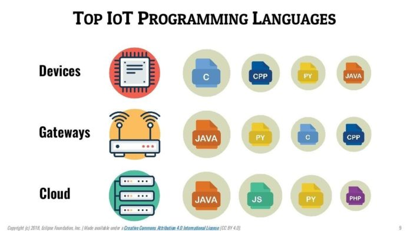
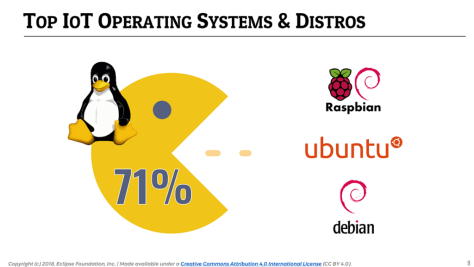

The internet of things is a concept that has been popularized in the last few years because it facilitates our life very much by enabling communication between devices that are all around us.

This concept is related to an interconnection between objects through the internet. These objects are common and it would be from a car until home appliances. 

It is basically a network between objects with the purpose of collecting and analyzing information to improve the quality of products and with this bringing a better experience to every customer who uses them. 

Here is a video that explains better what internet of things (IoT) is.

<youtube-video id="LlhmzVL5bm8"></youtube-video>

<title-2>Best programming language for developing an IoT project</title-2>

Internet of things projects involves software development with the architecture of electronics (hardware). 

It is the best of these worlds together for making our lives easier and better.

When we are in presence of software development on an IoT project it is very important to know that there are at least three stages, which are: 1) the measurement of data, 2) the collection on the same data, 3) and the analysis.

For each one of these stages, it is possible to use a different programming language or environment of development.

For example, “the data is measured via a sensor on the device which has limited capabilities. This data is then aggregated and transmitted using a gateway such as an app on a smartphone or a small console which has completely different computing power than the device. This data is stored and analyzed using the cloud.”

Source: [Iot for all](https://www.iotforall.com/2018-top-3-programming-languages-iot-development/amp/)

In addition, the team of [Eclipse Foundation realized a survey the last year](https://blog.benjamin-cabe.com/2018/04/17/key-trends-iot-developer-survey-2018) as every year from 2015, to know trends, preferences, and methods more used for developers specialized in this area.

You can see the results of this survey in the next images with the list of programming languages more use in this kind of project in 2018. 

Talking of that, we made a post about the [most popular programming languages](https://cobuildlab.com/blog/most-popular-programming-language/) in the last year in general terms. You can visit it if you want to find out more information about it. 

As you can see, Java and C are the winners, and Python is a little behind in the third position.

C is the most used language because It is perfect to developing on low-level code. It can work directly with the RAM. That’s why it is in the first place. Or it was in the first place until 2018, at least. 

C is so good for this kind of project that is used even for [microcontroller programming.](https://www.egr.msu.edu/classes/ece480/capstone/spring15/group13/assets/app_note_john_foxworth.docx.pdf)

In the second place, we have Java. This programming language doesn’t have limitations for being used on hardware, and also it is very portable. 

If you use Java Virtual Machine, you will have the possibility to transfer code to any chip. This technology is used commonly on servers and smartphones, but also it has been used on small devices. 

This versatility makes it perfect for IoT projects. 

Python is in the third position. The best that it has for the internet of things is its capacity to organize, manage and analyze complex data. All of them part of this kind of development. 

Python is robustly supported and it has many many libraries that can help you with the work. 

Thanks to its clean syntax and source code Python is also preferred for the internet of things.

<title-3>Others facts about the internet of things</title-3>

**1. Every project is multi-party**

As we said before, the internet of things works like a network of many devices that interact and facilitate our lives. 

This projects should have at least two parts connected by an app or system. 

**2. Reliability is more than required**

Actually, it is the main characteristic of these systems. 

If you are developing one or you plan to do it, be sure of choosing a good cryptography method that can help you to manage and keep safe the information of customers and even your own information. The [blockchain](https://cobuildlab.com/blog/technology-brands-and-blockchain/) is maybe a good idea too.

Security on software and hardware is primary. And all of this without sacrifice operability or free interconnection between all devices that are part of the network.

**3. Scalability is necessary if you want to be IN the market**

Now, this is the key to be on the top. All projects point to incorporate more devices through the time, and even open its compatibilities to other brands and devices that not necessarily are relative to them. 

This is aligned to the main goal of this technology: make better and easier our lives. With democracy and openness, this goal would be closer. 

**4. Cloud connection**

In the internet of things projects, lots of information is handled. And this information is stored and classified on the Cloud. 

In the same survey that we mentioned before, more than 500 developers and owners of IoT project confess that they work more with Amazon Web Services, Azure, and Google Cloud Platform.

Until the last year, these cloud services are the top three. 

**5. These are the areas that are more popular for IoT**

Home automation is the most known. Also, self-drive cars, there is a concept called [smart cities](https://internetofthingsagenda.techtarget.com/definition/smart-city), and even on industrial automation, it has popularized this technology. 

**6. These are the top of Operating system used for the internet of things projects**

Linux is the absolute king. 

We couldn’t finish this article with some examples of the internet of things nowadays. For that, we prepare the next videos. 

<youtube-video id="hIEIGDsbKqY"></youtube-video>

<youtube-video id="EyMB828lieU"></youtube-video>

The **internet of things** is the present and the future, and we are excited about that because it is related to our passion: [software development](https://cobuildlab.com/blog/best-software-development-process/). So, if you want to find out more information about it you can subscribe to our newsletter or just read us again. For this month we are talking about software. You are welcome! 
