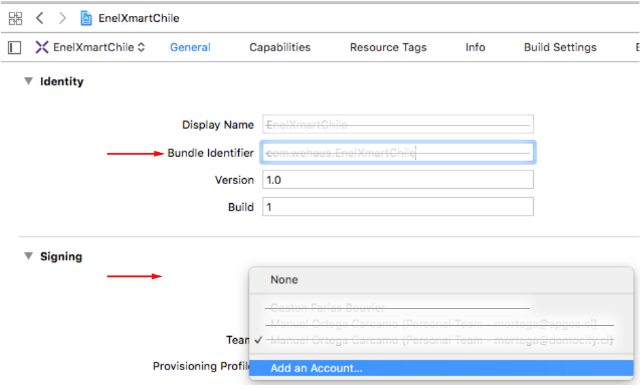
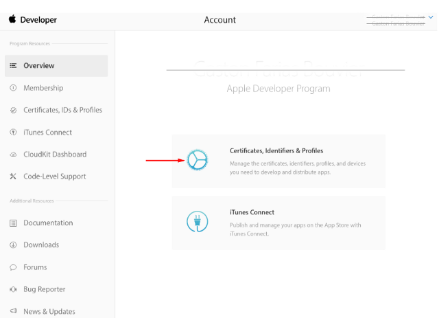
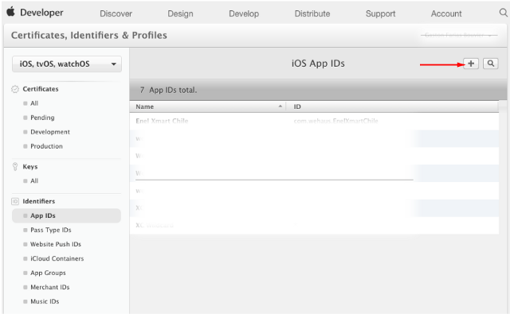
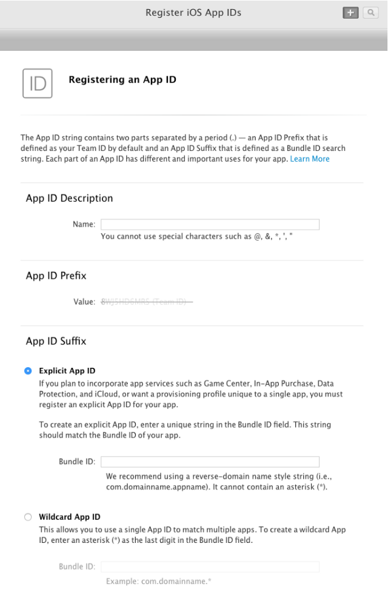
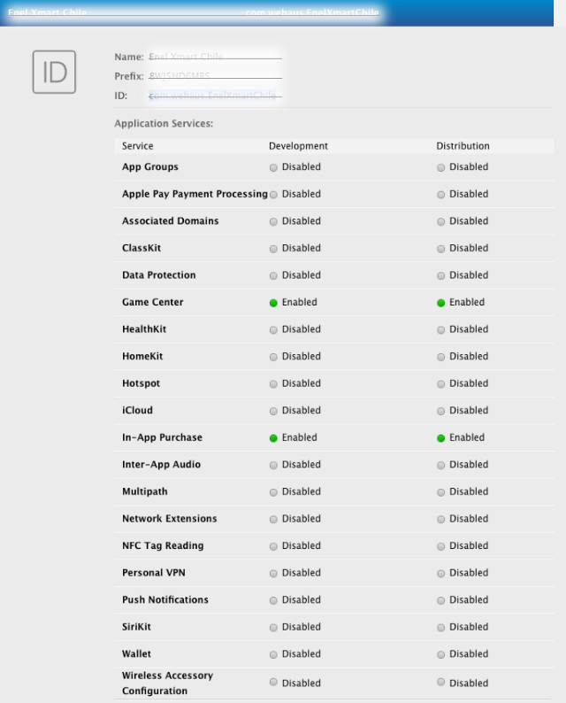

Before, we were talking about everything is necessary for developing an [Android App](https://cobuildlab.com/blog/android-app/), and when it is recommendable to do it. We couldn’t leave Apple out, because we are in the US, and here Apple wins the battle of the most sold devices including their iPhones that use iOS. 

In a few words, depending on the place you are in the world to know how to create an **iOS App** could make you a millionaire. If you are in the US, you will have more probabilities.   

Let’s go ahead and learn how to create correctly an iOS App.

<title-2>Let's know a little bit about Apple and its iOS</title-2>

**Apple Inc** has been famous for its Mac computers, iPhones, iPods, and many technology’s devices which are very fancy, simple, and of very high quality. 

Steve Jobs was a genius and this quality was transmitted to Apple devices. In the list of Apple’s successes, we can find the iPhone. A smartphone launched to the market on June 29th of 2007. But curiously they had begun to work on iPhone 24 years ago on 1983. 

What happened? Why did they take so long to finish it? Well, the answer was Steve Jobs. The first prototype of iPhone people says that it was on Stanford, a really prestigious university in California. 

Before launching it, many people asked Steve why they had not released a phone, and he only said that phones would have a big importance in people’s lives when they need access to information in a portable way. 

But he didn’t say anything about Apple’s work on smartphones. 

It wasn’t until January 9th, 2007 that the Apple team announced the iPhone launching for that year. 

Before that, they launched the Motorola ROKR E1 by the hand of Motorola. Apple’s team weren't satisfied, and that was the main reason for working on a smartphone made 100% by them. 

Then, the world met the iPhone. An elegant, easy to use, simple, tactile, and functional smartphone. 

But Apple didn’t stay only in designing and producing a smartphone, they bet for a mobile operating system unique and patented by them. In this form, iPhone OS was born, which is known nowadays how iOS. 

iOS is a Unix-like based on Darwin operating system, BSD, and macOS. It is used on smartphones, tablets, and other Apple’s devices. 

The iOS user interface is based on direct manipulation, using multi-touch gestures. Interface control elements consist of sliders, switches, and buttons. Interaction with the OS includes gestures such as swipe, tap, pinch, and reverse pinch, all of which have specific definitions within the context of the iOS operating system and its multi-touch interface.

Source:[Wikipedia](https://en.wikipedia.org/wiki/IOS)

Now it is the second most famous OS in the world. A little lower of Android. But in our country, it is the only one on the top. 

<title-2>Developing an iOS App: step by step</title-2>

Steps for developing an App are similar to the development process until publishing it on the app’s stores of every OS.

To develop for iOS in comparison with Android it is a little bit more complex. There are more details and steps to follow. For that reason, it is easier to understand it using phases instead of steps. 

But you have to know that, every phase we will show you it is composed of many steps.

If you are developing an iOS App you will have the next phases

1. The initial phase, where you need to define the reach of your app and it is possible we recommend you to make a mockup or a wireframing to keep in mind what you want during the development process. 
2. Next, in the second one, it will be necessary to think as a dealer. You need to think how you can earn money with the app if it sustainable through time, and in a few words create your own business’ model. All of this before developing the app. 
3. When you have all of these details defined. The next phase will be designing and developing phase. Separating each one. 
**Designing:** iOS Apps have a particularly when it is designing the icon of the app. Apple has some specifications on this topic. 
Also, we can say you don’t use much interactions or texts. 
Create descriptive buttons.
Keep your branding without overloading the app.
**Developing:** At this time you will have to choose a team to develop the iOS app. Select the technology, framework, tools, and the programming language you will use. Even you will need to define if you want a native, hybrid or a Cross-platform app. If you want to know more about that, you can visit our last post. (link). 
4. Once your app is functioning and it has finished you will make public on the App  Store of Apple. At this point, you can find some differences between Android and iOS that is the case we are talking about. This process is a little bit more difficult than the competition and then we will explain it better.
  
<title-3>How to publish an iOS application in the App Store</title-3>

Apple is a fan of perfection. They want to be sure of everything has a quality standard respectable. 

That’s why they have some steps for doing it. First, you have to test your app for more than one time. In that way, you will correct every error, failure or detail in the app. 

Then, you have to check the license for your app and choose the most convenient for you. 

Apple has [guidelines](https://developer.apple.com/app-store/review/guidelines/) for applications. Checked it before release the app and be sure of accomplishing them.
 
You have to create your team on the Xcode and the Bundler Identifier. 

You can do it in a next way: 

Source: [Medium](https://medium.com/devschile/publicando-en-la-app-store-y-no-morir-en-el-intento-1f17553dc8b8)

Once you have done this, it will be time for creating your certificate and the Provisioning Profile for iOS.

You also will work with Itunes Connect where you will register the iOS app. 

At this moment you only should upload the information that will be published on the App Store, including the project binary in Xcode. 

Every change you would have you just have to upload it here and it will happen.

<title-3>Is it the same created an App for iPod, iPhone or iPad?</title-3>

Not exactly. When we are developing an iOS App for iPhone, it is common to do it for those devices also. If you are in this case, you need to be careful. There are a few differences between these devices and that’s why you need to do some changes for every version of your iOS app. 

These changes are especially on design. We mean, images resolution, typography, and other aspects. 

But don’t worry. Changes are really small. They won’t delay you so much. 

If you want more specific information, here you will give it. Enjoy it and create successfully your own **iOS App**.

<youtube-video id="bUQz9ZWjsvc"></youtube-video>

