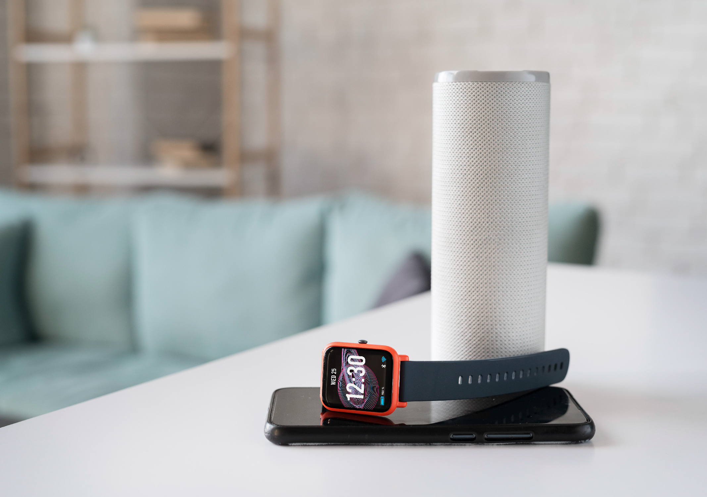

Miami, FL. Dec 07, 2021.

To no one’s surprise, <a target="_blank" href="https://www.cobuildlab.com/blog/How-Technology-can-save-your-Small-Business-in-this-COVID-19-crisis/">   COVID-19 </a> has been a momentous event for human kind that has forced a rethinking of many everyday aspects of everyone's life, regardless of lifestyle, occupation or social position. Lockdown has caused people to change the way they do things, whether personal or work related.

Although restrictions have gradually eased in some places sooner than others, people are still torn between "freedom" and the paranoia of remaining isolated out of fear of infecting themselves or others. 

Even so, the economy is making headway and cities have begun to move more and more, seeing concerts and other public events, lessening -perhaps- the importance of such a catastrophic situation, but affirming that life goes on and that there are ways to continue without harming others. 

Regardless, the overall picture indicates that people are leaning toward social distancing, for obvious reasons, wandering among the many studies that discuss the amount of time the virus can remain on surfaces. A widely accepted figure is between 8 hours and 9 days depending on the viral strain and the surface with which it comes in contact. And of course, there is already a general culture of constant hygiene that can help mitigate the potential damage of the virus, although it is not 100% effective.    

 <title-2>Did you know that office workers touch their faces about 15 times every hour?</title-2> 
    

This has prompted public places, such as offices, hospitals and stores, to take steps to minimize frequent contact with surfaces. It is now more common to see <a target="_blank" href="https://www.cobuildlab.com/blog/Artificial-Intelligence-Do-For-Your-Small-Business/">   AI-enabled</a> facial recognition systems to automatically open doors in the workplace, or using the <a target="_blank" href="https://www.cobuildlab.com/blog/IoT-in-supply-chain-management/">   Internet of Things (IoT)</a> to enable connected elevators or smart appliances. The truth is that IoT and AI solutions can - and are - playing a key role in helping people make the transition to the new normal of life more bearable.    

 <title-3>IoT and AI Solutions: 4 tech applications to reduce the spread of COVID-19 through direct contact</title-3> 
    

These are ways in which public places - in particular - can be safer zones for people who use them, looking for ways to reduce or eliminate contact between surfaces and artifacts that are likely to be frequently used by people.

<b><title-4>1. AI-Powered Contactless Access System</title-4></b>

Some companies, such as <a target="_blank" href="https://aws.amazon.com/">   Amazon</a>, are already exploring the use of facial recognition technologies to control social distancing between colleagues. In addition, several startups are beginning to offer tailored solutions for their customers' needs, such as the use of thermal detection at store entrances to allow automatic opening and closing of doors only for healthy employees and customers or, at least, with the temperature within established parameters that indicate that no infectious process is active. 

These are some of the technologies developed that use <a target="_blank" href="https://www.cobuildlab.com/blog/AI-powered-robots-for-warehousing/">   AI-powered</a> facial recognition to mitigate the potential risk to the ravages of the pandemic:

<a target="_blank" href="http://donottouchyourface.com">   Allows companies to train a machine learning algorithm - specifically Tensorflow.js - with their webcam.</a> By doing so, it will be able to detect when employees touch their faces and alert them accordingly.

<b>Contactless access system:</b> Includes both facial recognition and thermal control. Equipped with temperature scanners and <a target="_blank" href="https://www.cobuildlab.com/blog/Custom-software-Artificial-intelligence-IoT/">   IoT-based</a> door sensor technology, its system recognizes and records employee faces, compares them to the database, checks the temperature, and allows or denies entry, all in less than just 3 seconds. 

Biometric and card access should be a thing of the past, even though there are still many companies that rely on this entry system for their employees. 

The intervention of technology is very important to take on this new contactless lifestyle, IoT and AI solutions are the key for companies to adapt to the new normal we are facing until the situation normalizes - that we go back to how life was in 2019 - or considering that COVID-19 could be part of life.    

<b><title-4>2. Connected Elevator</title-4></b>

Returning to the office can be one of the situations that promotes surface touching the most and elevators are one of the places where, even though touching can be limited with capacity restrictions, buttons still exist and, considering when the virus on surfaces can last - if true - action should be taken. 

The use of interconnected sensors can help offices reduce the need for employees to touch common surfaces.

While encouraging the use of stairs may be an obvious choice in some workplaces, people working in high-rise buildings may not be able to use that option. Advances in IoT have enabled elevators to allow people in apartments and office buildings to use apps to indicate which floor they want to travel to.

Here are 2 very innovative examples: 

<b>MyPort App by Schindler Elevator Corporation:</b> It activates an elevator for 1 user and, thanks to machine learning, can even predict what time of day he or she needs service and which floors he or she usually goes to. In addition, because the system allows restricted access to the elevator, it also eliminates the need for outside security personnel.

<b>Hyundai Elevator:</b> According to the company, it offers a number of services to encourage hygienic practices, including a touchless button that can be activated without pressing.

Once again, <a target="_blank" href="https://www.cobuildlab.com/blog/ways-technology-is-changing-logistics/">   technology</a> promises advances that could greatly reduce contact with surfaces and between people, but of course, these are not cheap solutions, although they will gradually become part of the normality of companies.    

<b><title-4>3. Voice commands to activate devices</title-4></b>

Hand washing may be one of the best ways to prevent the spread of the virus, but what about the faucet? The same applies to all surfaces that are "very tactile" such as microwaves, switches, water dispensers, etc.

All this can be solved with IoT, as all these devices and appliances can be controlled by voice command thanks to voice assistants such as Google, Siri, Alexa, or even from the cell phone itself. 

An example of these innovative IoT and AI solutions is the smart faucet from "U by Moen" that works via voice assistant and even hand gestures. Also, there are light switches that can be programmed and air conditioners with cloud-based control panels.    

<b><title-4>4. Smart Lock & Door Knobs</title-4></b>

Doorknobs are one of the least hygienic surfaces in existence. There doesn't have to be a pandemic crisis to know that. Within all this need not to touch surfaces, doors could not be left out.

The example is something that was invented to avoid touching doorknobs in restrooms to protect us from those who do not wash their hands. It turns out that it is now required for every door you might come in contact with. 

<b>Automatic door handle dispenser:</b> Basically, it is an easy-to-install door handle that replaces a plastic surface right after touching it, so the next person who touches it will not come in contact with the previous person's bacteria or germs. 

Who would think that an invention from more than 10 years ago would be so necessary today, right?    

<youtube-video id="https://www.youtube.com/watch?v=_6ot2U0abuI"></youtube-video>    

COVID-19 has become an everyday situation, altering our routines and sanitizing what we previously, even if necessary, did not see or consider. 

The pandemic has forced <a target="_blank" href="https://www.cobuildlab.com/blog/digital-transformation-5-trends-to-pay-attention-to-in-2022/">   innovation</a> into action and has uncovered inventions that previously were not treated with the seriousness they deserved. 

Can <a target="_blank" href="https://www.cobuildlab.com/services/artificial-intelligence-development">   AI</a> and <a target="_blank" href="https://www.cobuildlab.com/services/iot-development">   IoT</a> bring us back to normality within this abnormality that we have been living for almost 2 years now?

<b>Cobuild Lab Team</b>
