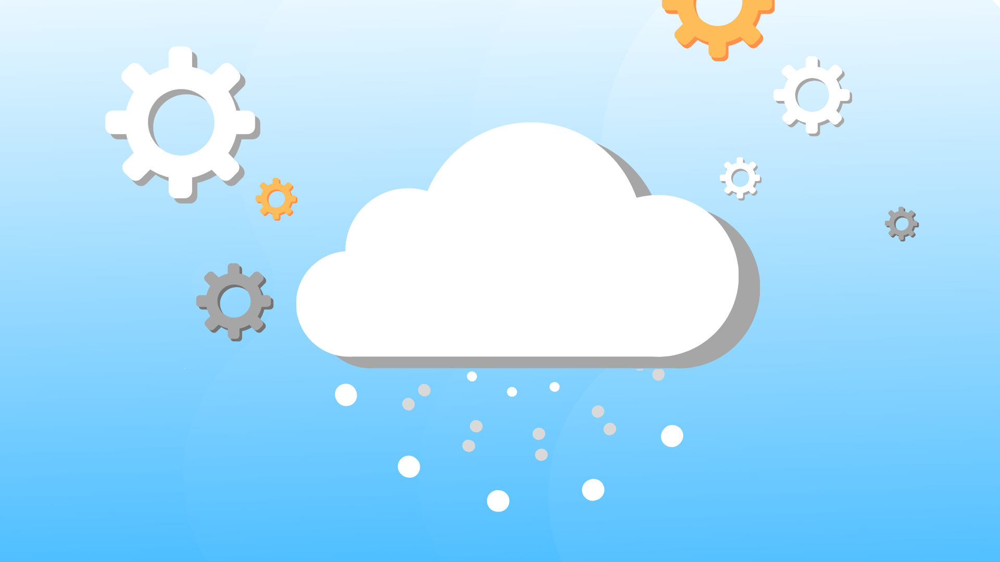
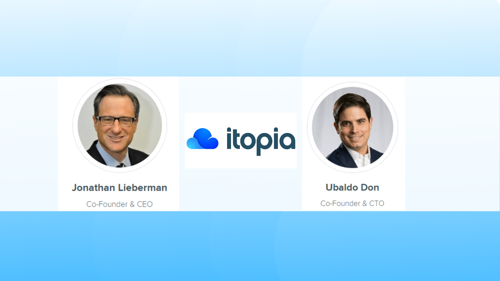
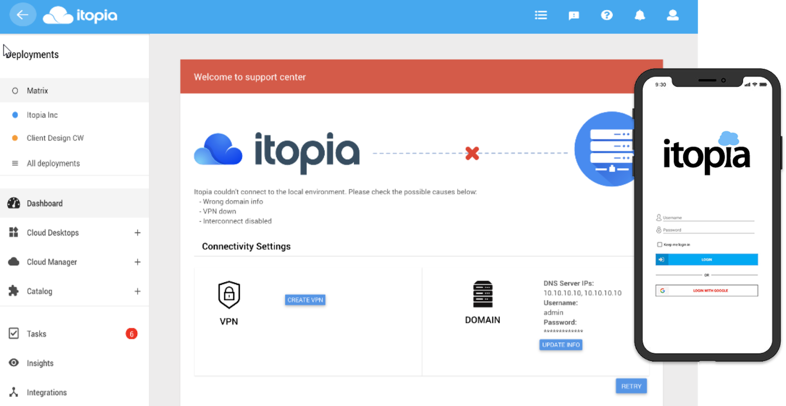

Today we want to talk about the leading desktop-as-a-service solution for the <a target="_blank" href="https://cloud.google.com/"> Google Cloud</a> platform, providing automated and orchestrated end-to-end software. We present to you Itopia.

We've all used or heard about the cloud; we know it allows us to store and access data and programs over the Internet instead of our computer's hard drive. 

The term 'cloud' is just a metaphor from the Internet. It goes back to the days of flowcharts and presentations that depicted the giant Internet server infrastructure as nothing more than a white, bloated cluster, accepting connections and delivering information while it floats.

There are three types of clouds: Private, public, and a hybrid between the two. A private cloud enables the user to their own infrastructure or site. It is ideal for businesses that deal with private data such as bank accounts or want to have privacy within the network. The public cloud, on the other hand, is very similar to how a power company provides its service as a utility, and the hybrid cloud combines features of both private and public clouds.

With a public cloud, all hardware, software, and other components of the underlying infrastructure are owned and managed by the cloud provider. In a public cloud, you share the same hardware, storage, and network devices with other organizations or "tenants" of the cloud. You access the services and manage your account through a web browser.

The founders of Itopia, <a target="_blank" href="https://www.linkedin.com/in/ubaldo-don-29a57935/"> Ubaldo Don</a>, and <a target="_blank" href="https://www.linkedin.com/in/jonathanlieberman1/"> Jonathan Lieberman</a>, knew that the public cloud would revolutionize our daily lives, and they were right. One of the main advantages of the public cloud is its low costs, you don't have to buy hardware or software, you just pay for the service you use. You don't have to worry about maintenance as the service provider takes care of it, the scalability is almost unlimited, and it is very reliable as they have a vast network of servers that guarantees no problems.

Ubaldo and Jonathan sought to enable IT managers to deliver Windows desktops and virtual applications to workers on any device, in the world's fastest and most secure hyperscale cloud, and that's how they founded <a target="_blank" href="https://www.itopia.com/"> Itopia, Inc.</a> in late 2013. 

They developed a software to automate the migration process and orchestrate the management of Windows workloads in the <a target="_blank" href="https://cloud.google.com/"> Google Cloud</a> to help companies transition from legacy VDI environments in their facilities.

Based in Miami, Itopia empowers enterprises to modernize IT by automating the configuration and monitoring of cloud resources and end-user management, all from a single control panel in the browser. Right now itopia Automates over 250 IT Tasks!

<title-3 align="centered"> ITOPIA CLOUD AUTOMATION STACK </title-3>

<youtube-video id="z5fDtjHgx8Q"></youtube-video>

Their flagship product - <a target="_blank" href="https://www.itopia.com/desktop-as-a-service/"> itopia Cloud Automation Stack</a>  - is a SaaS offering used by IT teams to deliver Desktop-as-a-Service (DaaS) to their organizations in the Google Cloud, all from a single control panel.  <a target="_blank" href="https://www.itopia.com/schedule-a-demo/"><button type="button" class="button is-primary">Request a Demo</button></a>

Here's a tutorial that shows you <a target="_blank" href="https://cloud.google.com/solutions/partners/deploying-windows-rds-itopia"> how to use Itopia's cloud automation stack (CAS)</a> to deploy and manage <a target="_blank" href="https://docs.microsoft.com/en-us/windows-server/remote/remote-desktop-services/welcome-to-rds"> Windows Remote Desktop Services (RDS)</a> integrated into various Google Cloud services. 

<title-3 align="centered"> Google Cloud's exclusive DaaS solution </title-3>

In 2019 <a target="_blank" href="https://www.itopia.com/itopia-integration-with-google-cloud-managed-service-for-microsoft-ad-remote-desktop-collection-orchestration/"> Itopia Announced Integration with Google Cloud Managed Service for Microsoft AD, Remote Desktop Collection Orchestration</a>

Itopia is now Google Cloud's exclusive DaaS solution, and in 2018 it won Google Cloud Technology Partner of the Year.

<youtube-video id="ygPMUPBpHB4"></youtube-video>

With itopia, IT teams gain the control and agility necessary to give employees secure access to the custom-tailored apps and resources they need: anytime, anywhere, on any device. Itopia is definitely setting the table for the future of work - one virtual desktop at a time.

For more information on itopia’s solutions please visit: <a target="_blank" href="https://www.itopia.com/"> www.itopia.com</a>
