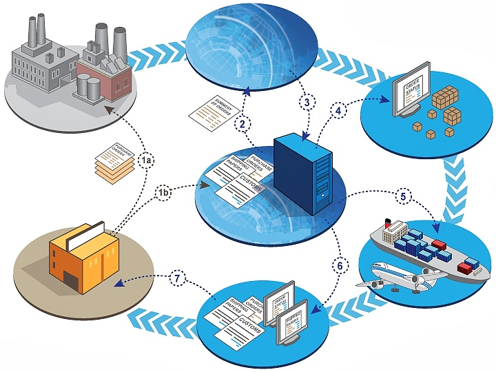

Companies today need great logistics to make their shipments to consumers, and these shipments need permits and all kinds of documentation to pass through borders, whether by air, sea, or land.  On top of that, they need to organize orders, deliveries, collections, and others. With that in mind, today we bring you 5 **key features that your freight forwarding software** must possess. Let’s learn more about them:  

 

<title-2>Freight forwarding software solution as you know is:</title-2>

 

The freight forwarding solution software is a tool that manages the shipments of the companies. From issuance to receipt. 

Without these tasks and resource managers, companies' products would not be able to reach their final consumers. 

Most common tasks are related to the reception, storage, and delivery of the cargo in real-time.  It also helps to manage the necessary shipping documents such as air waybills and landing bills required to move shipments by land, sea, and air.

 

 
  
Source: <a target="_blank" href="https://mpoverello.com/2013/06/05/freight-forwarder-liability-at-a-glance/">  Mpoverelo </a>

It also handles quotations, reservations, and pick-up orders. As well as determining the most feasible and cost-effective shipping mode for the company, without compromising the original product conditions such as freight, ocean, air, expedited ground, truck brokerage, LTL, linehaul, and rail. 

 

<title-2>Some key features for your freight forwarding software</title-2>

 
  
<title-3>Invoicing:</title-2>

 

Invoicing is one of the most important aspects to consider in shipping activities, as it can help you save considerable paperwork time and get paid faster, not to mention the facility it provides for multi-currency payments. It also helps with the necessary documentation where you can detail your company details and shipping partners. 

 
  
<title-3>Quotations:</title-2>

 
  
Streamline the generation and transport of quotations by any means of transport, always with continuous monitoring to convert them into orders that later become revenue for the company. Include ad hoc quotes, one-click shipment generation, email templates, shipping rate generation, and much more.

 
  
<title-3>Order management:</title-2>

 
  
Capture, track, and fulfill orders across multiple sales channels. Track the status of orders, manage to invoice, manage recurring orders, integrate with shipping carriers, clone orders, detect errors, handle back orders, manage returns, and reconcile with purchase orders.  

 
  
<title-3>Warehouse management:</title-2>

 
  
Manage and coordinate inventory and actions throughout a warehouse or distribution center. Optimize picking and shipping. Ensure a higher accuracy of order fulfillment, faster delivery times, efficient labor management, increased visibility of an order’s status, optimizes storage space, minimized inventory movement, and improves the yard and dock productivity.

 
  
<title-3>Tracking:</title-2>

 
  
This is more consumer-driven as consumers can see in real-time the status of their package or product and creates greater reliability with the customer.

 

<title-2>With a customized software tool for freight forwarding we can:</title-2>

 
  
Make a predictive analysis (with artificial intelligence) of the possible fluctuations that will have the US dollar or the currency you use to pay your international freight rates (freight) as we understand that these variations are a problem for you as a customer and for external providers of this service because it directly affects the cost of the goods. If we analyze the historical, risks, etc, we can establish a parameter to cover these fluctuations. 

This can also be done with the change of seasons, oil and fuel prices, and even the weather. 

Unify and better manage port fees and service charges (regardless of country). 

Effective handling of international documentation (including environmental regulations and conditions) that increase over time. 

Solve all transportation infrastructure problems that may arise (as a customer and as a supplier).

 

<title-2>How does the freight forwarding system work?</title-2>

 

The freight forwarding system works as a bridge or connection between the customer and the other forwarding services. Products can be forwarded to and from international destinations using various carriers with different requirements and legalities. And of course managing all methods of shipment whether by air, land or sea. It also helps evaluate all possibilities and possible connections, to ensure the total profitability of the operation. As long as you manage to channel all these aspects, including the first ones mentioned in the article, you will be able to guarantee a successful operation in each of your shipments.   

You have been able to see how important freight forwarding systems are. Today's companies should not carry out their shipping operations without the use of these tools (commercial or customized). 

Are you ready to build your tool and advantage your competition with a high-quality freight forwarding process? Then contact our team, and get started.
