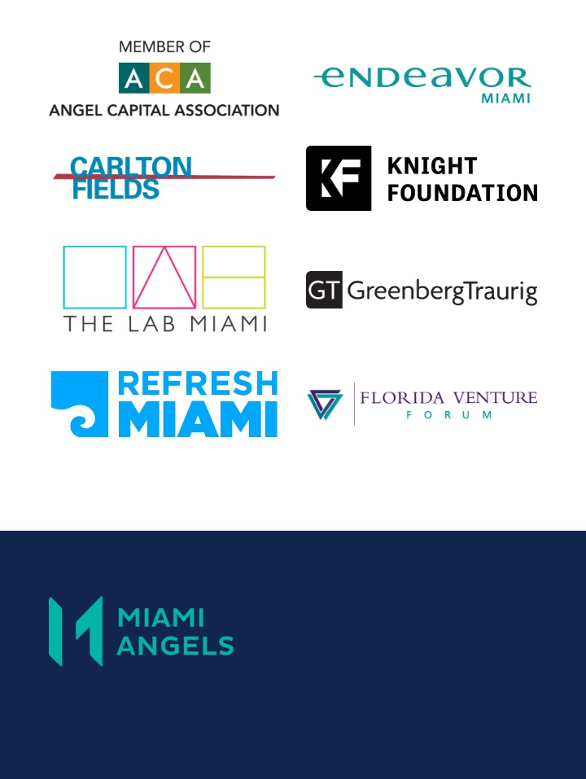
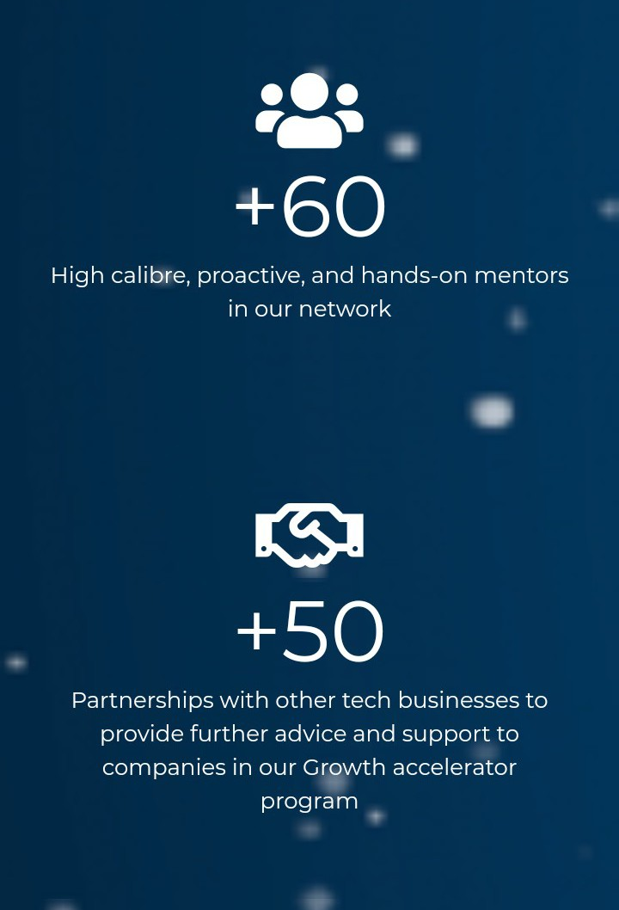

This was the month of funding. We share tips, methods, and tools that you could use and follow for raising enough money for your business. But we are located in Miami, and we want to support especially to startups and entrepreneurs here. That’s why we decided to make a post about one of the most common methods for raising funds: Venture Capital.

You can access to venture capital in many firms, and we will show you the top **Venture Capital firms in Florida**. Enjoy it! 

<title-2>Venture Capital Firms in Florida would be the most important support for your business idea</title-2>

<title-3>1. HIG Capital</title-3>

[H.I.G Capital](https://higcapital.com/) is a big and billion venture capital firm that has offices in the whole world, including Miami. 

In the country, they have a presence in eight states. Miami, New York, Boston, Chicago, Los Angeles, San Francisco, and Atlanta. 

Also, they are in South America and Europe, so it is a really big company. 

They bring private equity, credit, and lending products. Also, they contribute with bio-health, real estate, growth equity and they give financing for especial situations too. 

H.I.G has $30 billion of equity capital under its management. 

They have over 350 members for operating, consulting, technology and financial management. 

This company was found in 1993 and from there they have supported to more than 300 companies in the world. They support small and mid-size companies focuses on leveraged buyouts, debts, and other investment. 

You can see all the companies they have supported here, in [its portfolio](https://higcapital.com/portfolio/sector).

<title-3>2. Rokk3r Fuel EXO</title-3>

[Rokk3r Fuel EXO](https://www.rokk3rfuel.com/) is a global funding company for exponential growth companies. 

Technology is their preference. 

The company has an office here in Miami, but also they are in New York, Denver, London, Toronto, Bogota, and Mexico City. 

This firm has been interested in startups specialized in virtual reality, augmented reality, artificial intelligence, cyber defense, on hardware like 3D printing or mobile. Also, in the blockchain, e-commerce, consumer media, and others in the tech area. 

It is really big and you would apply to them for getting funding if you plan to be in one of these markets. 

They look for companies with the next requirements.

Source: [Rokk3r Fuel EXO](https://www.rokk3rfuel.com/)

Enjoy [its portfolio](https://www.rokk3rfuel.com/portfolio/) here. 

<title-3>3. South Venture</title-3>

[South Venture](https://sthventures.com/about) is a firm that has more than 7000 investors associated in over 6 countries in the whole world. 

This firm of venture capital is located in Miami and as we say, it is an “initiative of investors for investors”. The same who created the investors club of [Angeles IG](https://www.igangels.com/)

An interesting fact about this firm is that they have worked in co-investment with other big venture capital firms like Google Ventures, Goldman Sachs, YCombinator, Red Point, etc. How did they do it? Well, developing a platform where there are millions of investors in the world (including from these big firms) bringing the opportunity to entrepreneurs of getting funding from any of this venture firms or investors. 

They are focused on startups in Latin America, Spain, and our country: United States; and their investment is over $6.000.000. Technology is their preferred target. So, you can choose this venture firm, use its platform and maybe, getting more investment from other venture firms in the world. Are you ready? Other 23 startups as Nubelo and Videoo did it.

<title-3>4. Miami Angels</title-3>

[Miami Angels](https://www.miamiangels.vc/home) is a company that provides capital to tech companies in Florida, especially in the South.

In this firm, there are over 100 investors who love investing in early-stage companies.

They not only bring funding. Also, They work for that every entrepreneur can have access to best resources and a path to future funding. 

This company also bet for global networks of investment. That’s why they work closely with other funding companies like:

Source: [Miami Angels](https://www.miamiangels.vc/home)

If you want to know its work, we invite you to see [its portfolio](https://www.miamiangels.vc/portfolio).

<title-3>5. Venture City</title-3>

This firm is special because they are not only a venture capital firm, also, they are an accelerator and incubator of startups localized on the Little Havana and Madrid.

[Venture City](https://theventure.city/) have invested in more than 18 companies in the world, and not only in the US.

This firm develops a venture and growth acceleration model that benefits startups in the whole world bringing them capital, engineering, product, growth, marketing, legal, and even internationalization strategies. 

They prefer software companies but they are not exclusive to this. Actually, they define the company as a multi-industry funding. 

These are its numbers:

Source: [Venture City](https://theventure.city/)

If you are in Miami and have good ideas to make a startup, now you have a panorama of which **venture capital firms in Florida** can help you to find the necessary funding for making it real. If you need more information, we can help you with this, we are an idea accelerator too. Good luck entrepreneur. The goal every day is closer.

