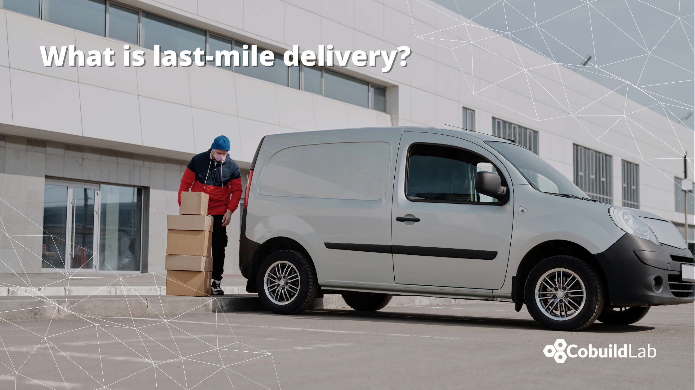

When we buy a product online, absolutely no one wonders how it gets to the door of the house. But since 2,400 BC the Egyptians had royal messengers who communicated to the people all the decrees enacted, and later on, the Romans and the Greeks used a system of postal couriers as well. Of course, courier and parcel services have nothing to do with those archaic institutions but when technology arrived it was tremendously affected. For example, you no longer received correspondence in the mail, you just got an email.    

But it’s the digital era that brings these services back to life, giving them a global and instant meaning. Thanks to the rise of e-commerce and retail giants like Alibaba or Amazon, the courier and parcel industry is more alive than ever. Now that we are in pandemic times, the industry that we once considered archaic has become incredibly necessary and in high demand, forcing it to reinvent itself, and that is where last-mile delivery comes in.    

<title-3 align="centered"> What is last-mile delivery? </title-3>    
    

 Last-mile delivery refers to the very last step of the delivery process when a parcel is moved from a transportation hub to its final destination—which, usually, is a personal residence or retail store. This is the most critical step in the delivery process, and the one that businesses want to ensure is as quick and efficient as possible. This is to keep up with the continually increasing consumer demand for speedy shipping, especially in e-commerce, food, and retail industries. It also happens to be the most expensive leg of the journey that goods take to reach their ultimate destination.     

<title-3 align="centered"> Optimizing last-mile delivery </title-3>    

Naturally, there will be hundreds of situations beyond our control, although many of them can be solved with good planning since not all companies are prepared to face the great demand of e-commerce logistics, perhaps this is why so many new companies offering the service in an outsourced way have emerged lately. That is why we will expose some key points that must be optimized in the supply chain to achieve the customer's expectations.    

* **Optimize delivery routes:** it is necessary to take into account traffic flow, road closures, and more to find the most convenient routes to cover the highest number of deliveries in a short time, and applying the Backhaul concept so you can make the most of the truck's return trip by avoiding empty miles.    

* **Opting for lighter vehicles** allows agile travel in urban areas. The trend is towards the use of electric or hybrid vehicles that are much more efficient for transportation.    

* **The "click & collect" trend** as an alternative delivery method is gaining momentum as platforms such as Amazon, which already have physical stores where you can pick up your packages, have understood that this strategy is more economical and environmentally friendly.    

<title-3 align="centered"> The future of Last-Mile Delivery </title-3>    

As we have been discussing, the COVID-19 era has accelerated many processes in the supply chain, making the courier and parcel industry a crucial necessity. To meet this massive demand, the industry will have to rethink different strategies to improve its service, including betting on that which once displaced it from the market: technology. These are some of the strategies that are expected from last-mile delivery in the near future:     

* **Betting on new technologies:** the use of drones and autonomous vehicles to robotic automation are some of the technological integrations that are already being adopted.    

* **Increase delivery locations** to offer customers a range of options.    

* **Address Intelligence** is the next big thing for B2C deliveries    

* **More environmentally friendly deliveries**, using carbon-neutral vehicles, or rethinking your delivery methods.    

* Once again, **route optimization** that locates optimal unloading points and more efficient routes will continue to be a must for the industry.    

* There are more and more incumbents in the industry that are driven by the entry of social delivery or collective transport companies called **"New Players"** capable of optimizing the routes and supply chains of the future.    

* The construction of **urban micro warehouses** allows shortening the execution times of their daily operations reducing costs and efforts.    

Last-mile delivery has been a key factor for businesses across the globe in areas where they have a need for more effective delivery service. Consumers easily look for alternatives if their logistics partners come up short in providing top-notch supply chain services including last-mile delivery software.    

Technology is the best strategy for the industry, through it you can build solutions that improve rational efficiency, allowing you to handle high delivery volumes. The use of Custom Software Solutions provides the ability to implement geolocation systems that allow assigning closer distribution services, avoiding unnecessary travel, reducing delivery times and fuel consumption. Companies such as <a target="_blank" href="https://cobuildlab.com/"> Cobuild Lab</a> offer a variety of resources to streamline all processes in the logistics industry by leveraging technology to create software products capable of accelerating last-mile delivery processes and increasing competitive advantages.    

Optimizing last-mile delivery can result in significant savings for e-commerce businesses and retailers, especially as the number of shipments across most industries continues to skyrocket. This is crucial in building brand loyalty that could help companies take a huge slice of the market share.    

<title-5 align="left"> About Cobuild Lab </title-5>

We partner with Industry Experts to solve Logistical and Productivity problems with Custom Software Solutions, Artificial Intelligence, and the Internet of Things.  Since 2012 we've focused on developing and combining cutting-edge techniques, tools, and technologies to increase development speed to deliver faster results.    

<youtube-video id="5fbYxQNgJ7s&"></youtube-video>     

Got an idea for a web or mobile app? Let’s build it! Check out our <a target="_blank" href="https://cobuildlab.com/price-calculator/">  price calculator</a> to have an estimate of the cost of your project or email us at contact@cobuildlab.com and get a FREE online consultation. 

