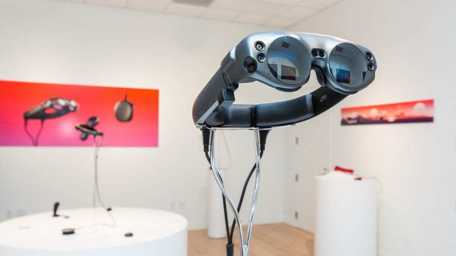
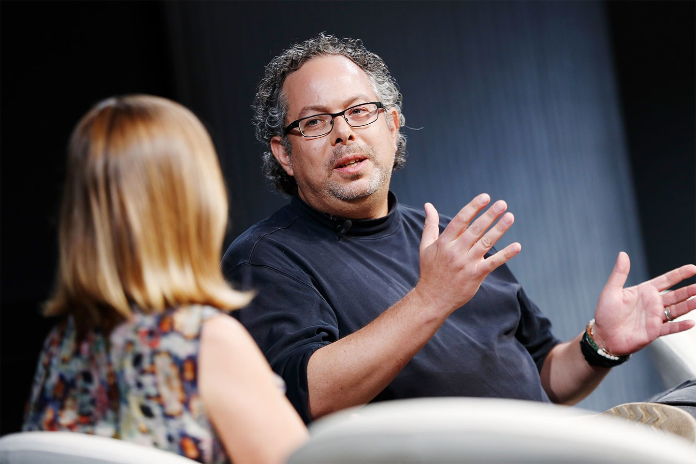

Magic Leap is an American company, located in Miami that is revolutionizing the technology scene. 
Founded by **Rony Abovitz** in 2010 has raised $1.4 billion, with large-scale investors such as _Google_ and the _Alibaba Group_. **Magic Leap** has been working on a virtual retinal screen as well as an augmented reality headset.  

<credits>
By [Sarah Tew/CNET](https://www.cnet.com/pictures/magic-leap-one-photos/)
</credits>

Rony Abovitz is an American Entrepreneur born in 1971. Abovitz's father worked in the real estate industry and his mother was an artist. Abovitz states he grew up playing Atari video games, and at the age of 8, he received his first computer which he says was an Apple Macintosh. After high school, Abovitz aimed to have a career as a scientist. He attended the University of Miami, where he eventually obtained a master's degree in biomedical engineering. While attending university, he was also a cartoonist. 
Source: [Wikipedia](https://en.wikipedia.org/wiki/Rony_Abovitz)   

<credits>
By [Vanity Fair](https://www.vanityfair.com/news/2017/10/magic-leap-raises-500-million)
</credits>
Abovitz founded Magic Leap Studios to satisfy his passion for comics. After selling his medical robotics company, he managed to finance his idea. His main idea was to make a series of feature films, but after meeting at _Jackson's Weta Workshop_, the project became something more. 

In October 2014, the startup raised over $540 million of venture funding from _Google_ and other investors. On March 7, 2018, Magic Leap raised $461 million in Series D funding from Axel Springer Digital Ventures and Saudi Arabia's Public Investment Fund, which brought the total funding amount to $2.3 Billion. Other investors include _Alibaba Group_, _AT&T_, _JP Morgan Chase_, _Fidelity Management_, _Qualcomm Ventures_, and _Morgan Stanley_. 

In 2016, **Forbes** estimated that Magic Leap was worth $4.5 billion. In October 2017, Magic Leap announced the partnership with online comic book publisher Madefire. Magic Leap unveiled its first product, the Magic Leap One, on December 20th, 2017. Magic Leap One was released to developers in 6 cities on August 8, 2018. Magic Leap, a company that hopes to break new ground in what it means to be a "computer person". Change the world's thinking and take it to the next level. CEO Abovitz promises to immerse himself in experiences through computer-generated images with the physical world.  

<credits>
By [Engadget](https://www.engadget.com/2018/02/13/magic-leaps-ar-headsets-price-nba-deal/)
</credits>
 
## **How does it work?**

It is a new portable computer (this is composed of a wireless remote control and headphones connected by cable to a pocket PC) designed to draw a spatial map of the surrounding environment and create the illusion that digital objects are in the same environment as the person using it. 

The glasses contain the screens, audio, and sensors of the external camera. A handheld controller with a touchpad and a system that connects to a round computer that attaches to your body and makes everything work. In June 2018, the company's first headset, **Magic Leap One**, did introduce for the first time, later in July, the device confirmed its use of _NVIDIA TX2 hardware_. 

This same year _AT&T_ invested in the company and will become its exclusive partner, with Magic Leap One being the first product to be sold only in AT&T-owned stores throughout the United States. 

<youtube-video id="TfzlU7nW23Y"></youtube-video>

<block-quote>
_"The Magic Leap One headset shows the potential of 3D-mapped augmented reality displayed through clear lenses, but like the Microsoft HoloLens, it's purely development hardware for the earliest of adopters."_
</block-quote>

[https://www.pcmag.com/review/363545/magic-leap-one/](https://www.pcmag.com/review/363545/magic-leap-one/)

<block-quote>_"Google backed Magic Leap and Microsoft among potential bidders for controversial augmented reality warfare systems for US army soldiers"_</block-quote>

[https://www.dailymail.co.uk/sciencetech/article-6212051/Magic-Leap-Microsoft-potential-bidders-AR-warfare-system.html](https://www.dailymail.co.uk/sciencetech/article-6212051/Magic-Leap-Microsoft-potential-bidders-AR-warfare-system.html)
