**Convince investors** is something that every startup, an entrepreneur has to do and do it well. 

Have you ever heard the meaning of a brief? Well, a brief is a summary, a resume of a process, product, company, business model, or any information you want to share summarized. Well, a **pitch deck**, which is our goal with this article, it is a kind of brief that helps you bring an overview of your business plan.

This overview is commonly used for entrepreneurs to convince investors and get economical resources to their business project for finding and convert people that they want in their teams. 

If you need investment for achieving a business idea, well, organize your ideas, give it a body, and share it with customers, partners, and co-founders making a pitch deck.

<title-2>Structuring the perfect pitch deck</title-2>

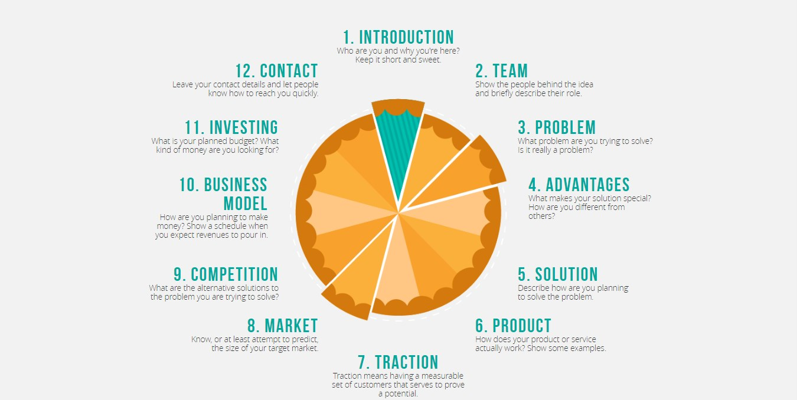

Source: [Pitch Deck.improve presentation](https://pitchdeck.improvepresentation.com/what-is-a-pitch-deck)

**1. Make an effective and striking introduction**

You can begin saying who you are, and why you are there talking with them. 

Give some facts about your business idea without revealing it completely. 

As every speech, this is one of the most important moments, because you must catch the attention of everyone in the room. So, explore your creativity and use all the resources you can for catch and keep the attention of the audience. It could be a video, and activity, a phrase, etc.

**2. Show the whole team (people behind the project)**

If you have a solid project or you want to have one, It is more than needed a great team. 

It is high recommendable that you show every member of this team, and explain well their roles. 

This will give value to your speech and project, and investors will see the human value and the whole talent behind the business proposition.

**3. Talk about the problem**

If there wasn't a problem or a necessity to solve, your business would not have a reason to be.  

Before launching a product or service in the market you need to be sure about what key problem you are solving or which necessity you are satisfying.

Well, if you need investors, you must you be clear about the problem for transmitting the information to everyone you will involve in the project.

**4. Offer the solution**

You talked about the problem, but what happens with the solution? 

In this fourth slice in your pitch deck, you must talk about the solution you are offering.

How you plan to solve it. Be clear and concise, but explain as good you can because this is your most important value proposition. 

**5. Show what makes you different from others (Advantages)**

Almost every necessity in the world is covered for a product. There are lots of ideas and good business proposal.

Show and tell every value proposition you have that make you different from other alternatives. 

Take your time at this point. You would win investors in this phase that we call “advantages of your business plan”.

**6. Present the product in action**

How does your product or service actually work or how you plan that It will work. 

Captures, screens, UX, UI if it is a software and every resource that shows the functionality of your business plan. 

This will give you solidity because you would have all the details in mind.

NOTE: a video works really good to this phase of your pitch deck.

**7. Traction, traction, and traction**

Traction is the potential of your business plan. 

At this point, you should show a set of potential customers for your product or services as proof of the success you would have. 

If you want to reach investors you should tell them that your project will gain enough money, and people will want to buy It. 

Incorporate this information in your pitch deck. It will be very useful.

**8. One of the most important points: the market**

Try to size the target market and make a prediction or estimate the segment you would take in the market. 

Investors want to know the size of this market, how much time they will recover their invest (ROI), how much is valued the market that you plan to get in, what kind of market is, and especially the market growth.

Which are our recommendations? Show the market growth in the past, in the present, and based on that, make a prediction of market growth. 

To do this in the best way possible, It is recommendable a graph with this information.

**9. Be transparent about the competition**

Part of the information you have to manage is how many brands exist in your market niche.

This would help you to know what works for them and what mistakes you shouldn't repeat.  

Also, It can give you information to make the predictions, and basically to know the environment that you will be part. 

Size the market and Talk about the competition when you are making a pitch deck; this will give transparency and a panorama of the market. Investors want to know that.

**10. Talk about the way you will earn money (business model)**

Everyone that will participate in your business needs to know this. Why? Because of your profit also will be their profit. 

This is the consequence of every business, so be as clear as possible and show which will be the exact profit percent for everyone. If they invest they will want to recover their investment and more than that.

**11. Explain what investment you want**

Did you know that there is a different kind of investment?. Actually, you can look for investors even when your product or service have been released and you want to upgrade It, or launch something special. 

Almost at the end of your pitch deck, explain what kind of investment you want or you need. And tell specifically how you are gonna use it.

**12. Show all your contact information**

Be accessible. Bring all your contacts(telephone numbers, emails, social media account)  and investors will contact you and they would feel closer of you. 

We recommend you to do this at the end because It is the information they will remember better.

If you are not totally clear about how you should structure the perfect pitch deck, we leave you this video that actually it is a template for doing one.

<youtube-video id="UdKkfuYCAjA"></youtube-video>

<title-3>This that you NEVER should do in a Pitch Deck</title-3>

Rules are rules. 

For doing a pitch deck a convince effectively to investors you do not just have to do certain things, also there are some mistakes that you never should do. These are some of them:

* **Don't use too many bullet points that will bore your audience**

Source: [Pitch Deck.improve presentation](https://pitchdeck.improvepresentation.com/what-is-a-pitch-deck)

This would confuse to investors and they will pay more attention to understand them, that the information you will be sharing.

* **Don't talk too much and use your own words to explain**

Source: [Pitch Deck.improve presentation](https://pitchdeck.improvepresentation.com/what-is-a-pitch-deck)

As any speech, you shouldn't take too much * time and show too much information, because your audience will feel bored and tired. 

Also, read keywords and explain in your own words. That will demonstrate more confidence and knowledge about the business and the market. 

* **Don't use many texts. Take advantage of images**

Source: [Pitch Deck.improve presentation](https://pitchdeck.improvepresentation.com/what-is-a-pitch-deck)

Images and videos are more interesting and catch better the attention of every investor, co-founder or audience. 

Use them more than text for your presentation. Write only keywords that can help you to remember the whole information, and keep in context to everyone. 

* **Don't use small fonts and prepare with time your speech**

Source: [Pitch Deck.improve presentation](https://pitchdeck.improvepresentation.com/what-is-a-pitch-deck)

If you don't know enough about design, It is ok. But remember that you shouldn't use fonts too small because people won't read It. Also, it is a good idea to choose the color for the background and the font in the video or the presentation based on the hour you will present It. 

For example, if It is early in the morning or when the sun is shining, It will be better darker colors because the light color will make more difficult the reading. 

The opposite happens when the presentation is at night or in a place with low sunlight. Colors like white and light blue will be more appropriate. 

Also, you should know that these color tips are for one of the elements ( fonts or background). The other element must be completely the opposite kind of color.

Suppose that you choose a dark color for the background, well, your texts you should put it in light colors. 

All of these aspects implies preparation anticipated. So, never in the life, you go without preparing well your pitch deck.

<title-3>Tools that will help you with your investment pitch-deck</title-3>

* **PowerPoint**

For doing a beautiful presentation and show the whole information in a good way.

* **Photoshop**

This amazing tool is part of Adobe Suite, and It is perfect for editing photos that make your speech more interesting.

* **After effects**

A good idea for making the perfect pitch deck is using animations or motion graphics. This program of Adobe Suite can help you to do this.

* **Prezi**

This tool incorporates slides for presentation and animations. 

It is an all-in-one program that will help you to make the best pitch deck.

**BONUS:** If you don’t know where to start,  [YCombinator](https://blog.ycombinator.com/intro-to-the-yc-seed-deck/) and  [Sequoia Capital](https://www.slideshare.net/PitchDeckCoach/sequoia-capital-pitchdecktemplate), offer 2 powerful templates

<title-3>A good example of a pitch deck</title-3>

The best way to understand something is looking some examples. Today we made it with a good pitch deck. How we say before, you will need a presentation, video or animation to support your pitch deck. 

This time, we select an Uber Pitch Deck. Enjoy it and take every note you can.

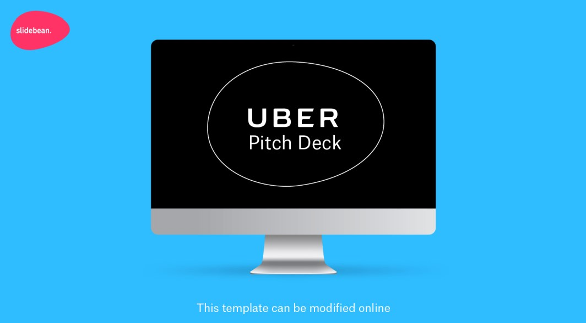

 

 

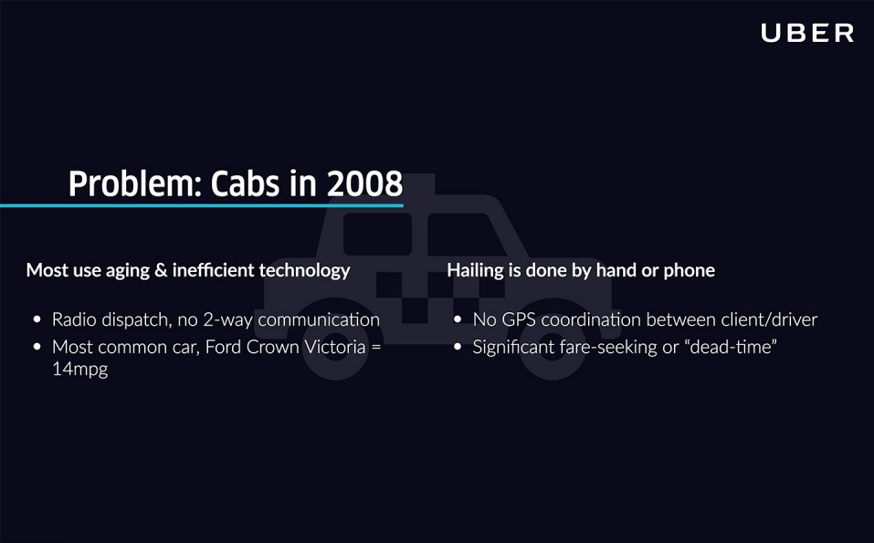

 

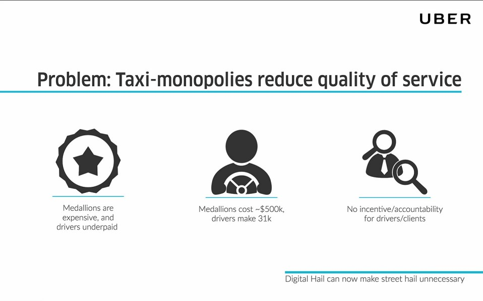

 

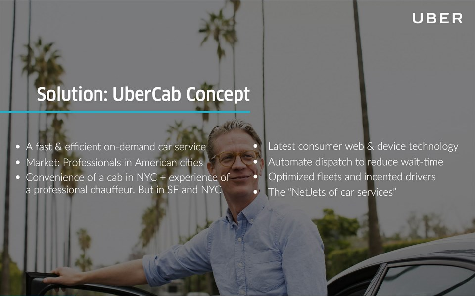

 

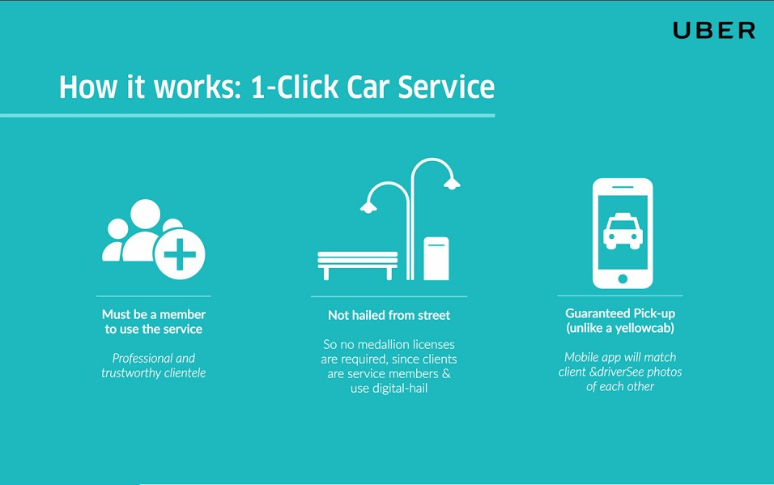

 

 

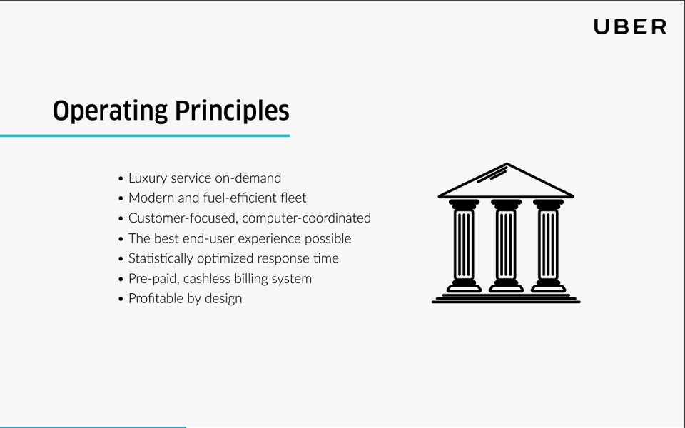

 

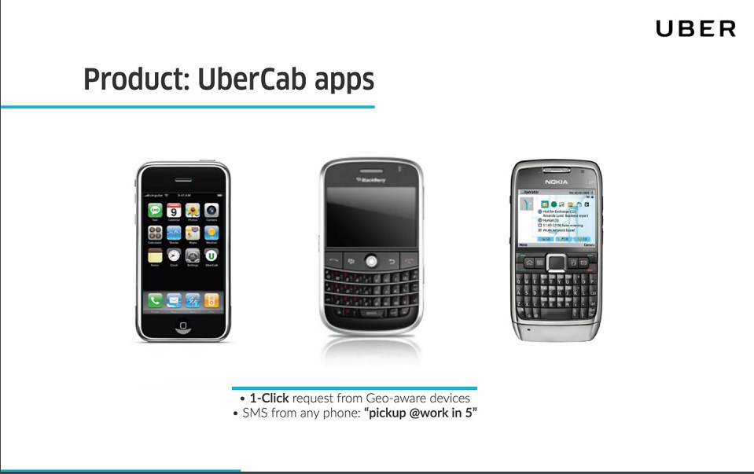

 

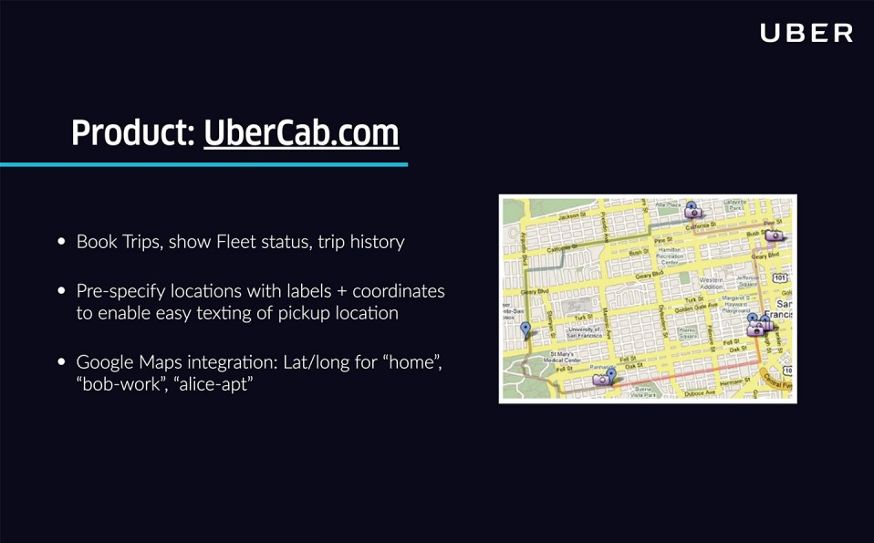

 

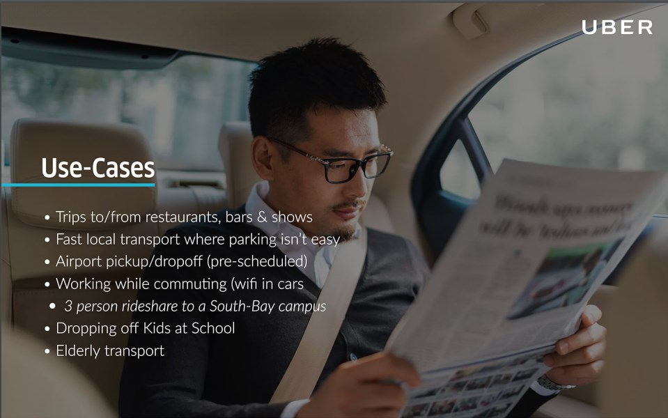

 

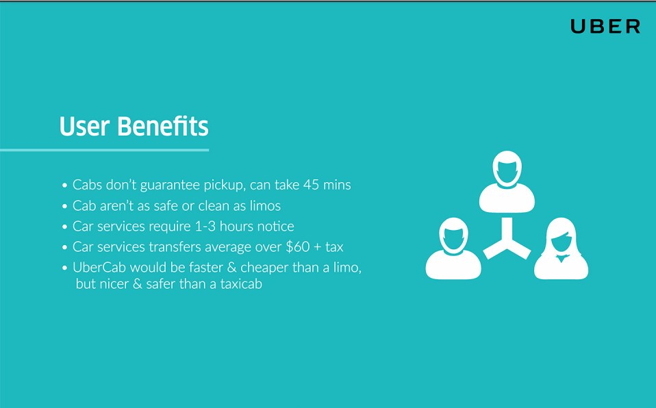

 

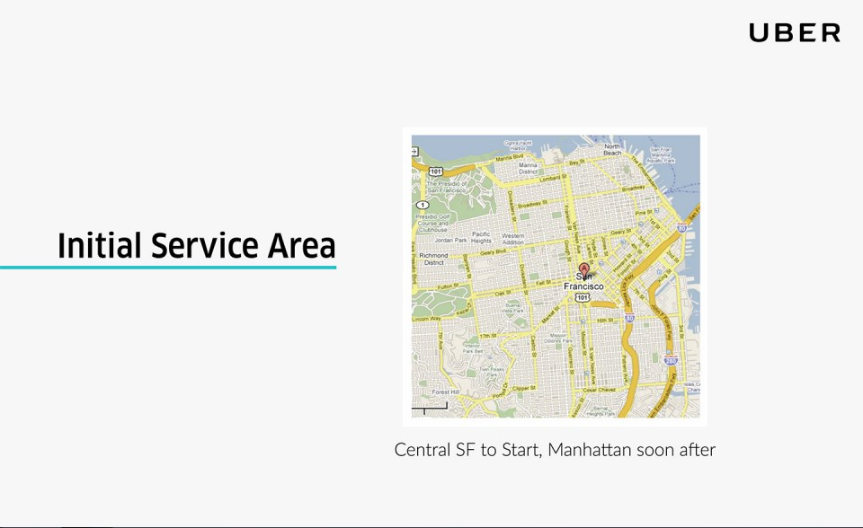

 

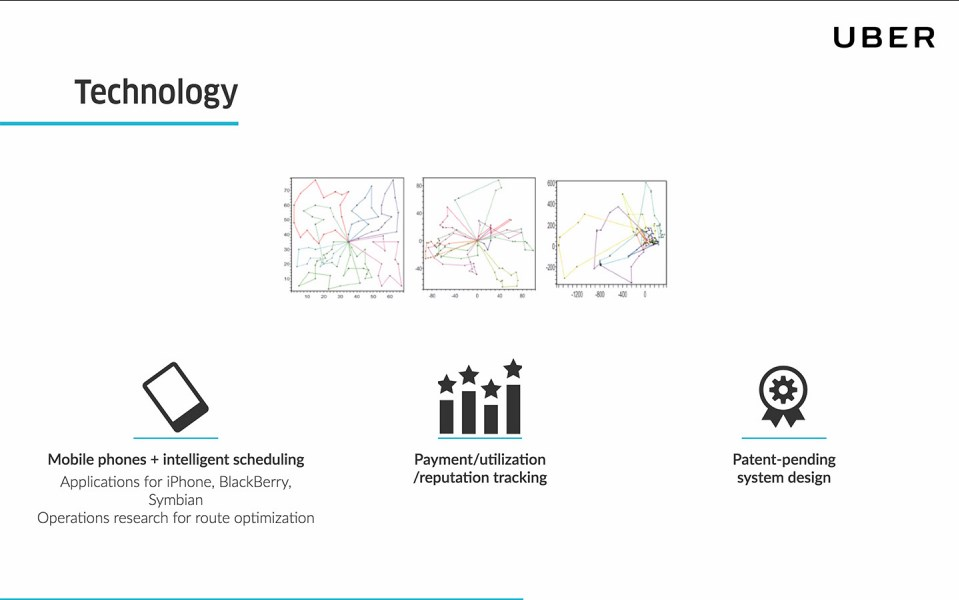

 

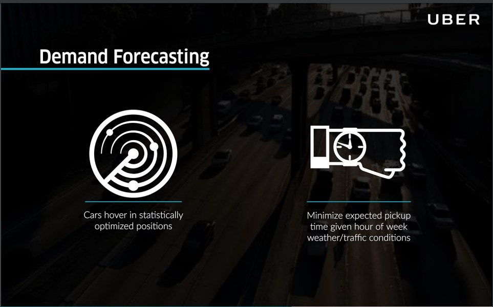

 

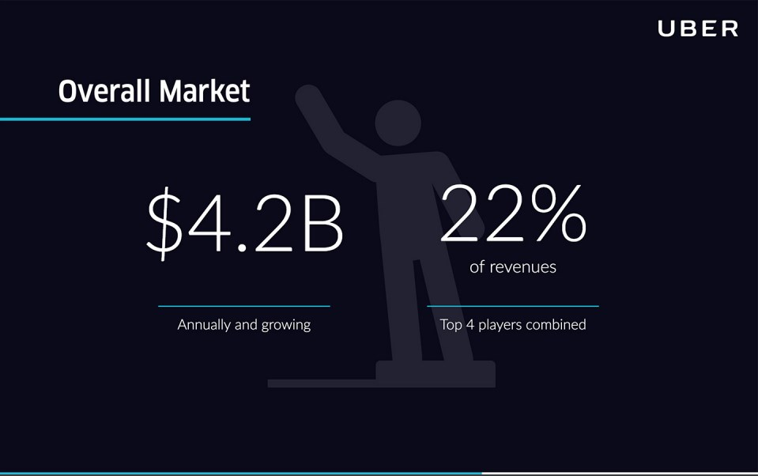

 

 

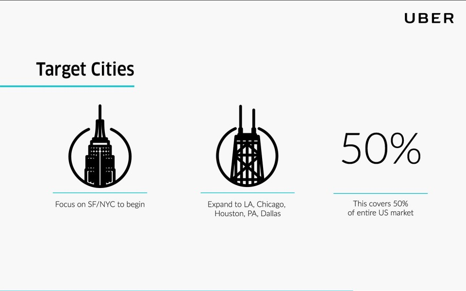

 

Source: [Slide.bean](https://slidebean.com/blog/startups/pitch-deck-examples)

 

Would you like to have more information about the perfect **pitch deck**? We can help you with that. Contact us and **convince investors** in an easy, fast, and effective way. For now, follow these steps and work hard in your speech. Good luck! 

