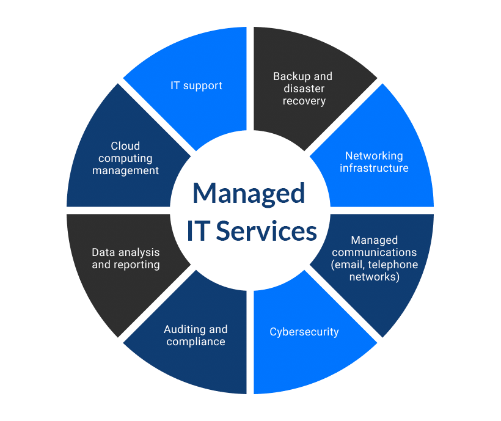

As companies begin to grow, so do their technology needs. Flourishing companies often find that they can save time and money by hiring the right managed services partner. Likewise, for a company to remain competitive in an ever-changing marketplace, it must know how to manage its technology and adapt to new market trends. Next, we will show you a little more about what this is all about and what you should know before hiring a service like this for your company or business. 

 

<title-2>What comprises an <a target="_blank" href="https://www.cobuildlab.com/blog/Internal-vs-outsourced-IT-support/"> IT service </a>?</title-2>

 

**IT services** involve a set of tech services and support for organizations to create, manage, access, optimize and store their information and processes. The great thing about IT support services is that they can be as simple or as detailed as the person asking the question wants them to be. Often, a question can be answered in seconds or minutes. 

Other times, the help desk assistant will be more than willing to spend hours with the inquirer on the phone or via email to provide the technical solutions needed to use the product. Although each helpdesk is different, it is usually possible to access all the necessary information and support through them. Sometimes it may take several calls to get computer problems solved, but that's what the IT operator is there for.

 

<title-2>Some requirements your IT support provider should have</title-2>

 

<title-3>* Track record in your industry:</title-3>

 

When selecting an IT service provider, the experience and reputation it may have in the market or sector where you or your company works can be a determining factor. If they do not have sufficient knowledge, expertise and experience according to the sector to which your company belongs, this will pose a great risk to your business operations. That is why you should always make an investment on the background of these companies and how their reputation is in the environment. Also, you can take a look at the resumes of their top IT professionals to see if they have already worked with clients in the same field as you. All of this allows you to have a more detailed picture when making a selection.

 

<title-3>* Must have efficient communication channels:</title-3>

 

Your service provider is obligated to establish an efficient communication channel with you to keep you abreast of any changes, or movements within the service provided, and that includes involving you in the monitoring of your technology system. To establish this agreement efficiently, the <a target="_blank" href="https://www.cobuildlab.com/blog/improve-communications-to-increase-team-productivity-by-developing-custom-software/"> communication channel </a> must be favorable and convenient for both of you. 

 

<title-3>* How many solutions are available:</title-3>

 

Knowing the services offered by the providers will help you a little bit better in choosing the right one. This is one of the most important steps when looking for an IT provider as this is where you can find out if it will work for you. Since every company has its own needs and preferences concerning its industry, it is important to identify the services of an IT provider and whether they will suit your needs.  You should also consider the levels of support your company needs, whether it is pay-as-you-go support, repair service, or a fully managed support system.  

 

 

<a target="_blank" href="https://realscandinavian.com/avenues-where-msps-can-help-government-agencies/">   Realscandinavian </a>

 

<title-3>* Onboarding process should be in the next way:</title-3>

 

Whether you are switching IT support providers or hiring one for the first time, it is important to know exactly how they will integrate you into their support and monitoring platform, and how they plan to deploy the software once the contract is signed. 

The onboarding process should also include visits to your company's offices. This allows the support company to label equipment with a unique asset number, take pictures of key pieces of hardware such as servers, firewalls, and switches, and introduce themselves to members of the management team.

 

<title-3>* Proactive Maintenance:</title-3>

 

At a busy, growing company, sometimes only fix technology when it is not working. A managed services partner will make sure you are proactively running the updates you need now to avoid problems later.

 

<title-3>* High Security:</title-3>

 

One of the services that a managed IT support company should provide to all of its customers is high security. As soon as you start working with a computer support company, you should notice a big difference in the way you access your computers. A good managed services company will help you <a target="_blank" href="https://www.cobuildlab.com/blog/cybersecurity/">  protect your network from cybercriminals and hackers </a>. Make sure your plan includes regular security testing and attack monitoring.

A business' technology system is crucial to the company's progress and changes as time goes on. During this development, you'll want to make sure that the **IT service provider** you want can support and push the boundaries of your business today, and drive it into the future. In addition to meeting your technical support needs. By following all of these steps you have nothing to worry about and will surely select the best IT provider for your company or business.
