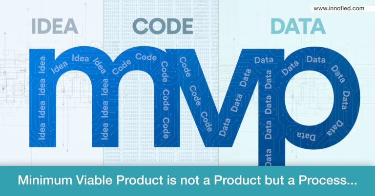

The **minimum viable product** (MVP) is the literal the first functional version of your software product. It is a goal achieved. The first version of an idea that can completely change your life. It is the first look of your app or software. It is the end of a phase and the beginning of the other at the same time.

How we said in a previous post, an MVP is a step of the [first part of cobuild's process](https://cobuildlab.com/blog/cobuild-process-part-1/) and we consider that is one of the most important pieces to have success and begin the life-cycle of your product with the right hand.

This post is not only about what is an MVP. What we want with this article it shows you the process you have to follow in the construction of your MVP.

<title-2>But first, let us explain what is an MVP and its main characteristics</title-2>

An MVP better known as a Minimum Viable Product, it is the first and light version of your product, maybe an app or software. But this version should be completely functional, and also, it should have some projections to later versions. 

It is a first version that has the more quantity of knowledge and validated ideas with the less amount of efforts and resources. But it communicates perfectly the solution and the app goal. 

This first version is more than a beta or a test version. It is actually your app functioning 100%. But with the most essential features and the lower resources quantity as be possible. 

All of your favorite products now maybe had an MVP. 

For example, Dropbox had an MVP. It was really simple, and we decide to share it first video. 

<youtube-video id="xy9nSnalvPc"></youtube-video>

Also, Facebook had an MVP called TheFacebook. This MVP was only available for Harvard students and It was more than a success. Then Mark Zuckerberg, its creator, took the decision of expanding it to other universities, and then, the entire world.

<title-2>For building your MVP you need</title-2>

Source: [Innofield](https://www.innofied.com/updated-mobile-app-development-mvp-strategy-for-startup/)

Steps 

**1. Focus on the customer needs**

If you decide to create an app or any software you are creating one for other people, not for you. In that way, It is a mistake that you develop an app only thinking in what you want to do or get. 

Do you need criteria or initial idea? Of course. But that is not the final criteria. This idea has to be validated and take it to the customer vision.

For example, thinking like a customer you can make the next questions: why I need this product? How can It help me to solve my necessity? Why I would buy it? What do I want from it? 

**2. Competitor search** 
    
In all development processes you need to size, study, and know really good the market you will be in. That’s a requirement. Why? Because another person could have the same idea before, or maybe there is something really similar in the market, and you need to know what are they doing (good or bad) for making the difference or just don’t make their mistakes. Actually, you would take their hits and improve them, take them to the next level. 

To capitalize the market, you need to offer value propositions. That’s the key. It is very difficult for an idea not to be done. What we can do is get it better, and doing a different value proposition. This is how your customer will love you.  

If you study the market, the competition and your possibilities, opportunities, and advantages you will create success criteria, and that’s the goal in this step of MVP development. 

**3. App goal and main features**

To say “app goal” actually is something small, because in this point we need to define more than that. 

In this third step, we should know what the customer wants, and what is doing the competition in the market. The next thing we have to know is what we want to achieve or cover in the market with the app. This part we prefer to call it the “key problem”. 

This key problem is the situation or the segment in the customers’ life you want to satisfy with the app. This key problem also can help you with the categorization of features later.  

You can define a key problem by asking you the following questions: 
 
- What problem or situation does my product solve? 
- Who is having this problem? 
- How big the problem is? 
- How are people solving this situation now? 
    For example, 

- My problem is the lack of time and organization. 
- The businessmen are suffering my key problem. 
- This problem is so big because affects the 70% of productivity in his and her lives. 
- There are lots of apps in the market with schedules, workflows, and organizers, but I want to offer finance control and more cybersecurity using blockchain technology to save the whole information and transaction. 

That’s only a part in this phase, because the other part is the performance and development details of your app, as: the team of developers, the programming language you will use, the platform you will choose for the app, which tools or libraries you will use, the user experience, the user interface, and all the steps you need to follow in every [software development process](https://cobuildlab.com/blog/best-software-development-process/). But remember, this development process is about your minimum viable product.

About the app features, we want to show you the **story map technique.**

A story map is a visual way to build software. “Story mapping is a top-down approach of requirement gathering and is represented as a tree”.
Source: [Thoughtwords](https://www.thoughtworks.com/insights/blog/story-mapping-visual-way-building-product-backlog) 

A story map has the next components inside: goals of the app in the market, what you will achieve, activities you need to do, and tasks you must achieve. And the last, stories. Stories that are user stories for software development. That you can make thinking like a customer or you can create with the real customer criteria.  

First, you can write the app goal in a text box. From there, it will continue the whole map. If you have more than a goal, or you separate the internal and external goals, you also could write them in different text boxes. You only need to know that’s the first column in the map. 

The second column should have all the activities you need to follow for accomplishing your goals; such as a concept map. 

How we said in the workflow post before, all activities should be tasks later, with a responsible, a period of time to do it, etc. That will be the third column of your story map.

By last, take all information recovered and you use it for doing [user stories](https://cobuildlab.com/blog/user-stories/) that have expectations, reviews, suggestions, and comments about your software product or app.

At this time, you will end your story map. 

“Story mapping allows you to identify the pain points of the user and gains that a user can achieve. This exercise let you determine the greatest potential and adds more value. Then you will be able to focus on the minimum viable product while adding the less impactful ones to the product roadmap for the late releases”. 
Source: [Medium](https://medium.com/swlh/how-to-build-an-mvp-in-the-right-way-in-2018-f538df0f2bba)

**4. Features definition** 

This is one of the most important steps in MVP development.  

A feature is a characteristic in your app. To be more specific, a feature is a piece of functionality that adds value to your customers. They are functions that are needed to be satisfied with the software. 

“When building an MVP it’s good to remember about Pareto principle which says that: 80% of the features you build require on 20% of your efforts, whereas, the remaining 20% of the features will need 80% of your efforts. So, while building an MVP you’d better pay your attention to that 80 % and take from them the most relevant ones.”[Medium](https://medium.com/@Brocoders/how-to-choose-core-features-for-an-mvp-2c4a76c36331)

**5. Prioritize the features** 

It is recommendable to choose a maximum of 5 main features for your  MVP. Don't go so far. At least in this first version. Through time you can get better and add more features. But first, you have to be sure of customers’ acceptance. 
Features are this functions you offer with your app in this first version and then you will improve in later versions.

That means that during the MVP development you also will create a draft of the entire app. 

**6. Launch, test, rerun, and keep improving**

Once you achieve the last steps you only have to release it and measure its performance and acceptance in the market. 

Customers always bring pieces of advice, comments, suggestions, and feelings about your app. That works like a thermometer of testing. 

When you have all of this information you will know what needs to be improved, which features are missing, etc. Work on that with your development team, rerun, and improve your product through time.

**7. Make a video, commercialize it**

We say a video because it is the best way to commercialize a product, and you have the proof in the post we made about [video marketing](https://cobuildlab.com/blog/video-marketing/)

But at this point, you have the MVP and you launch it. But, how to make people know and use it properly? A video can help you with this. And more than that. A video helps you promote your product. It is friendly and easy to consume. 

All aspects you need to cover in the first promotional video campaign are how the app works, the most important benefit it has, which key problem it will solve if you tell a story that catches the attention of customers it is better. There is a phrase we love: “sell without sell”. 

It is not the same that a person tells you: buy “time app” because it will allow you to organize your days - that a person tells you: 
Organizing my days is so difficult! I just cannot do it without help. In the last week, I was watching some apps on my phone hoping to get some application that can help me with this work. There were so many good apps. But at the moment I saw “time app” I knew there was no place for another app in my days. It is 100% recommended. 

That is a story, and we think that’s the best way to make a promotional video to sell. 

Once you have finished this process congratulations, now you have an **MVP**. If you want more information, tips, or guides to do it you can communicate with us and we will gladly help you. You will see how exciting is to develop a **Minimum Viable Product** (MVP) together.

