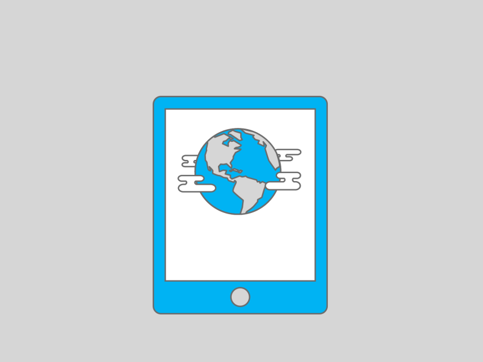

The new reality we are experiencing maximized the need to develop software in order to automate processes in small businesses here in Miami and the whole world. 
Or just developing applications for innovating our business model, and making it more profitable and sustainable over time despite challenging factors such as the pandemic. 
You can do this with a **web software, a mobile app or even a cross-platform system**.

Let's know the advantages and disadvantages of each kind of [software development project](https://cobuildlab.com/blog/best-software-development-process/).

<title-2>Mobile Apps vs. Web Apps</title-2>

 

Mobile apps are built for a specific platform, such as Android for a Samsung Galaxy or iOS for the iPhone. You can download them and install them by an app store and they have access to system features like the camera or the GPS. These apps live and run on the device itself. Instagram, Twitter and TikTok are some examples of popular mobile apps.
Web apps, on the other hand, are accessed by browser and will adapt to any device you’re using them on. They don’t need to be downloaded or installed and they’re not native to any specific system. Due to their responsive nature, they have a similar look and functionality to many mobile applications— which may lead to some confusion.

 

<title-2>What is a Mobile App?</title-2>
 
 

 
 
 
  
 
A mobile application or “app” -as it’s most commonly known- is a type of application software that’s been designed and built to run on a particular piece of hardware, such as a tablet computer or a smartphone. These apps are frequently used to supply its users with services akin to the ones they usually access on their desktops. The widespread use and popularity of this type of software can be traced back to Apple and its App Store, which helped carry the concept to the mainstream with the ever-increasing number of apps available for their devices. 

 

<title-3>Mobile Apps Pros (for business owners)</title-3>

 

* Can work offline
* They’re safer — they require approval from the app store
* Easier to build given the accessibility of developing tools, SDKs and interface elements.
* You will be able to personalize 100% of all the gestures and functionalities that you want your software to have. On the web, you can also customize the development, but it has some limitations that in Android or iOS you don't have. 
* [Marketing efforts](https://cobuildlab.com/blog/Planning-a-Digital-Marketing-Strategy-key-to-success-for-your-New-Software-Application-or-Small-Business-in-the-US-during-COVID-time/) may be less because users have not to remember exactly your name or your app link to enter. 

 

<title-3>Mobile Apps Pros (for users)</title-3>

 

* They run faster than web apps.
* Given their access to system resources, they have greater functionality.
* Can work offline
* It works better because it is a specific development effort for each mobile platform.

 

<title-3>Mobile Apps Cons (for business owners)</title-3>

 

* They can be a little or way more expensive than web apps.
* Since they’re compatible with different platforms like Android or iOs they have to be designed and built from zero. It is not possible to reuse code from the web or a different mobile app. We mean, if you develop for Android, that code is not compatible with iOS, and so on. 
* They tend to be more expensive to update and maintain. 
* Getting a native app approved by the app store can be challenging, especially for iOS.
* Improvements and bug fixing tend to be slower due to testing in multiple devices and the subsequent approvals of the Apps stores.

 

<title-3>Mobile Apps Cons (for users)</title-3>

 

* Customers will need available storage on their mobile phones for your application. 
* There are some advantages of the web that you will not be able to use, such as [webRTC](https://webrtc.org/) technology, which does not have mobile support. This technology is also known as Web Real-Time Communications and allows for real-time communications without plug-ins through a Javascript API. Especially in this [time of COVID](https://cobuildlab.com/blog/How-Technology-can-save-your-Small-Business-in-this-COVID-19-crisis/), this may be a functionality that users need.

 

<title-2>What is a Web App?</title-2>

    

A web application is a software program that runs on a web server. Unlike the traditional desktop applications that are launched by your operating system, web apps have to be accessed through a web browser.
Web apps have a lot of advantages over desktop applications. Because they run inside web browsers, developers don’t need to develop web apps for multiple platforms. For example, an app that runs in Chrome will also work on both Mac OS and Windows. Developers do not need to distribute software updates to users when the web app is updated. By updating the application on the server, all users will have access to the latest version.

 

<title-3>Web App Pros (for business owners)</title-3>

 

* Easy to maintain — they have a common codebase independent of the platform where they are used.
* They will update themselves. Although this is no longer a weakness of mobile applications. Companies behind it did their best to minimize the differences between the two developments. 
* Faster and easier to build than mobile apps.
* Don’t need app store approval, so they can be launched in a short time.
* Developers and companies that support these types of projects have designed some alternatives to strengthen what was previously their weaknesses. That's why we could work with [webRTC](https://webrtc.org/), the technology that allows us from the web to access the hardware of the device we are browsing, to be able to access the camera and transmit a live video, for example. 
* And there are also [Progressive Web Apps](https://en.wikipedia.org/wiki/Progressive_web_application), which are a type of application that allows us to simulate an installation of your application in the browser, and this way, you can have more direct access. But you should know that it is not a download, it is more like installing a link in the operating system. 

 

<title-3>Web App Pros (for users)</title-3>

 

* Don’t have to be downloaded or installed — web apps work in browsers.
* They will update themselves. 

 

<title-3>Web App Cons (for business owners)</title-3>

 

* Do not work offline
* Tend to be slower than mobile apps, and less advanced regarding features
* Not as easy to find as mobile apps because they are not listed in a specific database, like the app store. This is why you should increase your branding and [marketing](https://cobuildlab.com/blog/Planning-a-Digital-Marketing-Strategy-key-to-success-for-your-New-Software-Application-or-Small-Business-in-the-US-during-COVID-time/) efforts because your customers should not only visit you but also remember your name and link to re-enter unless you promote other alternatives such as * Progressive Web Apps, which do not apply in all cases. 
* Security and quality are not always guaranteed — web apps don’t have to be approved by the app store.

 

<title-3>Web App Cons (for users)</title-3>

 

* Do not work offline
* Tend to be slower than mobile apps, and less advanced regarding features

 

<title-2>Differences between Mobile Apps and Web Apps</title-2>

 

The differences between developing a native mobile application and developing one for the web were previously very significant, but over time those differences decrease until they seem imperceptible. 

It is still different, and there are slight advantages and disadvantages, but today we cannot say that in general one is better than the other. It all depends on the scale of your project and what your needs are. It is best to consult an expert on the subject. 

 

<youtube-video id="_G8tvBFqMXc"></youtube-video>

 

Some things to take in consideration to make a decision:

**Capabilities**: 
Hardware intensive applications are recommended to be developed as Mobile Native Apps as the tools have a more direct access to the devices Hardware.
Web Apps still have some limitations accessing device resources like Bluetooth, compass, file system, etc.
If you want to develop a video call application there is no tool at the moment that can work both in Mobile Apps and Web Apps.

**Time to market:**
Web applications take significantly less time to be released. This is not only true for putting features faster due to the extensive popularity, communities and tools for web resources, but also because they skip the process of approval from the apps stores. 

**Product Maturity**:
If you plan to play a lot with users and features, we recommend going with a web application. Iterate, add or remove features on a Web application is faster than in a Mobile app, even if it is just for Android or iOS. Also the waste is less. 

**Budget**:
Developing a Mobile App tends to be as expensive or more expensive than a web application, both development activities and testing activities.  This depends on the context too, but consider that, there are many more different mobile screens than desktop resolutions, and there are more differences between Android and IOS as operating systems than between different browsers, even in different operating systems. 

 

<title-2>Can I Simultaneously Develop an App in Mobile and Web? Meet the Cross Platforms</title-2>

 

    

 

A cross-platform computer system, software or product can work across multiple types of operating environments and platforms. Different kinds of cross-platform systems include both software and hardware systems, as well as systems that have a distinct construction for every platform, as well as other larger systems especially designed to work the same way across multiple platforms.
Cross platform is also known as multi platform or platform independent.

 

<title-3>Top Technologies for Cross Platform Development</title-3>

 

<title-3>[React Native](https://reactnative.dev/)</title-3>

 

React Native is an extensively used open-source app building tool, based on JavaScript. It was developed to build apps capable of running on multiple platforms such as Android, iOS, yet, the user interface is native on any OS. The most known example are the mobile apps for Instagram, Facebook, and Skype.
One of its benefits is the array of assorted tools for debugging and packaging that helps to maintain the app development time within boundaries. It also has a highly functional approach as regards user interfaces with the ability for developers to see how the functions of source code work in real-time on their screens. The direct result: streamlining the process of building a user interface and attaining a perfect experience for the user.

 

**Advantages of React Native include**:

 

High performance and speed like native apps
Compatible with 3rd-party plugins
Live reloading feature
Fluid and well responsive UI
Good development environment
Not prone to bugs
Speedy debugging of code
Large community

We actually prefer it.

 

<title-3>[Flutter](https://flutter.dev/)</title-3>

 

Flutter is a new framework developed by Google. Using it, you can develop quickly and easily an app for Android, iOs, or web, for adapting it later to other platforms with very few changes. 

It works great, and it's partly because it feels like native because it incorporates good features and gestures. 

To help you better, we share the following video about this technology and some of the benefits it has. 

 

<youtube-video id="80pRyn7fZRk"></youtube-video>

 

<title-3>[Titanium](https://www.appcelerator.com/Titanium/)</title-3>

 

Taking JavaScript as the starting point, Titanium SDK gives developers the tools to construct cross-platform mobile apps that span native, hybrid, and web with one code base. Compared to your standard native platform, Titanium -as an open-source with thousands of API- is very helpful in delivering enthralling experience for the user in a fast way.
The community of Titanium developers are continuously helping its growth to make it more perfectly suited for cross/platform development. (According to Wikipedia an estimated 10% of all mobile phones globally use an app developed with Titanium!)
Advantageously, independent developers, software vendors, and other partners can create modules for extending the Titanium SDK with mobile interface controls, leverage native platform APIs, and access 3rd party services.

 
  
**Advantages of Titanium**:

 

It works across all platforms
Availability of over 5,000 APIs
Live reloading feature
Available client-side marketplace modules and cloud-based services
It has very large community support

 

<title-3>[Xamarin](https://visualstudio.microsoft.com/es/xamarin/)</title-3>

 

Currently, Xamarin is one of the top rated technologies used for cross/platform app development. Notably, developers have the alternative of writing or rewriting the code in other languages such as C, C#, and .Net frameworks, making it a match and fit for products and technologies made by Microsoft.
Lastly, Xamarin also enhances a UI toolkit for cross-platforming that compiles codes, irrespective of the native interface.

 

**Other Xamarin’s advantages include**:

 

Fewer bugs
High performance
Support for MVC and MVVM patterns of design
The same user interface as native
Automatic test by TestCloud
Common app logic
Self component store
Large community support

 

<title-3>[Apache Cordova](https://cordova.apache.org/)</title-3>

 

This technology was rebranded as PhoneGap after being owned by Adobe Systems in 2011. It is now known as an open-source software called Apache Cordova. We can characterize it as a hybrid development scheme for mobile apps that can also function as a web/based framework. 
The combination of Apache Cordova with somewhat similar techs like CSS, HTML and JavaScript is used for cross-platform app development. However, PhoneGap allows app developers to use numerous other libraries and frameworks, including Knockout.js, AngularJS, and jQuery.
Apache Cordova is compatible with IDEs that support any of the toolsets of iOS and Android like Xcode or Android Studio. On the downside, the resulting apps tend to be slower when processing large  chunks of data, and they’re usually not an ideal match in case you’re working with third-party libraries in order to access graphics when you compare them to native apps. Also, there are some native device APIs that are not yet supported by Apache Cordova.

 

**Advantages of Apache Cordova**:

 

Effective for backend
Open to HTML5, CSS3, and JavaScript developers
Works on all platforms

 
  
<title-2>What Do We Prefer to Develop? Web or Mobile?</title-2>

 

Actually, it could be either.
It all depends on the needs of your business and also the budget you count on, because it’s more expensive to develop a native app for each platform than developing for a cross platform or for the web.
The answer will first define how you visualize your project, what tools you have, budget, even what features you want to incorporate, and other factors that as a founder or as a manager of your small business you must know to make the right decision. The first step is to contact us, and we will gladly help you select the type of application that best suits you from a technical point of view, whether **mobile or web application**. 
