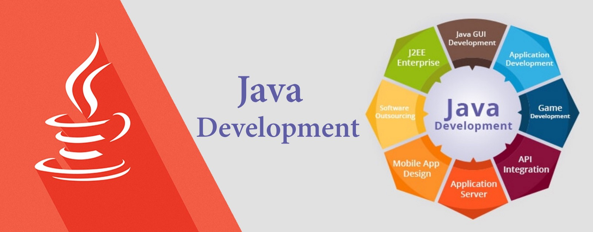
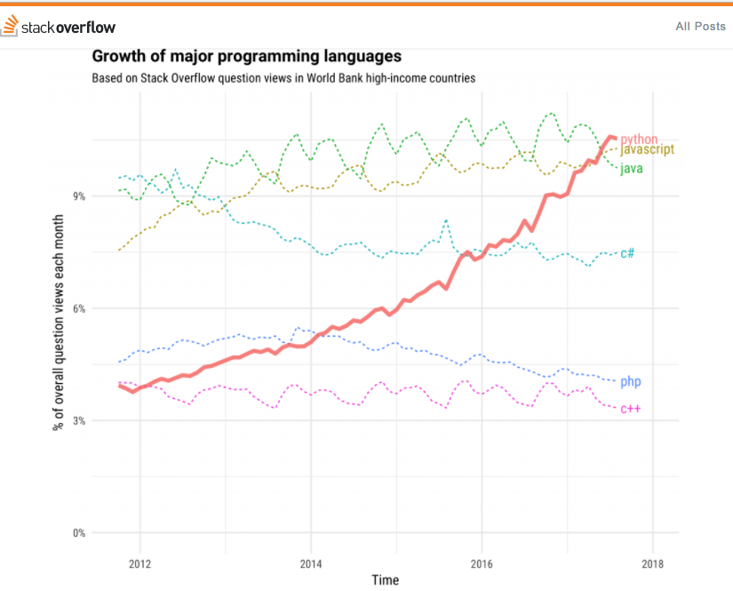
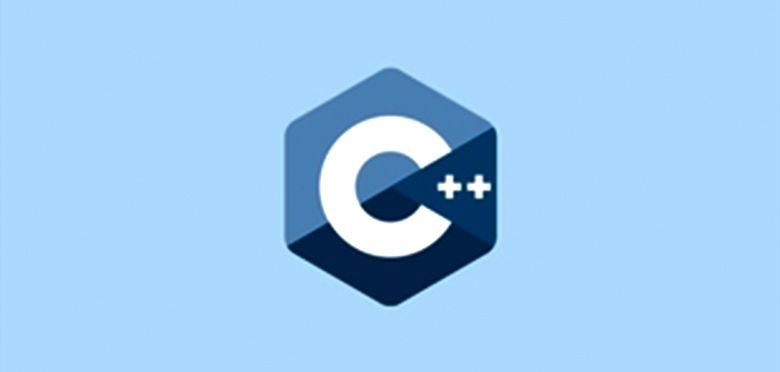
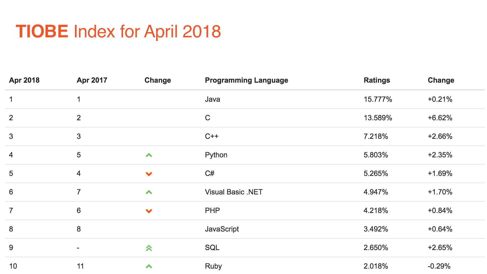
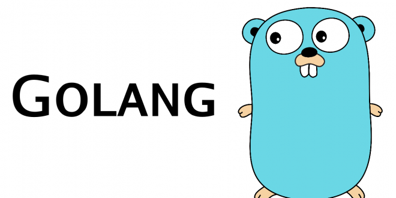

Github, Facebook, and the programmers' community in the whole world have shown their opinions and preferences for some **programming languages** the last year, and these 2019 trends began to notice. For that reason, we make this article about the most popular programming languages to explain to you which technologies you can use and take advantage in your software project. Let’s learn!

<title-2>The 5 most popular programming languages in 2018 and part of this year</title-2>

There are many programming languages nowadays. Too many options to choose. 

Some of them take the lead from the beginning, but others just were popular and used suddenly, but this doesn’t mean that every programming language on trend doesn’t have enough and valuable reasons to be popular. Of course, it has. There are several factors that support this preference, like how much friendly they are, the versatility they have, the ecosystem that they have, etc. 

Know Them.

<title-3>1. JavaScript</title-3>

Source: [Tutorial republic](https://www.tutorialrepublic.com/javascript-tutorial/)

This programming language is maybe the most used on the internet. It was created in 1995 for Brendan Eich, and now it is the unique and standard programming language interpreted for browsers. For that reason, it is used commonly for interactivity on websites.  

Some years ago if you wanted to develop a software or just a website for the web you had to mix this programming language with other technology. But now, it is different, thanks to tools like NODEJS it is possible to develop a website or a web app only using this programming language. 

This language is universal, and also it is very friendly. That’s why many beginners prefer it as his or her first language. 

[JavaScript is the most used on Github](https://www.businessinsider.com/the-10-most-popular-programming-languages-according-to-github-2018-10#1-javascript-10) with most contributions in its private and public repository, actually, they make the next graphic to prove it.

Source: [Hackernoon](https://hackernoon.com/top-3-most-popular-programming-languages-in-2018-and-their-annual-salaries-51b4a7354e06)

It is for much the programming language most used in the world in Github, and it has been for [the past 6 years with a use percent of 69,8%.](https://hackernoon.com/top-3-most-popular-programming-languages-in-2018-and-their-annual-salaries-51b4a7354e06)

<title-3>2. Java</title-3>

Source: [Hackernoon](https://hackernoon.com/is-java-good-for-your-web-application-development-83c5b2d0344a)

Java is a programming language mostly used on business projects. It was created by James Gosling on January 23, 1996, and its last release was on 2018, specifically the Java 10 version. 

If you thought that JavaScript was easy and friendly, Java it is even more. Actually, it is one of its more important advantages compared with other programming languages. 

Java is easy to use, to write, compile, debug, and learn. It is simpler because it uses automatic memory allocation and garbage collection. 

Also, it is a really robust, reliable, and secure language preferred to develop large and stable systems. 

It is used for creating cross-platform apps, meaning software for web, mobile, desktop, etc. 

Stack Overflow made a survey where they discovered that Java popularity in 2017 and 2018 [remained in the same level of 45,3% of use.](https://hackernoon.com/top-3-most-popular-programming-languages-in-2018-and-their-annual-salaries-51b4a7354e06)

<title-3>3. Python</title-3>

Source: [Python](https://www.python.org/)

This programming language is one of the most older in the list but the last 2018 it became very popular. 

Python was released in 1989 by Guido van Rossum at CWI on the Netherlands. 

This language is the best for developing big data software and from the last year, it has been used a lot for artificial intelligence projects. Even Google use it for its main tool of artificial intelligence. 

It is so versatile that can look like a lie, but It is a reality. It is easy to learn but at the same time, It is used in big and robust software projects. 

Also, Python is a language that has been one of the largest growth in the world. 

The [Stack OverFlow](https://stackoverflow.blog/) team found that [38;8% of its users use Python to their software projects.](https://hackernoon.com/top-3-most-popular-programming-languages-in-2018-and-their-annual-salaries-51b4a7354e06) And Github put this language in the third position of languages more popular in its platform. A little below of JavaScript and Java. Actually, in 2017 overpass C#.

This has been the growth of this language of code the last year

Source: [Hackernoon](https://hackernoon.com/top-3-most-popular-programming-languages-in-2018-and-their-annual-salaries-51b4a7354e06)

Incredible! Don’t you believe it?

<title-3>4. C++</title-3>

Source: [Incapp](http://www.incapp.in/cpp-language-training-institute-greater-noida)

This is one of the legendary languages. It was released in 1970 and now it's continually been used for operating systems, games, banking and trading applications, and browsers as the core language. 

This language is hybrid, and it is very particular because it was created as an extension of the C language with mechanisms that permit to do object-oriented programming. That's why we say it is a hybrid language. 

We located it in the fourth position of this list because there are some statistics like one realized by [TIOBE](https://www.tiobe.com/tiobe-index/) team where we can see the popularity of this programming language between 2017 and 2018.

Source: [TIOBE](https://www.tiobe.com/tiobe-index/)

<title-3>5. Go</title-3>

It is the newer of this list and it is inspired on the C syntax. Go also is called Golang and it was developed in 2007 for, nothing more and nothing less, than Google. And it was created for Robert Griesemer, Rob Pike y Ken Thompson. 

It is supported by Linux, FreeBSD, and Mac OS X until now. 

When Google’s team created this language they wanted to create a dependable and efficient software. It uses light processes called [goroutines](https://tour.golang.org/concurrency/1). Its syntax is dynamic and friendly. 

Also, don’t need virtual machines and it has Quick compilation and execution speed. 

Golang has been popularized very fast and big companies as Uber, Netflix, the New York Times, and Facebook use it. 

This language is more than a promise and we think that it will have very much success this 2019. 

This information is very useful when you are beginning your software project because you need to choose which language of code is more convenient for you. For sure, any of these **most popular programming languages** would be work perfectly. But if you want to know more specific information and more factors that make better one of these languages for you, you cannot lose our next post where we will give you some tips and steps to choose the best option that fits your needs. Wait for it. 

