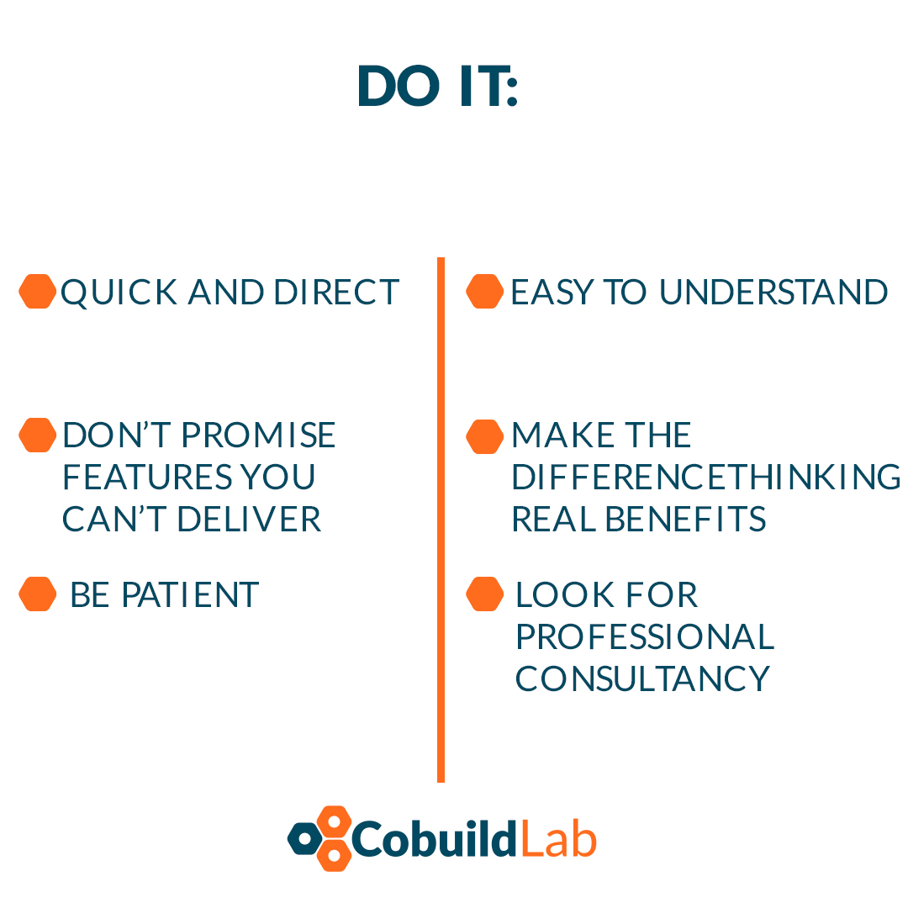

The value proposition is an item that any business (large or small) must know and take advantage of to differentiate itself from the competition and achieve a good reputation in a micro-market niche. The **value proposition for startups** goes a little bit beyond the concept we commonly know, and that is why we saw the need to develop this content. 

I hope you can take advantage of it if you are in the early stages of your startup. Let's start. 

 

<title-2>If You Didn't Know What a Value Proposition Is, Here We Explain It and Apply It to Your Startup Matter</title-2>

 

A value proposition is a unique hallmark of your brand or software product that sets it apart from the competition. 

It is the way you bring value to your end consumer and gives them a reason to buy or use your proposal over others in the market. 

To make this decision:

**1. You need to do some research on the market where you want to launch your app**
**2. You know your direct and indirect competition very well**
**3. If possible, experiment with it, use it** 
**4. Think as a consumer what you would like to add, remove or improve**
**5. Establish it in your business structure document**

This is in simple words, but the work goes much deeper than that. It takes months, and there are specialists in this specific field because in short, it is what will make people buy you or not. 

Sometimes the proposal is not in functionality or the application. It's in the way of payments, in the type of application (whether it is <a target="_blank" href="https://cobuildlab.com/blog/mobile-apps-web-apps-or-cross-platform-what%E2%80%99s-the-best-for-my-small-business/">   web or mobile </a>), etc. 

**6. And when it comes to the development of software tools**, to the constitution of the value proposition we must add another activity that is solely and exclusively for startups, and that is the validation of that value proposition. 

You can conduct interviews, surveys, develop a minimum viable product (MVP), or simply use some techniques that help you validate that the value proposition you have chosen for your software will be effective. 

**7. Once you launch your app to the market, this process continues**. It is never enough to fine-tune the value proposition for the software. 

Many owners are attentive to reviews of the app in the store where the app is. Or they even invite users to give their feedback to improve the performance of the tool.

All these activities have multiple purposes, but one of them is to improve the value proposition and offer the final consumer what they want and need. 

 

<title-2>A Value Proposition for a Software Application has:</title-2>

 

<title-3>Relevance:</title-3>

 

Because it provides a useful solution to solve a need or pain that the client may have. Later on, we will talk to you about what the client's pain point is. 

 

<title-3>Value:</title-3>

 

Because the client understands the benefit and the contribution he has for his life. In short, it must be clear what it brings. 

 

<title-3>Differentiation:</title-3>

 

Because you are not going to invent hot water, but you must specify what you are doing differently, to mark that feature or characteristic that makes you stand out from the rest of the options on the market. 

 

<title-2>What Are the Client's Pain Points?</title-2>

 

To begin with, we have a phrase that interests you:

 

<block-quote>*As long as the more pain points you know about your customers, the more you can help them, and the more you help them, the more they will want to use your app.*</block-quote>

 

Now we do. Your client's pain points are the problems, questions, concerns that your audience faces, but not from a technical point of view, but rather from a human point of view. 

In fact, there are points of pain that they may not even know they have. They may not recognize them as a problem, but you can anticipate, and give them the timely solution to that problem, and in doing it, they'll notice that they had it. 

You will find a solution to each of these points of pain or problems. This work sometimes includes hypotheses and assumptions of future scenarios. It's all about being 100% strategic. 

Initially, it is a marketing concept, but ideally, we can adapt it to the development of software tools that you are going to launch for mass consumption. 

 

<title-2>Start Developing Your Startup's Value Proposition, Following These Five Golden Rules</title-2>

 

 

All that remains is for us to wish you much success in developing your **startup's value proposition**. 

