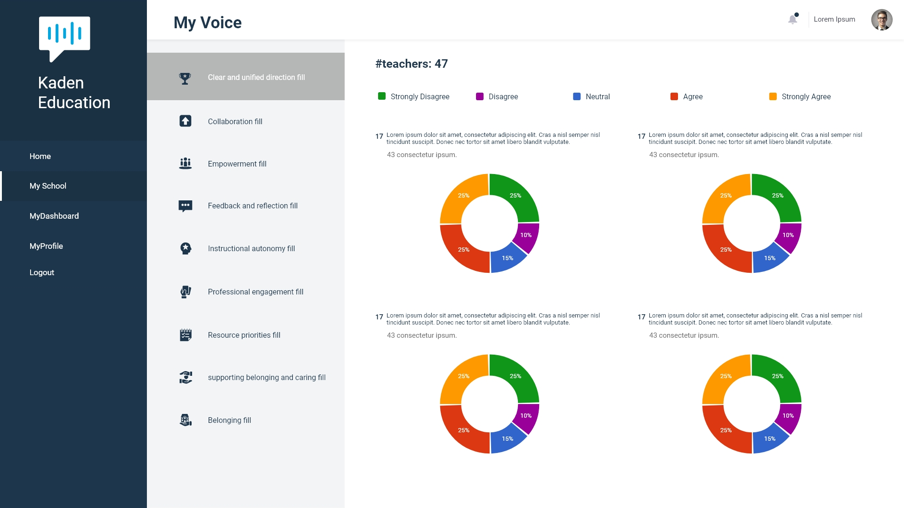
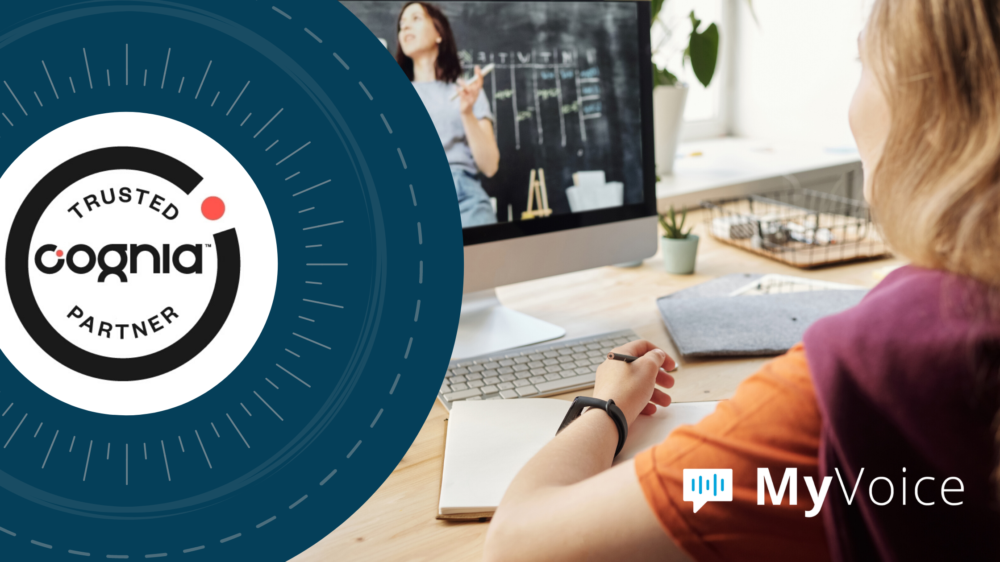

Miami, FL. June 29, 2020 -  We are very happy to announce that My Voice app has finally been launched. Now that most schools are closed due to the pandemic, it has created a seismic shift in the way instruction is delivered. <a target="_blank" href="https://cobuildlab.com/"> Cobuild Lab </a> helped Kadem Education in its goal of raising teacher’s voices by building a software solution to help them grow within the school system.     

First of all, <a target="_blank" href="https://kademeducation.com/"> Kadem Education </a> identified the critical cultural factors that helped teachers remain in their schools and also engage the students more efficiently. Once identified, they teamed up with Cobuild Lab to create an app that allowed them to monitors the satisfaction level of the teaching staff at a school-based on all those critical cultural factors.     

The platform had to be designed to facilitate specific and constructive conversations about improvement in each school, which would result in solutions built from the inside. So we put together a managed team of our best Web Developers, QA Analysts, and Product Managers to transform this idea into a <a target="_blank" href="https://cobuildlab.com/blog/identifying-opportunities-to-create-a-software-product/"> Software Product. </a>    

    

As a result, we presented <a target="_blank" href="https://myvoice-edu.com/"> MyVoice™ </a>, the first digital platform of its kind designed to provide specific and constructive conversations, and supporting teachers for the improvement in each school, resulting in solutions developed from the inside.    

    

The platform has been included in a new initiative by <a target="_blank" href="https://www.cognia.org/"> Cognia™ </a> the leader in accreditation, assessment, and continuous improvement. The  <a target="_blank" href="https://www.cognia.org/the-cognia-difference/trusted-partner-program/"> Trusted Partner Program </a> aims to empower institutions and educators with resources to bring sustainable professional development for remote learning.    

E-learning is now more necessary than ever and although there are multiple platforms to get the knowledge to the students, the truth is that many schools don't have a distance education system and this makes educators labor more challenging. So, the MyVoice app comes at a crucial time in the sector, hoping to create a lasting positive impact in schools across the country.    

Thank you for reading. Stay safe!
