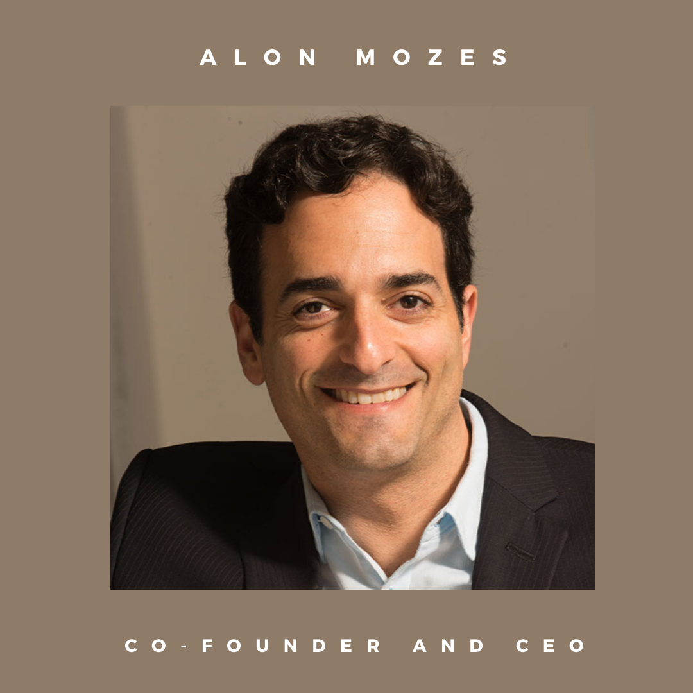
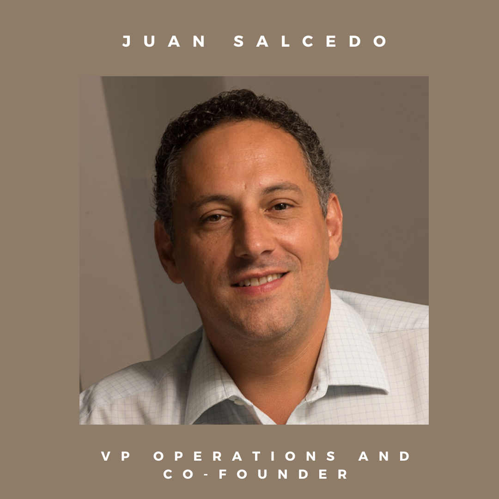
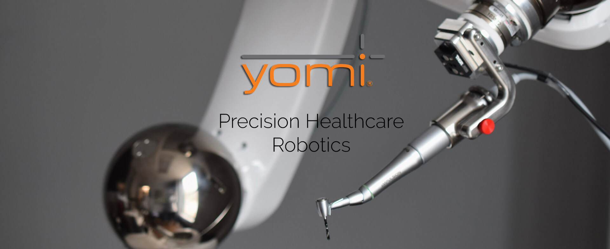
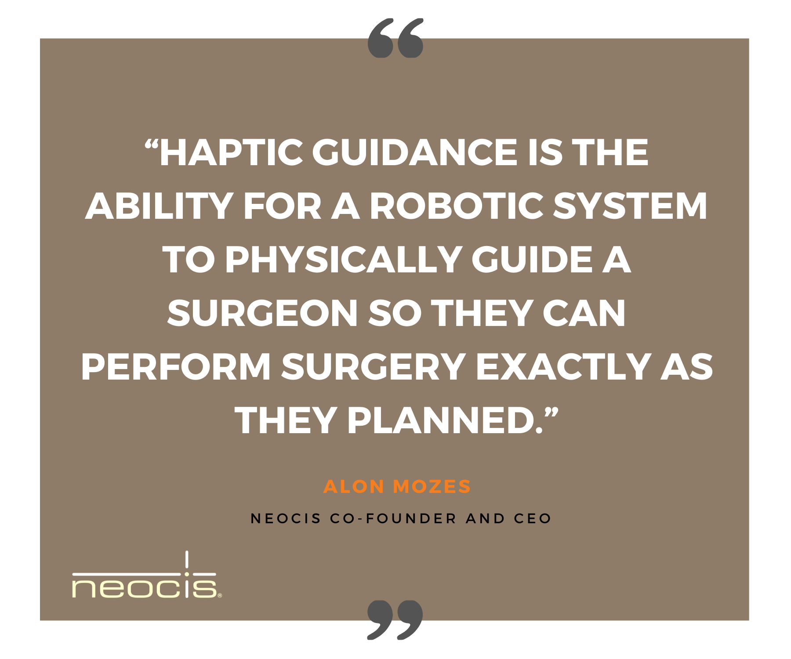

In this segment, we like to showcase some of the most interesting Miami-based startups and by the time this article is published, the whole world keeps struggling with a <a target="_blank" href="https://cobuildlab.com/blog/covid19-update-stay-home/"> pandemic </a> and a deeply affected global economy. Sure, good things will come out from this critical moment because history has taught us that any crisis is ground zero for innovation and creativity, so let’s talk about technological innovation in the medical field.    

We live in an age where the use of technology dominates our lives, but some of these technological developments have had an amazingly positive impact on the healthcare industry and a good example of this is <a target="_blank" href="https://www.neocis.com/"> Neocis </a>, a startup that is transforming dental implants surgery with advanced robotics.    

Founded in 2009, <a target="_blank" href="https://www.neocis.com/"> Neocis Inc. </a> is a Miami-based robotics healthcare startup focused on enhancing dental surgeon’s capabilities and advancing patient care through the latest technology. And all started when it’s founders Alon Mozes and Juan Salcedo developed the revolutionary RIO system for robotic guided orthopedic when they both worked for Mako Surgical. After Mako had a successful IPO and ultimately <a target="_blank" href="https://www.wsj.com/articles/stryker-to-acquire-mako-surgical-for-about-165-billion-1380114400"> sold to Stryker for $1.65B </a> in 2013, Mozes and Salcedo sought out other medical markets in which providers and patients might benefit from haptic guided robotic surgery.    

<title-3 align="centered"> Its founders </title-3>    

 

<title-6 align="centered"> Alon Mozes CEO and Co-founder. </title-6>    

As a principal engineer and one of the first 20 employees at MAKO Surgical Corp., <a target="_blank" href="https://www.linkedin.com/in/alonmozes/"> Alon Mozes </a> helped develop the software for their groundbreaking Rio system for orthopedic robotic surgery. Prior to MAKO Surgical Corp., he developed Emmy award-winning technology with <a target="_blank" href="https://www.smt.com/"> Sportvision, Inc. </a> in the area of real-time sports broadcast graphics.    

 

<title-6 align="centered"> Juan Salcedo VP Operations and Co-founder </title-6>    

<a target="_blank" href="https://www.linkedin.com/in/juan-salcedo-87724511/"> Juan Salcedo </a> was a principal robotic design engineer for MAKO Surgical Corp. and was a key designer for the first concept as well as one of the main designers for the second generation systems to follow. Prior to that, Mr. Salcedo served as lead researcher for the <a target="_blank" href="https://www.fiu.edu/locations/engineering-center/index.html"> Cardiovascular Engineering Center </a> at Florida International University. Mr. Salcedo was also a senior manufacturing engineer for Calnetix Inc., the world leader in developing and manufacturing high-speed electric motors and generators.    

<title-3 align="centered"> The first robotic guidance system for dental surgery </title-3>    

The search for Mozes and Salcedo ended sooner than they expected. With Mozes' father as an endodontist, the dental industry was a natural choice for their next project. As so they decided to innovate and they developed a brilliant solution: the very first robotic guidance system for dental surgery.    

<title-3 align="centered"> We introduce you YOMI </title-3>    

Source: <a target="_blank" href="https://www.neocis.com/"> Neocis </a>    

<a target="_blank" href="https://www.neocis.com/technology/"> Yomi </a> provides dental surgeons with guidance through the use of haptic robotic technology and multisensory feedback to help achieve the right location, angulation, and depth to place the implant exactly according to plan.    

It provides guidance throughout surgery, with the dental surgeon retaining control at all times without the constraints of cameras or physical guides. It’s real-time visual guidance and robotic haptic guidance enables a minimally invasive approach, which can lead to faster surgery, faster recovery, and less pain for the patient.    

<youtube-video id="7xDb5A1DAuc"></youtube-video>    

Fun Fact: The name Yomi comes from a family dentist friend who has the nickname "Yomi" and who gave Mozes and Salcedo key clinical input when they were developing their prototype.    

<title-3 align="centered"> Robot-assisted surgery </title-3>    

Robot-assisted surgery was developed to try to overcome the limitations of pre-existing minimally invasive surgical procedures and improve the capabilities of surgeons performing open surgery. In dentistry, there was nothing like it this is probably why Yomi is so amazing, the best of both worlds, it combines the surgeon’s clinical expertise with the benefits of robotic surgery.

    

Right now there is a lack of haptics in some robotic systems currently in clinical use, which means there is no force feedback or tactile feedback. Therefore Surgeons are not able to feel the interaction of the instrument with the patient.  Fortunately, the Yomi system already has this haptic feedback in order to improve the interaction between the surgeon and the tissue. When the drill bit reaches planned depth, Yomi provides the dental surgeon with the solid confidence of a physical “hard stop”. Distinct audio cues are provided for at each step in the process. The dental surgeon can also obtain visual confirmation and quantitative data through the graphic display on the Yomi monitor.    

**Reducing human error**. Once you’ve decided exactly where the implant should go, Yomi guides you into the position. It securely maintains handpiece trajectory, preventing unintended deviation from plan. Should the patient move, Yomi tracks and follows patient motion.     

Neocis is one of the  <a target="_blank" href="http://thetechtribune.com/10-best-tech-startups-in-miami/"> Best Tech Startups in Miami  </a> for the 3rd year running and we’ll definitely keep an eye on this amazing team.  Thank you for reading and let creativity caught you working. Stay safe!

