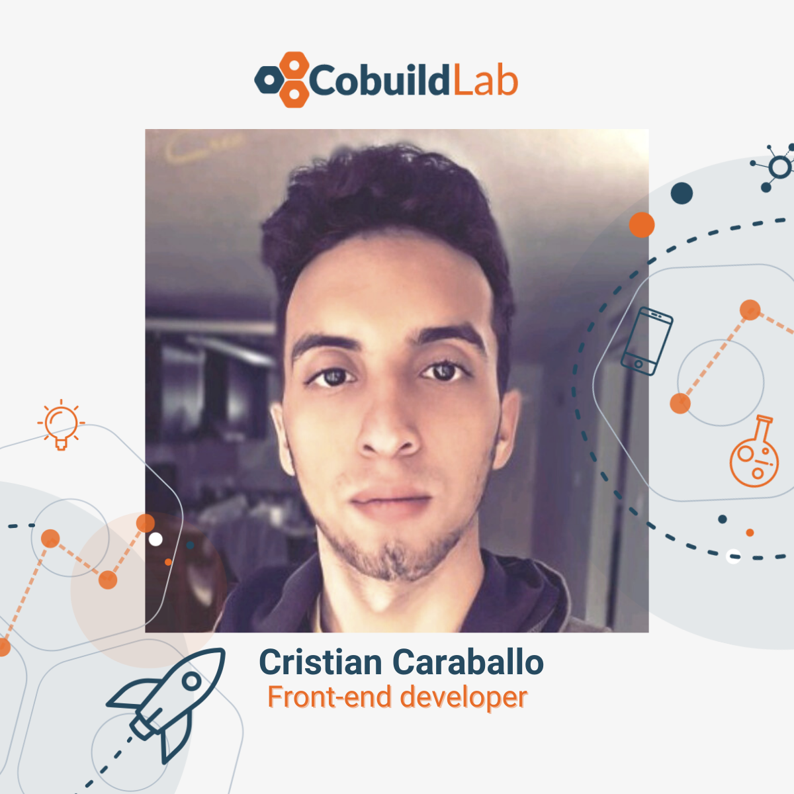

Miami, Fl. September 27, 2021

<title-4> The last quarter of the year is looking very bright for Cobuild Lab. As the company grows so does our team! We are welcoming new faces in our web development department. </title-4>   

<title-3 align="centered">  Cristian Caraballo   </title-3>

    

Cobuild Lab team is happy to welcome  <a target="_blank" href="https://www.linkedin.com/in/crisomg/">  Cristian Caraballo</a> as a **Front-end developer**. As part of the web development department, Cristian will be responsible for ensuring the alignment of web design and user experience requirements. He will also be in charge of optimizing web pages for maximum speed and scalability while maintaining brand consistency throughout the design. 

Cristian enjoys learning and expanding his knowledge in web development so he signs up for every Plazi class he can get his hands on.    

<title-3 align="centered">  Lucas Leguizamo  </title-3>

    

As a **Full Stack developer** in Cobuild Lab’s web development team, <a target="_blank" href="https://www.linkedin.com/in/lucas-leguizamo-dev/">  Luca Leguizamo</a> will be responsible for designing and developing front-end web architecture, ensuring the responsiveness of applications. He says that he’s “passionate about design and intuitive apps”, which comes in very handy as he will be working alongside graphic designers for web design features. 

Luca is a Full Stack developer which means he can develop both front-end and back-end web architectures. He is skilled with fundamental front-end languages such as HTML; CSS, JavaScript, and is familiar with JavaScript frameworks such as React. His design abilities and quick learning of new technologies stood out, *“I bring a lot of enthusiasm and passion to both studying and applying my knowledge to projects.”* 

At <a target="_blank" href="https://cobuildlab.com/"> Cobuild Lab</a> we’re firm believers that every single time we’re writing a line of code we’re writing our future. We are very excited about working with talented people and we wish Cristian and Lucas the very best! 

Thank you so much for reading!    

<title-4 align="left"> About Cobuild Lab </title-4>

We partner with Industry Experts to solve Logistical and Productivity problems with Custom Software Solutions, Artificial Intelligence, and IoT.  Everything from using email autoresponders to automated workflow can help you redefine your relationship with the customer and open up new revenue streams for you. It's time for you to use technology and automation to make your business more efficient.

<youtube-video id="5fbYxQNgJ7s"></youtube-video>     

Got an idea for a web or mobile app? Let’s build it! Check out our <a target="_blank" href="https://cobuildlab.com/price-calculator/">  price calculator</a> to have an estimate of the cost of your project or email us at contact@cobuildlab.com and get a FREE online consultation. 

