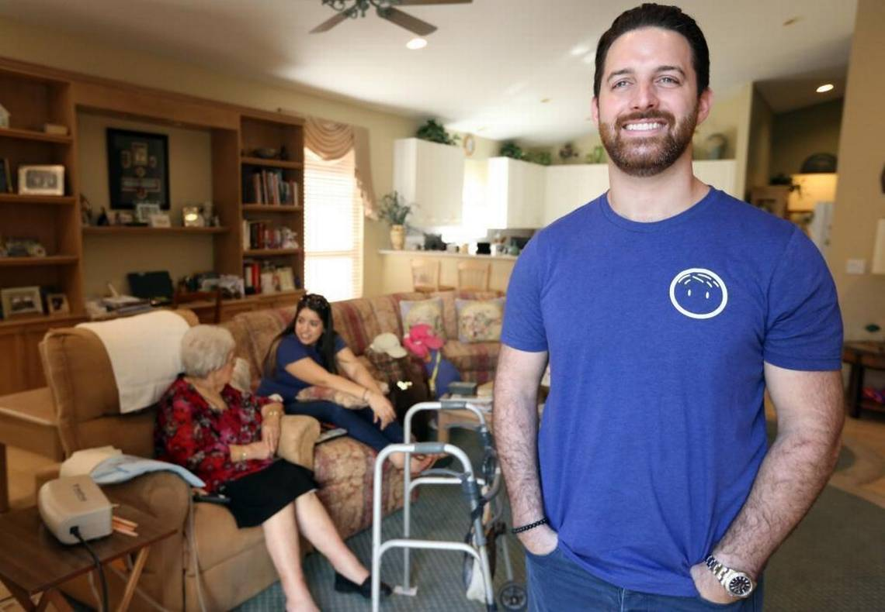
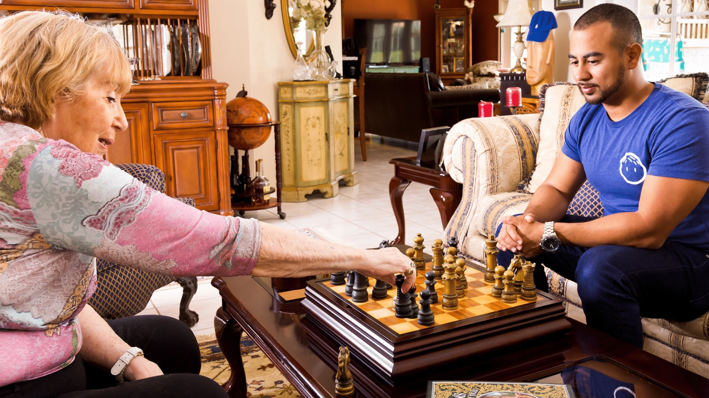

[Papa Pals](https://www.joinpapa.com/become-papa-pal/) are incredible providers of a social experience for seniors, they provide help with **transportation, daily tasks, run errands,
teach technology**, and provide an amazing day for them. The goal is to provide seniors something to look forward to.
**Andrew Parker** graduated from Florida State University with a Bachelor of Science, Finance. He worked in different companies as an account
manager and executive and was vice president of health systems in the telehealth company MDLIVE for five years before launching Papa.

<credits>Photo by [Miami Herald](https://www.miamiherald.com/)</credits>

Parker lived close to his grandfather, who had early-onset dementia and often went to help him with his errands. As his workload grew,
Parker posted on Facebook as an assistant. A woman named Andrea, whom her family interviewed and did a background check, began helping her
grandfather regularly.
The experience made Parker realize that there was a gap in the market for older people who, like their grandfather, were mostly
independent and didn't need a caregiver, but still required special help from a trusted person. So he left his job at MDLIVE and launched
a business called Papa, which connects students with seniors for domestic or driving tasks, but the company's real goal is its slogan:
**Grandkids on-Demand**.

<credits>Photo by [Join Papa](https://www.joinpapa.com/)</credits>

Papa's mission is to support the elderly and their family. They have a clear objective that focuses on curing loneliness in the elderly.
They are also expanding their business model by working with partners, including senior facilities, to offer Papa Pal's services to their
residents.
Students part of Papa are trained to try to help clients broaden their social life by providing a companionship experience.
Senior can use the Papa application or a customer service line to reserve a Papa Pal. They can take elders to the grocery store or
doctor's appointments, help them with homework or teach them how to set up a new smartphone, as well as offer them companionship.

The company has about 250 members who pay a monthly membership fee of $15 to $30 and then pay $15 per hour for student visits or Papa Pal
who undergo a review in order to work with this organization. They must be people with empathy, patience and the ability to bring people
into a conversation.

Monthly membership adds a companionship, home help, and technology lessons to the pay-for-use plan, which only include social
transportation.

<youtube-video id="https://www.youtube.com/watch?v=9OVyD9InLdw"></youtube-video>

The **Miami-based** company is currently participating in **the Y Combinator accelerator program**.

The service is currently available only in Florida, but Parker plans to expand to ten more states next year, starting with
**Pennsylvania**, at the end of the year. **Medicare** and **Medicaid** will begin covering this type of service in 2019, so
beneficiaries will be able to use it at no cost.

<credits>Photo by [@join_papa](https://twitter.com/join_papa)</credits>

<block-quote>“Humana Inc. has partnered with a startup called Papa Inc. to provide "grandkids-on-demand" for qualifying members of its
Medicare Advantage plans.”</block-quote>
<credits>Source: http://bit.ly/2E8UxUi</credits>

<block-quote>“When reddit co-founder Alexis Ohanian and Hollywood A-lister-turned-investor Ashton Kutcher heard South Florida-native
Andrew Parker’s pitch in August for his “grandkids on demand” service, they were instantly smitten.”</block-quote>
<credits>Source: https://hrld.us/2Ruh5lo</credits>
